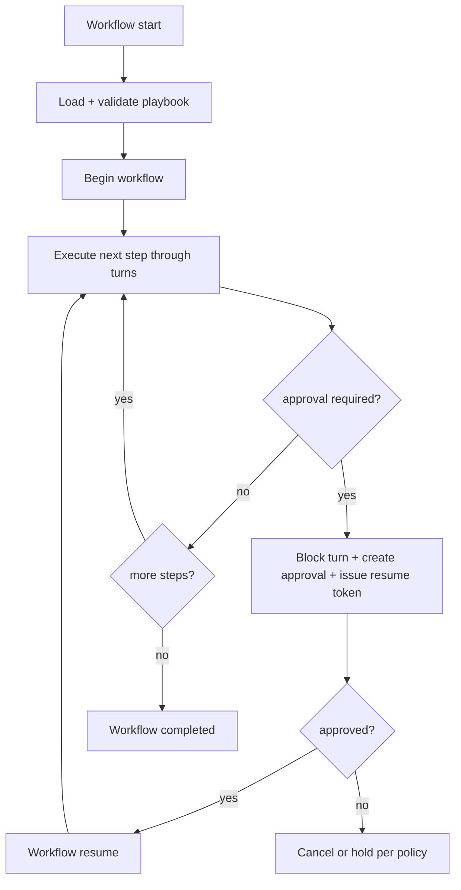

# Playbooks (deterministic workflows)

A playbook is a durable workflow spec executed through turns and durable state, not by prompt memory alone. It gives Tyrum a reviewable workflow graph with deterministic pause/resume behavior.

## Quick orientation

- Read this if: you need the control flow for multi-step deterministic work.
- Skip this if: you need tool-level runtime mechanics or queue internals.
- Go deeper: [Turn Processing and Durable Coordination](/architecture/turn-processing), [Approvals](/architecture/approvals), [Automation](/architecture/automation).

## Workflow -> pause -> resume flow

Playbooks are about control-plane determinism: each step is typed, bounded, and auditable.

## What playbooks are for

- composing many side-effecting or read-only steps into one durable workflow
- pausing safely for approvals and resuming without replaying completed effects
- preserving evidence and outcomes per step
- expressing workflow behavior as data (YAML/JSON), not ad hoc model decisions

Playbooks are not skills. Skills are instruction/context bundles; playbooks are runtime-enforced workflow specs.

## Runtime contract (minimal)

The surface is intentionally small:

- start a workflow from inline pipeline, stored id, or loaded file path
- resume a blocked workflow by durable resume token
- cancel queued, active, or blocked workflow progress under policy rules

Common workflow inputs include `cwd`, `timeoutMs`, and `maxOutputBytes`. Output is a status envelope such as `ok`, `needs_approval`, `cancelled`, or `error`.

## Workflow shape

A playbook defines `name`, optional `args`, and ordered `steps`.

Step commands use explicit namespaces so execution is unambiguous:

- `cli`, `http`, `web`, `mcp`, `node`
- `llm` for JSON-only model steps with explicit tool budget and allowlist

Steps can consume prior outputs, and JSON-declared outputs are validated as JSON contracts.

## Approval behavior

Any step can declare `approval: required`.

- execution blocks before side effects
- an approval record is created with bounded preview context when available
- resume requires a durable token and explicit decision
- denied or expired paths cancel or hold according to policy

This keeps long workflows safe under restarts, reconnects, and multi-instance execution.

## Safety constraints (non-negotiable)

- enforce step timeouts and output caps
- enforce workspace boundary for `cwd`
- enforce tool policy and sandbox rules for every step
- use secret handles instead of embedding raw secret values
- require postconditions for state-changing steps when feasible

## LLM steps in deterministic workflows

LLM steps are allowed as bounded judgment or extraction stages, but they remain runtime-governed:

- explicit model and JSON output schema
- explicit tool allowlist if tools are allowed
- max tool call count and runtime budgets
- normal policy and approval gates still apply

## Related docs

- [Turn Processing and Durable Coordination](/architecture/turn-processing)
- [Approvals](/architecture/approvals)
- [Automation](/architecture/automation)
- [Tools](/architecture/tools)
