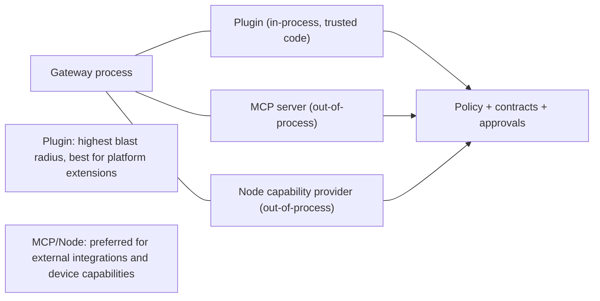

# Gateway plugins

A gateway plugin is an in-process extension module that adds gateway-local behavior such as tools, commands, and scoped routes.

## Quick orientation

- Read this if: you need the plugin trust boundary and extension model.
- Skip this if: you need low-level loader implementation details.
- Go deeper: [Tools](/architecture/tools), [Node](/architecture/node), [Sandbox and policy](/architecture/sandbox-policy).

## Extension trust boundaries

Use plugins when you need gateway-local extension points. Use MCP or nodes when you need safer separation for external integrations or device access.

## What plugins can contribute

- tool descriptors with typed input/output contracts
- slash commands
- scoped gateway RPC surfaces
- MCP server definitions/configuration (server runtime still out of process)

## Required plugin contract

Each plugin needs a manifest (`plugin.yml`, `plugin.yaml`, or `plugin.json`) that the gateway can validate before executing code.

Required manifest fields:

- identity: `id`, `name`, `version`
- load target: `entry` (relative ESM path)
- declared contributions: tools, commands, routes, MCP definitions
- requested permissions (for example network or secret scopes)
- `config_schema` for plugin config validation

Plugin config is loaded from `config.yml` / `config.yaml` / `config.json` in the plugin directory, defaults to `{}` when absent, and should reject unknown keys by default.

## Policy and tool exposure model

Plugin tools are not implicitly available to the agent runtime.

- side-effecting plugin tools should be opt-in
- effective tool policy controls whether they are exposed (`allow` or `require_approval`)
- plugin tool calls still pass through the same contract, policy, approval, and sandbox boundaries as built-in tools

This keeps plugin flexibility without creating a hidden bypass path.

## Installation integrity and hardening

Plugins are trusted code, so install/load rules are strict:

- validate entrypoint path lexically and by resolved real path
- reject traversal and symlink escapes
- reject unsafe ownership/permission posture for plugin roots
- prefer pinned registry installs and integrity verification
- avoid running arbitrary lifecycle scripts during install

When present, `plugin.lock.json` is treated as a pinning contract (`source`, pinned `version`, and integrity hash). Mismatches should prevent plugin load.

## Observability and audit

Plugin lifecycle and usage must be visible:

- lifecycle events for load/fail/unload
- plugin metadata in status/export surfaces
- tool invocation audit with scope and policy snapshot linkage

Common event surfaces include `plugin.lifecycle` and `plugin_tool.invoked`.

## Safety posture

- plugin install/enable/upgrade is a privileged operation
- prefer curated sources and pinned versions
- require explicit permission declarations and least privilege
- keep policy/approval boundaries active even for in-process contributions

## Related docs

- [Tools](/architecture/tools)
- [Sandbox and policy](/architecture/sandbox-policy)
- [Node](/architecture/node)
- [Approvals](/architecture/approvals)
