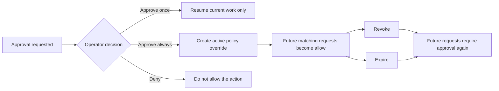

# Policy overrides (approve-always)

Policy overrides are durable allow rules created by operators so repeated low-variance approvals do not require the same prompt every time.

## Quick orientation

- Read this if: you need the difference between approve once, approve always, revoke, and expire.
- Skip this if: you already know the lifecycle and only need wildcard grammar details.
- Go deeper: [Approvals](/architecture/approvals), [Tools](/architecture/tools), [Sandbox and policy](/architecture/sandbox-policy).

## Resolution and override lifecycle

The short version:

- `approve once` resolves the current approval and changes nothing durable about future requests.
- `approve always` resolves the current approval and creates a scoped override for future matching requests.
- `revoke` or `expire` stops the override from applying, so future matching requests fall back to normal policy and approval flow.

## What an override can do

An override is meant to relax `require_approval` into `allow` for a narrow, auditable slice of work. It is not a free-form trust flag and it should not silently broaden access.

By default, overrides should:

- stay tenant- and agent-scoped
- usually stay workspace-scoped for workspace-backed tools
- target one tool family and one normalized match pattern
- never defeat an explicit `deny`

## Matching model

Overrides match against the tool's normalized target, not raw user text. That target must be derived from validated inputs, because sloppy normalization turns narrow operator intent into a broad allow rule.

Examples of healthy patterns:

- `fs`: `write:docs/architecture/*`
- `messaging`: `send:slack:acct_123:chan_C024BE91L`
- `connector.send`: an exact destination key rather than a broad wildcard

Examples that are usually too broad:

- `bash:*`
- `fs:delete:*`
- `send:*`

## Operator choices in practice

| Choice         | Effect on current approval | Effect on future matching work         |
| -------------- | -------------------------- | -------------------------------------- |
| Approve once   | resumes this run           | none                                   |
| Approve always | resumes this run           | creates active override                |
| Deny           | blocks this run per policy | none                                   |
| Revoke         | n/a                        | disables an existing override          |
| Expire         | n/a                        | lets an override age out automatically |

## Hard invariants

- Overrides are policy data, not prompt conventions.
- Every override creation, application, revocation, and expiry must be auditable.
- Decision records should show which override made an action allowable.
- Explicit deny remains stronger than override-created allow.

## Related docs

- [Approvals](/architecture/approvals)
- [Reviews](/architecture/gateway/reviews)
- [Tools](/architecture/tools)
- [Sandbox and policy](/architecture/sandbox-policy)
