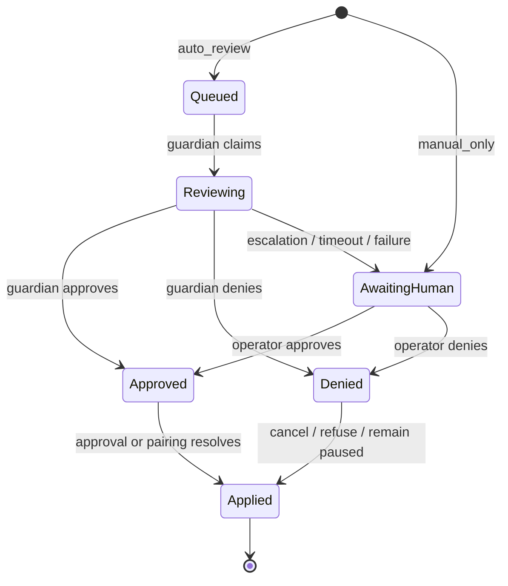

# Reviews

Reviews are the gateway-owned decision pipeline for approval and pairing work that may need guardian evaluation before a final human or system resolution is applied.

## Quick orientation

- Read this if: you need the review lifecycle, escalation path, and why reviews are separate from approvals.
- Skip this if: you only need event payload fields or processor implementation details.
- Go deeper: [Approvals](/architecture/approvals), [Policy overrides](/architecture/policy-overrides), [Gateway](/architecture/gateway).

## Review lifecycle

The review system does not replace approvals or pairings. It decides how they get resolved and keeps the reasoning trail attached to the durable parent object.

## What reviews own

- initializing review posture from policy (`auto_review` or `manual_only`)
- creating durable reviewer entries for guardian, human, and system decisions
- running guardian review safely under retries and restarts
- escalating to a human whenever automation cannot justify a terminal decision

## Why this is a separate layer

The approval or pairing record is still the operator-facing object. Reviews exist so Tyrum can keep three concerns separate:

- queue state the operator sees
- reviewer-by-reviewer audit detail
- final resolution that the execution engine or pairing lifecycle consumes

Without that split, the main approval object becomes overloaded with internal reviewer bookkeeping.

## Escalation path

Escalation is the safety valve. Guardian review may succeed, deny, or decide that a human needs to finish the decision. Tyrum should also escalate when the guardian path fails, times out, or loses confidence after a restart or policy lookup problem.

That means human review is not an exceptional fallback. It is the normal safe endpoint whenever automated review cannot defend a durable allow or deny.

Guardian prompts should make two things explicit:

- missing or omitted evidence means unknown, not safe
- `requested_human` is the default whenever risk is not clearly low and well-justified

Guardian review also uses explicit risk-score bands so different runs do not improvise their own threshold vocabulary.

## Hard invariants

- Every reviewable item should expose durable review state on the parent approval or pairing.
- Guardian processing must be safe under duplicate claims and concurrent gateway instances.
- Parent-object events remain the public operator contract; review internals should not become a second mandatory queue abstraction.
- Escalation must preserve context so the human reviewer can finish the decision without recreating the case from logs.

## What operators inspect

Operators should be able to answer:

- what is waiting for review now
- whether a guardian already looked at it
- why it escalated
- what final decision was applied to the underlying approval or pairing

That is why review entries matter even though the primary queue still lives on the parent object.

## Related docs

- [Approvals](/architecture/approvals)
- [Policy overrides](/architecture/policy-overrides)
- [Gateway](/architecture/gateway)
- [Events](/architecture/protocol/events)
- [Data model map](/architecture/data-model-map)
