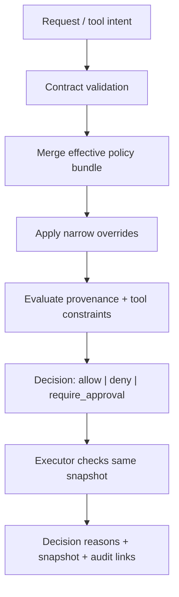

# Policy enforcement model

Read this if: you need the exact path from policy input to enforced execution decision.

Skip this if: you only need the high-level safety model; start with [Sandbox and Policy](/architecture/sandbox-policy).

Go deeper: [Policy overrides](/architecture/policy-overrides), [Approvals](/architecture/approvals), [Tools](/architecture/tools).

## Enforcement pipeline

## Scope

This page specifies how policy becomes enforcement: merge order, override handling, provenance-aware decisions, snapshot-based execution, and fail-closed behavior at the executor boundary.

## Core rules

- Decisions are data, not prompt text.
- `deny` wins over `require_approval`, which wins over `allow`.
- Operator overrides can narrow approval friction but must not silently bypass an explicit `deny`.
- Executors must enforce the same snapshot-derived policy that queue-time checks used.

## Snapshot and executor model

Execution uses the stored policy snapshot that was active when the turn was created. The turn carries `policy_snapshot_id` and a deterministic content hash, and executors receive that reference before performing policy-governed actions. This keeps replay, audit, and post-incident analysis coherent after live policy changes.

## Provenance-aware enforcement

Untrusted content remains tagged as data through the runtime. Policy can escalate or block actions when arguments or destinations derive from untrusted sources. This is an enforcement rule, not advisory prompt guidance.

## Fail-closed behavior

- Secret resolution happens only after snapshot-based policy allows it.
- Tool and network denials must fail closed even if an alternate path tries to bypass earlier checks.
- Execution-time approvals re-enter the ordinary durable approval flow instead of inventing a second mechanism.

## Auditability

Enforcement stays explainable through decision reasons, snapshot ids and hashes, override links, and approval/event linkage on the affected turn or evidence records.

## Related docs

- [Sandbox and Policy](/architecture/sandbox-policy)
- [Approvals](/architecture/approvals)
- [Policy overrides](/architecture/policy-overrides)
- [Tools](/architecture/tools)
- [Contracts](/architecture/contracts)
