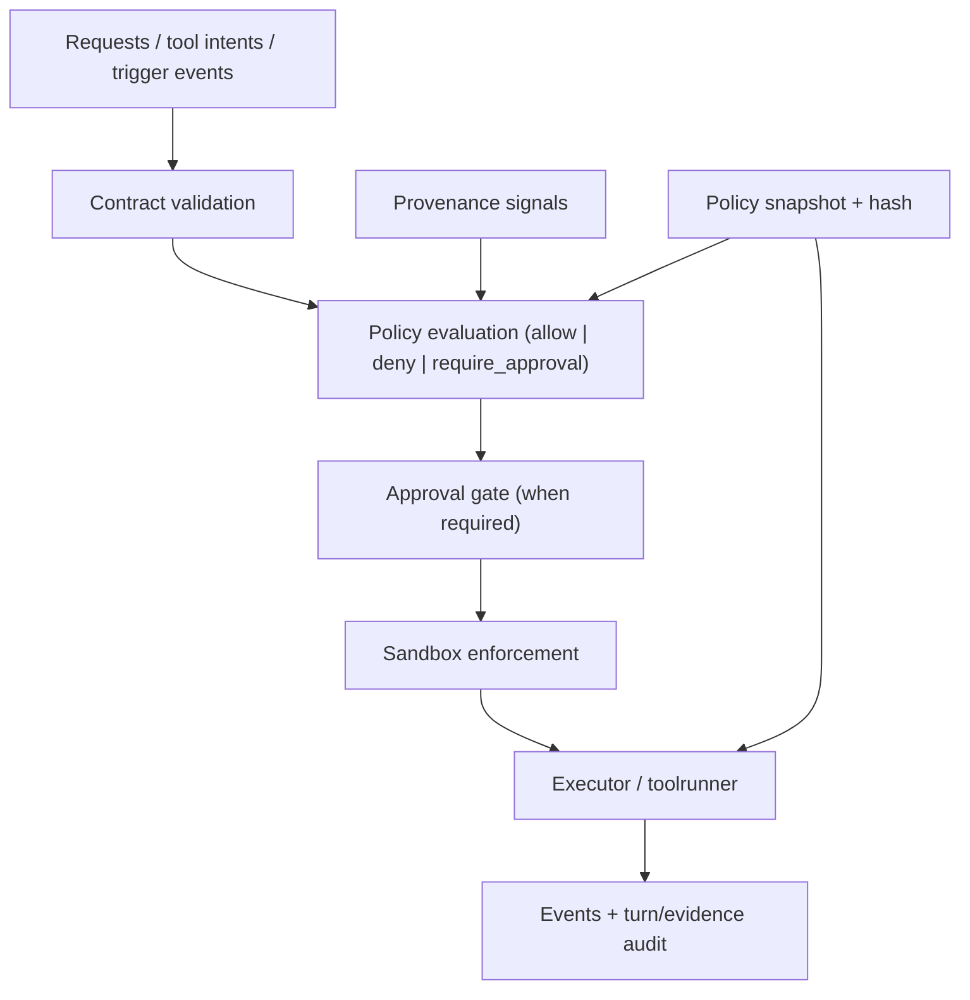

# Sandbox and Policy

Tyrum enforces execution safety with layered controls that do not depend on model compliance. Policy decides what is permitted; sandboxing enforces runtime limits even when policy allows execution.

## Quick orientation

- Read this if: you need the safety architecture across policy, approvals, and sandboxing.
- Skip this if: you need low-level matcher implementation details.
- Go deeper: [Policy enforcement model](/architecture/sandbox-policy/enforcement-model), [Sandbox hardening profiles](/architecture/sandbox-policy/sandbox-profiles), [Tools](/architecture/tools).

## Layered enforcement stack

The important separation is advisory vs enforcement: prompts and skills advise; policy, approvals, and sandboxing enforce.

## Policy model and precedence

Policy is a versioned declarative `PolicyBundle` evaluated deterministically to one decision:

- `allow`
- `deny`
- `require_approval`

Effective policy merges in this order:

1. deployment policy
2. agent policy
3. playbook policy
4. operator policy overrides

Conflict resolution remains conservative: `deny` > `require_approval` > `allow`. Overrides can narrow approval friction but should not bypass explicit denies.

## Provenance and injection defense

Untrusted tool/web/channel content is tagged as data with provenance metadata. Policy can escalate or deny actions based on provenance.

Conservative default:

- `PolicyBundle.provenance.untrusted_shell_requires_approval` upgrades shell calls from `allow` to `require_approval` when driven by untrusted input.

Narrow exceptions should use explicit, auditable overrides on stable match targets rather than broad allowlist relaxations.

## Snapshot and fail-closed execution contract

Every turn uses a policy snapshot reference (`policy_snapshot_id` + content hash). This keeps decisions replayable and auditable.

Hard requirements:

- snapshot hash is computed from canonical policy bytes
- executors enforce snapshot-derived policy, not caller assumptions
- secret resolution occurs only after snapshot-based allow
- egress/tool denials fail closed on alternate paths
- decisions and applied override ids stay attached to durable turn and evidence records

## Minimum policy domains

A production bundle should cover at least:

- tool policy and parameter constraints
- network egress controls
- secret-handle resolution constraints
- connector/messaging scope controls
- artifact access and retention defaults
- provenance-based decision rules

## Sandboxing baseline and profiles

Sandboxing enforces least privilege at runtime:

- workspace boundary checks
- least-privilege process/container defaults
- optional hardened container/process restrictions

Profiles:

- `baseline` (default): workspace boundaries + conservative process/container defaults
- `hardened` (opt-in): baseline plus stronger runtime hardening (for example read-only root filesystem and tighter runtime constraints)

`/status` exposes the active hardening profile, and model-facing runtime context may include sandbox posture so execution planning is grounded.

## Audit and observability

Policy decisions and sandbox denials are first-class telemetry:

- decision + reasons + snapshot reference on turn and evidence surfaces
- policy and sandbox enforcement events for operator UIs and exports

## Related docs

- [Policy enforcement model](/architecture/sandbox-policy/enforcement-model)
- [Sandbox hardening profiles](/architecture/sandbox-policy/sandbox-profiles)
- [Policy overrides](/architecture/policy-overrides)
- [Approvals](/architecture/approvals)
- [Tools](/architecture/tools)
