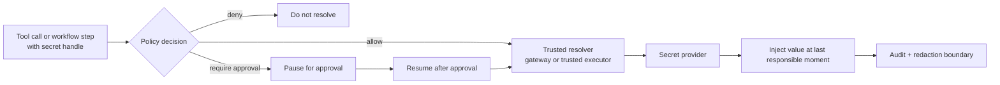

# Secrets

Tyrum is built around one hard rule: models and ordinary runtime state should not see raw secret values. Secrets are stored behind a trusted provider and referenced everywhere else by opaque handles.

## Quick orientation

- Read this if: you need the handle model, resolution boundary, and audit expectations.
- Skip this if: you only need provider-specific storage mechanics.
- Go deeper: [Provider auth and onboarding](/architecture/auth), [Sandbox and policy](/architecture/sandbox-policy), [Execution engine](/architecture/execution-engine), [ARCH-19 dedicated node-backed tool and routing decision](/architecture/arch-19-dedicated-node-backed-tools).

## Secret resolution boundary

The handle can travel through plans, approvals, run state, and logs. The raw secret value cannot.

The dedicated secret-to-node-clipboard flow is specified in [ARCH-19 dedicated node-backed tool and routing decision](/architecture/arch-19-dedicated-node-backed-tools). That record is the canonical source for `tool.secret.copy-to-node-clipboard`, the `secret_ref_id` / `secret_alias` contract, and the stricter ambiguity rules for clipboard delivery.

## What lives where

- Secret provider: stores the raw credential material.
- Gateway state: stores handles, metadata, policy linkage, and audit history.
- Trusted executor boundary: resolves the handle only when the step actually needs it.

This is why a tool can be approval-gated based on a secret scope without exposing the secret itself during planning or review.

## Why handles matter

Handles make four things possible at once:

- approvals can describe the capability being requested without leaking the credential
- logs and artifacts stay safe by default
- credential rotation can update provider state without rewriting old plans
- policy can reason about secret scope instead of raw value

## Rotation and revocation

Rotation updates what a handle points to. Revocation disables use of the handle until an operator replaces or reauthorizes it. For auth-profile-backed credentials, that state must propagate into provider routing so a revoked credential does not keep getting selected.

## Cluster-safe patterns

Single-host and clustered deployments can use different secret backends, but the rule stays the same: raw secrets are never persisted into the StateStore and never treated as model-visible data.

Common trusted patterns are:

- a shared secret provider reachable from trusted executors
- gateway-mediated resolution into a trusted node or sandbox without persisting the raw value

## Hard invariants

- Secret handles may appear in durable state; raw secrets may not.
- Resolution is policy-gated and auditable.
- Redaction applies before logs, events, artifacts, and UI surfaces are persisted or rendered.
- Debugging modes do not weaken the redaction boundary.

## Related docs

- [Provider auth and onboarding](/architecture/auth)
- [Sandbox and policy](/architecture/sandbox-policy)
- [Execution engine](/architecture/execution-engine)
- [Approvals](/architecture/approvals)
- [ARCH-19 dedicated node-backed tool and routing decision](/architecture/arch-19-dedicated-node-backed-tools)
