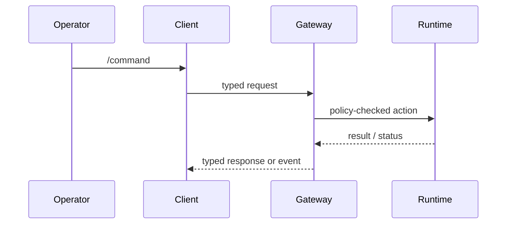

# Slash Commands

Read this if: you need the client-to-gateway command boundary for common operator actions.

Skip this if: you are looking for model prompts or free-form conversational behavior.

Go deeper: [Client](/architecture/client), [Protocol](/architecture/protocol), [Approvals](/architecture/approvals).

## Command path

## Purpose

Slash commands are a deterministic operator surface for common actions such as session control, status inspection, model changes, and policy-override management. Clients parse commands and translate them into typed gateway requests so command behavior stays auditable and policy-enforced.

## Command classes

| Class                 | Examples                                           | Architecture note                                    |
| --------------------- | -------------------------------------------------- | ---------------------------------------------------- |
| Session and execution | `/new`, `/reset`, `/stop`, `/compact`, `/repair`   | Control-plane actions, not model interpretation      |
| Context and usage     | `/status`, `/context ...`, `/usage`, `/presence`   | Read-oriented inspection surfaces                    |
| Models and auth       | `/model ...`                                       | Typed configuration or session pinning path          |
| Messaging and policy  | `/queue ...`, `/send ...`, `/policy overrides ...` | Can change runtime behavior and may require approval |

## Design rules

- Commands are handled by the gateway, not by the model.
- Command names should stay explicit and unambiguous.
- Side-effecting commands must still pass through ordinary policy and approval checks.
- Clients own command parsing UX; the gateway owns the authoritative action semantics.

## Related docs

- [Client](/architecture/client)
- [Protocol](/architecture/protocol)
- [Policy overrides](/architecture/policy-overrides)
- [Approvals](/architecture/approvals)
