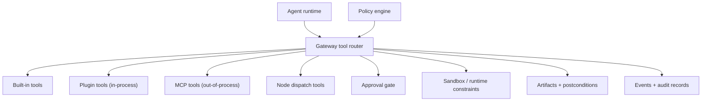

# Tools

Tools are the gateway's execution surface for the agent runtime. They are how model intent turns into bounded actions under policy, approvals, and audit.

## Quick orientation

- Read this if: you need the tool architecture and enforcement boundary.
- Skip this if: you need exact matcher internals for a specific tool class.
- Go deeper: [Sandbox and policy](/architecture/sandbox-policy), [Approvals](/architecture/approvals), [Gateway plugins](/architecture/plugins).

## Tool ecosystem and boundaries

The router is the hard boundary: prompt text suggests actions, but policy decides whether a tool call is allowed, denied, or requires approval.

## Tool families

| Family        | Typical examples                                                           | Trust / risk notes                                                     |
| ------------- | -------------------------------------------------------------------------- | ---------------------------------------------------------------------- |
| Built-in      | `fs`, `runtime`, `session`, `workflow`, `automation`, `messaging`, `model` | First-class policy coverage; many are high-risk without approvals.     |
| Plugin        | Gateway-registered tools from installed plugins                            | In-process extension surface; treat as trusted code.                   |
| MCP           | Tool catalogs from external MCP servers                                    | Out-of-process integration, still policy-gated at gateway boundary.    |
| Node dispatch | Capability calls to paired nodes                                           | High-risk local/device actions; pair + policy + approval path applies. |

## Enforcement pipeline

1. Validate request and tool input contracts.
2. Build a normalized match target for policy evaluation.
3. Apply policy decision (`allow`, `deny`, `require_approval`).
4. If required, pause at approval and resume with durable state.
5. Execute in sandboxed context with bounded outputs.
6. Persist evidence, artifacts, and audit events.

This sequence is mandatory for built-in, plugin, MCP, and node-dispatch tools.

## Safety rules that do not change

- Tool availability is enforced by policy, never by prompt wording.
- State-changing tools should produce postconditions and artifacts when feasible.
- Tool inputs and outputs are contract-validated and size-bounded.
- Secret handles are allowed; raw secret material in tool payloads is not.
- Untrusted source content (web/channel/tool outputs) remains data with provenance labels.

## Suggested overrides for `approve always`

When a tool call is `require_approval`, the gateway can return bounded `suggested_overrides` so operator clients can offer durable approval choices without free-form rule editing.

Guardrails:

- suggestions are tool-specific, narrow, and auditable
- explicit `deny` remains non-bypassable
- stable match targets are required before pattern matching
- prefer narrow prefix patterns; avoid broad or ambiguous wildcards

Pattern grammar is simple wildcard matching: `*` (zero or more chars), `?` (single char). Conservative suggestions should avoid leading wildcards and broad shapes.

## Match-target normalization (essentials)

Suggested overrides and policy overrides operate on a canonical per-tool match target derived from validated inputs.

Examples:

- `fs`: `op:workspace/relative/path` after canonical path normalization.
- `bash`: normalized structured command representation (not raw shell text).
- `messaging`: stable destination key, not message body text.
- `tool.node.dispatch`: capability id + action kind (+ normalized desktop operation where relevant).
- `tool.automation.schedule.*`: stable schedule semantics or exact `schedule_id`, not free-form cadence text.

## Related docs

- [Sandbox and policy](/architecture/sandbox-policy)
- [Approvals](/architecture/approvals)
- [Gateway plugins](/architecture/plugins)
- [Execution engine](/architecture/execution-engine)
