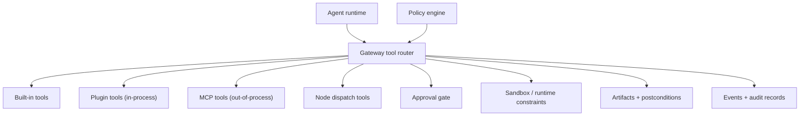

# Tools

Tools are the gateway's execution surface for the agent runtime. They are how model intent turns into bounded actions under policy, approvals, and audit.

## Quick orientation

- Read this if: you need the tool architecture and enforcement boundary.
- Skip this if: you need exact matcher internals for a specific tool class.
- Go deeper: [Sandbox and policy](/architecture/sandbox-policy), [Approvals](/architecture/approvals), [Gateway plugins](/architecture/plugins), [ARCH-19 dedicated node-backed tool and routing decision](/architecture/arch-19-dedicated-node-backed-tools).

## Tool ecosystem and boundaries

The router is the hard boundary: prompt text suggests actions, but policy decides whether a tool call is allowed, denied, or requires approval.

The clean-break model-facing replacement for the legacy generic node helpers is defined in [ARCH-19 dedicated node-backed tool and routing decision](/architecture/arch-19-dedicated-node-backed-tools). This page stays focused on the shared gateway enforcement pipeline that all tool families pass through.

For model-facing prompts, each tool exposes two layers:

- schema: the authoritative contract for required fields, nesting, and allowed values
- description/guidance: human-readable hints and examples that explain when to use the tool

The schema wins. Prompt prose must never be treated as permission to invent arguments that the schema does not allow.

## Tool families

| Family        | Typical examples                                                                | Trust / risk notes                                                     |
| ------------- | ------------------------------------------------------------------------------- | ---------------------------------------------------------------------- |
| Built-in      | `fs`, `runtime`, `conversation`, `workflow`, `automation`, `messaging`, `model` | First-class policy coverage; many are high-risk without approvals.     |
| Plugin        | Gateway-registered tools from installed plugins                                 | In-process extension surface; treat as trusted code.                   |
| MCP           | Tool catalogs from external MCP servers                                         | Out-of-process integration, still policy-gated at gateway boundary.    |
| Node dispatch | Capability calls to paired nodes                                                | High-risk local/device actions; pair + policy + approval path applies. |

## Enforcement pipeline

1. Validate request and tool input contracts.
2. Build a normalized match target for policy evaluation.
3. Apply policy decision (`allow`, `deny`, `require_approval`).
4. If required, pause at approval and resume with durable state.
5. Execute in sandboxed context with bounded outputs.
6. Persist evidence, artifacts, and audit events.

This sequence is mandatory for built-in, plugin, MCP, and node-dispatch tools.

## Safety rules that do not change

- Tool availability is enforced by policy, never by prompt wording.
- State-changing tools should produce postconditions and artifacts when feasible.
- Tool inputs and outputs are contract-validated and size-bounded.
- Secret handles are allowed; raw secret material in tool payloads is not.
- Untrusted source content (web/channel/tool outputs) remains data with provenance labels.

## Suggested overrides for `approve always`

When a tool call is `require_approval`, the gateway can return bounded `suggested_overrides` so operator clients can offer durable approval choices without free-form rule editing.

Guardrails:

- suggestions are tool-specific, narrow, and auditable
- explicit `deny` remains non-bypassable
- stable match targets are required before pattern matching
- prefer narrow prefix patterns; avoid broad or ambiguous wildcards

Pattern grammar is simple wildcard matching: `*` (zero or more chars), `?` (single char). Conservative suggestions should avoid leading wildcards and broad shapes.

## Match-target normalization (essentials)

Suggested overrides and policy overrides operate on a canonical per-tool match target derived from validated inputs.

Examples:

- `fs`: `op:workspace/relative/path` after canonical path normalization.
- `bash`: normalized structured command representation (not raw shell text).
- `messaging`: stable destination key, not message body text.
- Dedicated node-backed tools such as `tool.desktop.act`, `tool.browser.navigate`, and `tool.location.get`: exact tool id + normalized action-specific target.
- `tool.automation.schedule.*`: stable schedule semantics or exact `schedule_id`, not free-form cadence text.

## Model-facing guidance examples

High-risk tools should include canonical examples in their prompt-facing descriptions when argument nesting is easy to miss.

- filesystem mutators should explain safe usage order:
  - use `glob` or `grep` to discover candidates
  - use `read` to inspect the exact target
  - use `edit` or `apply_patch` for surgical changes
  - use `write` only for full-file replacement
- `bash` should show bounded commands with explicit `cwd` and `timeout_ms` when relevant.
- Dedicated node-backed tools should show direct action-shaped arguments, for example `tool.browser.navigate` with:
  `{"url":"https://example.com","node_id":"node_456","timeout_ms":30000}`
- `tool.node.list` and the dedicated action tool should make the discovery order explicit before execution when node selection is ambiguous.
- `tool.automation.schedule.create` and `.update` should show canonical nested `cadence`, `execution`, and `delivery` objects instead of free-form schedule prose.
- `webfetch` should distinguish `mode: "raw"` from `mode: "extract"` and show that extract mode uses a focused `prompt`.
- delegation and work-tracking tools such as `subagent.spawn`, `workboard.capture`, and `workboard.clarification.request` should include examples that show the intended bounded workflow.

## Related docs

- [Sandbox and policy](/architecture/sandbox-policy)
- [Approvals](/architecture/approvals)
- [Gateway plugins](/architecture/plugins)
- [Turn Processing and Durable Coordination](/architecture/turn-processing)
- [ARCH-19 dedicated node-backed tool and routing decision](/architecture/arch-19-dedicated-node-backed-tools)
