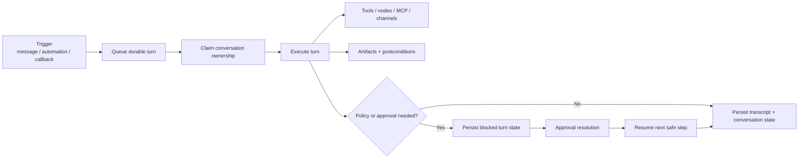

# Turn Processing and Durable Coordination

This is a mechanics page for durable turn queueing, pause/resume, recovery, and evidence linkage.

The gateway persists and coordinates turns so conversations can recover after disconnects, approvals, compactions, and worker restarts. This page describes those mechanics without introducing a second top-level activity model.

## Quick orientation

- Read this if: you need the mental model for durable turn queueing, pause/resume, ownership, and evidence linkage.
- Skip this if: you only need the high-level architecture; start with [Architecture](/architecture) or [Messages and Conversations](/architecture/messages-conversations).
- Go deeper: [Approvals](/architecture/approvals), [Artifacts](/architecture/artifacts), [Automation](/architecture/automation), [Scaling and High Availability](/architecture/scaling-ha), and [ARCH-20 conversation and turn clean-break decision](/architecture/arch-20-conversation-turn-clean-break).

## Durable turn model

The key idea is simple: durable turn state is authoritative. Executors can restart, clients can disconnect, and approvals can take time because progress is driven from persisted conversation and turn state rather than from in-memory workflow state.

## What this page owns

- Accepting queued turns from interactive surfaces, automation, and external callbacks.
- Claiming turn ownership safely across one process or many workers.
- Pausing for approval or external waits and resuming without duplicating side effects.
- Linking evidence and artifacts back to the turn that produced them.
- Publishing durable lifecycle events for operator inspection.

## Why durable turn processing matters

### Pause and resume

Approvals and external waits do not live in prompt text. The gateway persists blocked turn state and resumes from the durable checkpoint after resolution.

### Recovery after interruption

Worker restarts, socket churn, or process loss must not erase conversation progress. Durable turn state lets the gateway recover without replaying the full transcript blindly.

### Evidence over narration

State-changing work should produce artifacts or postcondition checks whenever verification is feasible. If verification is not possible, the outcome should stay operator-visible instead of silently becoming accepted truth.

## Deployment shape

The same model applies in single-host and clustered deployments:

- single host: the gateway and turn processor may run side by side and access local workspace tools directly
- cluster: workers claim turn ownership from the StateStore and delegate tool or node execution through trusted boundaries

Either way, completion is only real after transcript updates, conversation-state updates, and evidence linkage have been durably recorded.

## Hard invariants

- Durable state, not transient memory, is the source of truth for turn progress.
- Approval-gated work never continues until a durable approval outcome exists.
- Side effects should be paired with evidence or an explicit operator-visible unverifiable outcome.
- Cluster scaling must preserve safe conversation ownership and at-least-once event publication.

## What this page does not own

- Choosing the high-level plan from a user message. That belongs to the agent runtime and WorkBoard.
- Channel-specific rendering or provider-specific delivery quirks.
- Raw secret storage or credential management.

## Related docs

- [Messages and Conversations](/architecture/messages-conversations)
- [Conversations and Turns](/architecture/conversations-turns)
- [Approvals](/architecture/approvals)
- [Artifacts](/architecture/artifacts)
- [Automation](/architecture/automation)
- [Scaling and High Availability](/architecture/scaling-ha)
- [ARCH-20 conversation and turn clean-break decision](/architecture/arch-20-conversation-turn-clean-break)
