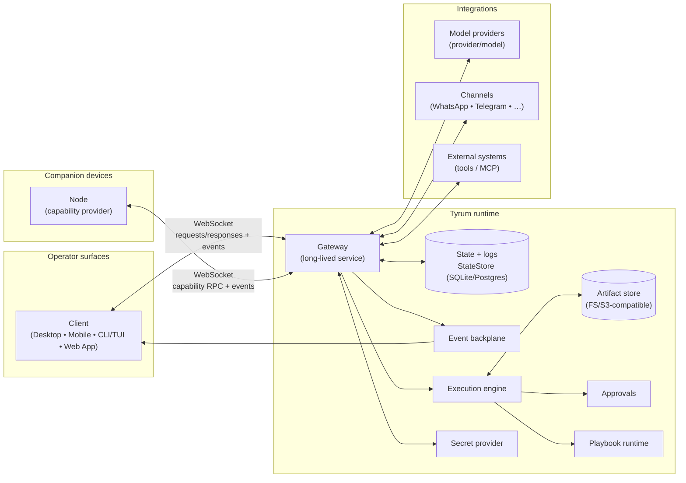

# Architecture

Tyrum is a WebSocket-first autonomous worker agent platform built around a long-lived gateway that coordinates durable execution, approvals, and audit evidence.

## Positioning

Tyrum is an autonomous worker.

- In the simplest case, it’s a **personal assistant** you run for yourself.
- In richer deployments, it’s a **remote coworker** you can share with a team.

The same core architecture scales from “one assistant” to “many coworkers” without turning into an un-auditable pile of prompts and cronjobs: durable execution, least-privilege authorization, explicit approvals, and evidence-backed audit trails.

## Engineering bar

Tyrum’s architecture is intentionally conservative:

- **Security best practices, secure by default:** local-first binding, explicit auth, least privilege, and defense-in-depth enforcement (not prompt-only “safety”).
- **Industry-standard primitives:** idempotency keys, durable outbox/eventing, leases/locks, auditable change control, and typed contracts at trust boundaries.
- **Avoid common agent anti-patterns:** opaque side effects, non-resumable runs, unbounded tool access, and “done” without postconditions/evidence.
- **Maintainability:** a small core with clear ownership boundaries and verifiable invariants.
- **Extensibility without weakening safety:** plugins, nodes, MCP, and channels extend capability, but remain policy-gated and contract-validated.

## High-level topology

## Building blocks

- **Gateway:** the long-lived service that owns edge connectivity (WebSocket), routing, and contract validation. See [Gateway](./gateway/index.md).
- **Tenancy:** the isolation boundary for identity, policy, and durable state. See [Tenancy](./tenancy.md).
- **StateStore:** durable state and logs (SQLite local; Postgres for HA/scale). See [Scaling and high availability](./scaling-ha.md).
- **Event backplane:** cross-instance delivery via a durable outbox (in-process for replica count = 1; shared for clusters). See [Backplane](./backplane.md), [Scaling and high availability](./scaling-ha.md), and [Events](./protocol/events.md).
- **Execution engine:** the durable orchestration runtime (retries, idempotency, pause/resume, evidence). See [Execution engine](./execution-engine.md).
- **WorkBoard:** workspace-scoped work tracking (Kanban) that keeps interactive sessions responsive by delegating long-running work. See [Work board and delegated execution](./workboard.md).
- **Workers:** step executors that claim work (leases), perform side effects, and publish results/events. See [Execution engine](./execution-engine.md).
- **ToolRunner:** a workspace-mounted execution context that runs filesystem/CLI tools. In single-host deployments it can be a local subprocess; in clusters it is typically a sandboxed job/pod. See [Scaling and high availability](./scaling-ha.md).
- **Scheduler:** cron/watchers/heartbeat enqueuers coordinated by DB-leases. See [Automation](./automation.md).
- **Playbooks:** deterministic workflow specs executed by the runtime (approval gates + resume tokens).
- **Approvals:** durable operator confirmation requests that gate risky actions and pause/resume workflows.
- **Secrets:** a first-class boundary; raw secrets stay behind a secret provider and are referenced via handles.
- **Auth profiles:** provider credentials (API keys/OAuth) expressed as metadata + secret handles for deterministic selection and rotation. See [Provider Auth and Onboarding](./auth.md).
- **Artifacts:** evidence objects stored outside the StateStore with policy-gated access. See [Artifacts](./artifacts.md).
- **Client:** an operator interface connected to the gateway (desktop/mobile/CLI/web).
- **Node:** a capability provider connected to the gateway (desktop/mobile/headless).
- **Protocol:** typed WebSocket messages (requests/responses and server-push events).
- **Contracts:** versioned schemas used to validate protocol messages and extension boundaries.

## Design principles

- **Local-first by default:** safe defaults assume localhost binding and explicit access control.
- **Typed boundaries:** inputs/outputs are validated at the edges (protocol, tools, plugins).
- **Least privilege:** capabilities and tools are scoped; high-risk actions require explicit policy/approvals.
- **Evidence over confidence:** state changes require postconditions and artifacts when feasible; unverifiable outcomes must not be reported as “done”.
- **Resumable execution:** long-running work can pause for approvals/takeover and resume without repeating completed steps.
- **Secrets by handle:** the model never sees raw credentials; executors use secret handles with policy-gated resolution.
- **Auditability:** important actions emit events and can be persisted for troubleshooting and compliance.
- **Extensible core:** gateway plugins, tools, skills, nodes, and MCP servers extend behavior without changing the gateway core.

## Architecture commitments

- **Ops ergonomics:** onboarding and diagnostics default to a hardened configuration.
- **Gateway authN/authZ:** explicit operator scopes, per-method authorization, device-token lifecycle, and a documented trusted-proxy + TLS/pinning story.
- **Plugins:** require manifests + config schemas, make risky tools opt-in, and harden discovery/install (path/ownership checks, safe dependency rules).
- **Scale validation:** reference deployments and a failure-matrix test suite are hard gates.
- **Integration quality bar:** channels and node capabilities are idempotent, approval-gated, and evidence-rich.

## Where to start

- [Scaling and high availability](./scaling-ha.md)
- [Gateway](./gateway/index.md)
- [Tenancy](./tenancy.md)
- [Gateway authN/authZ](./gateway-authz.md)
- [Identity](./identity.md)
- [Execution engine](./execution-engine.md)
- [Work board and delegated execution](./workboard.md)
- [Messages and Sessions](./messages-sessions.md)
- [Memory](./memory.md)
- [Playbooks](./playbooks.md)
- [Approvals](./approvals.md)
- [Policy overrides (approve-always)](./policy-overrides.md)
- [Secrets](./secrets.md)
- [Provider Auth and Onboarding](./auth.md)
- [Artifacts](./artifacts.md)
- [Backplane (outbox contract)](./backplane.md)
- [Sandbox and policy](./sandbox-policy.md)
- [Operations and onboarding](./operations.md)
- [Observability](./observability.md)
- [Data lifecycle and retention](./data-lifecycle.md)
- [Presence](./presence.md)
- [Client](./client.md)
- [Node](./node.md)
- [Protocol](./protocol/index.md)
- [Workspace](./workspace.md)
- [Sessions and lanes](./sessions-lanes.md)
- [Glossary](./glossary.md)
