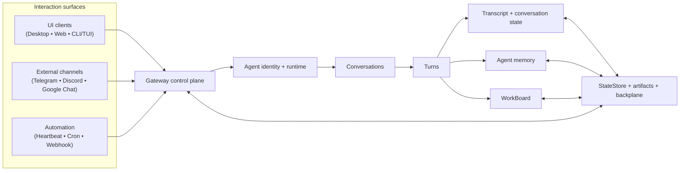

# Architecture

Tyrum is an autonomous worker platform built around one control plane, durable agent identities, conversation-scoped continuity, and turn-driven progress.

## Read this page

- **Read this if:** you are new to Tyrum and want the 5-minute system map.
- **Skip this if:** you already know the major boundaries and need mechanics details.
- **Go deeper:** start with [Target-state package graph](/architecture/target-state), [Gateway](/architecture/gateway), [Agent](/architecture/agent), [Messages and Conversations](/architecture/messages-conversations), and [ARCH-20 conversation and turn clean-break decision](/architecture/arch-20-conversation-turn-clean-break).

## System map

## Core boundaries

- **Gateway control plane:** owns transport, validation, auth, routing, durable turn coordination, approvals, and operator-facing APIs.
- **Agent runtime:** owns persona continuity through conversations, prompt assembly, tool use, memory recall, and work-state updates.
- **Conversations:** durable context boundaries that separate one UI thread, DM, group chat, heartbeat stream, or delegated child context from another.
- **Turns:** the only top-level unit of agent progress. A turn consumes prompt context, makes progress, and records durable outcomes.
- **Transcript and conversation state:** transcript is retained history; conversation state is the mutable continuity layer that survives compaction.
- **Memory and WorkBoard:** durable state outside the conversation transcript. Memory is agent-scoped. WorkBoard is workspace-scoped.

## Primary runtime flows

### Interactive flow

1. A surface event enters the gateway and is normalized into one typed message envelope.
2. The gateway resolves the target agent and conversation, appends durable history, and schedules the next turn.
3. The turn assembles prompt context from conversation state, memory, and work state.
4. The turn streams progress, updates durable state, and may create follow-up turns or child conversations.

### Background flow

1. Automation, approvals, external callbacks, or work-state signals target an existing conversation or create a dedicated child conversation.
2. The gateway schedules a turn in that conversation under the same durable rules as interactive work.
3. The turn updates transcript, conversation state, memory, and work state without switching into a second top-level activity model.

## Architecture posture

- **Conversation-first continuity:** context continuity is modeled through conversations.
- **Turn-driven progress:** progress is expressed as turns and durable state transitions.
- **Durable state over transcript-only:** transcript is retained history, but current truth lives in conversation state, memory, and WorkBoard.
- **Child conversations for isolation:** isolation is created by separate conversations when needed.

## Contributor contract

This architecture section documents the clean-break target model. New design and implementation work should align to this vocabulary even when current code still reflects older terms. For the live contributor package/layer contract, use [Target-state package graph](/architecture/target-state).

## Go deeper

- [Gateway](/architecture/gateway)
- [Agent](/architecture/agent)
- [Target-state package graph](/architecture/target-state)
- [Messages and Conversations](/architecture/messages-conversations)
- [Conversations and Turns](/architecture/conversations-turns)
- [Transcript, Conversation State, and Prompt Context](/architecture/transcript-conversation-state)
- [Protocol](/architecture/protocol)
- [Work board and delegated execution](/architecture/workboard)
- [Memory](/architecture/memory)
- [ARCH-20 conversation and turn clean-break decision](/architecture/arch-20-conversation-turn-clean-break)
