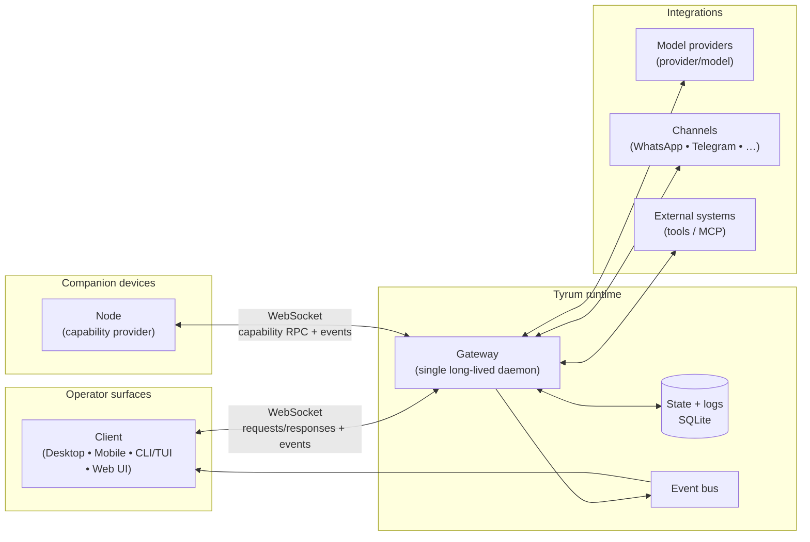

# Architecture

Status:

This section describes Tyrum's intended architecture. Some details may differ from the current implementation.

## High-level topology

## Building blocks

- **Gateway:** the long-lived process that owns connections, routing, validation, persistence, and orchestration.
- **Client:** an operator interface connected to the gateway (desktop/mobile/CLI/web).
- **Node:** a capability provider connected to the gateway (desktop/mobile/headless).
- **Protocol:** typed WebSocket messages (requests/responses and server-push events).
- **Contracts:** versioned schemas used to validate protocol messages and extension boundaries.

## Design principles

- **Local-first by default:** safe defaults assume localhost binding and explicit access control.
- **Typed boundaries:** inputs/outputs are validated at the edges (protocol, tools, plugins).
- **Least privilege:** capabilities and tools are scoped; high-risk actions require explicit policy/approvals.
- **Auditability:** important actions emit events and can be persisted for troubleshooting and compliance.
- **Extensible core:** tools, plugins, skills, and MCP servers extend behavior without changing the gateway core.

## Where to start

- [Gateway](./gateway/index.md)
- [Client](./client.md)
- [Node](./node.md)
- [Protocol](./protocol/index.md)
- [Glossary](./glossary.md)
