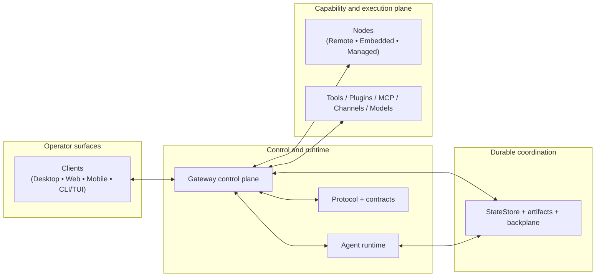

# Architecture

Tyrum is an autonomous worker platform built around one control plane, durable runtime state, and explicit safety boundaries for side effects.

## Read this page

- **Read this if:** you are new to Tyrum and want the 5-minute system map.
- **Skip this if:** you already know the major boundaries and need mechanics details.
- **Go deeper:** start with [Gateway](/architecture/gateway) and [Agent](/architecture/agent), then use the other architecture sections for protocol, client/node, and deployment behavior.

## System map

## Core boundaries

- **Gateway control plane:** owns transport, validation, routing, approvals, policy checks, and execution coordination.
- **Agent runtime:** owns persona continuity across turns through sessions, workspace state, memory, and work state.
- **Protocol and contracts:** define typed request/response/event boundaries between the gateway and peers.
- **Operator clients:** provide human oversight, steering, and approval decisions without owning capability execution.
- **Nodes:** provide device- or environment-specific capability execution behind pairing and policy boundaries.
- **Durability layer:** keeps state, evidence, and event delivery recoverable across restarts and scale changes.

## Primary runtime flows

### Interactive operator flow

1. A client connects to the gateway over the typed protocol and sends a request or message.
2. The gateway validates and routes the request into the agent runtime and, when needed, execution, approval, and node paths.
3. Progress and outcomes stream back as events, with durable state as source of truth.

### Durable background flow

1. The agent or automation layer captures work and hands it to the execution engine path.
2. The runtime coordinates tools, nodes, approvals, retries, and evidence through policy-aware execution.
3. Results are persisted and reflected back into agent state and operator surfaces.

## Architecture posture

- **Durable over transcript-only:** long-lived work and evidence are externalized instead of relying on prompt memory.
- **Explicit policy boundaries:** risky actions are approval- and policy-gated by runtime controls.
- **One logical model across deployment sizes:** local and clustered installs preserve the same runtime semantics.

## Go deeper

- [Gateway](/architecture/gateway)
- [Agent](/architecture/agent)
- [Protocol](/architecture/protocol)
- [Client](/architecture/client)
- [Node](/architecture/node)
- [Scaling and High Availability](/architecture/scaling-ha)
