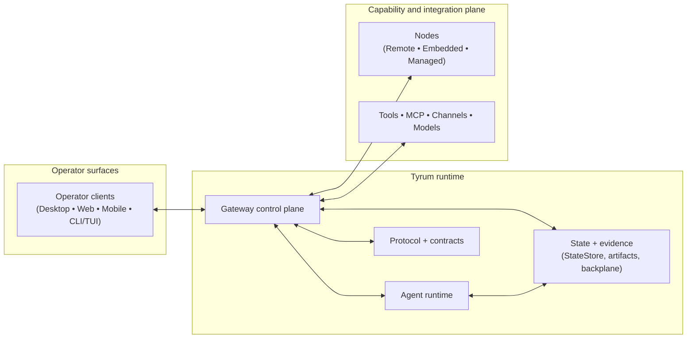

# Architecture

Tyrum is an autonomous worker platform built around a gateway, an agent runtime, and safety boundaries for execution, approvals, and audit evidence.

## Purpose

Tyrum is designed to scale from a local personal assistant to a shareable remote coworker without changing its core architectural promises. The same system should stay understandable and safe whether it is running on one laptop or across multiple processes and hosts.

The architecture is intentionally conservative. Tyrum favors durable state, explicit policy boundaries, resumable execution, and typed interfaces over optimistic prompt-only behavior. That bias is visible across the entire system: transport is typed, work is durable, risky actions are approval-gated, and observable evidence is preferred over narrative claims.

## Core building blocks

- **Gateway control plane:** Owns connectivity, routing, policy enforcement, approvals, execution coordination, and extension boundaries. See [Gateway](/architecture/gateway).
- **Agent runtime:** Owns the configured persona, workspace, memory, model selection, messages, and work state that make one Tyrum agent coherent over time. See [Agent](/architecture/agent).
- **Protocol and contracts:** Define the typed message surfaces and validation boundaries between the gateway, clients, and nodes. See [Protocol](/architecture/protocol).
- **Operator surfaces:** Let humans observe state, steer execution, review evidence, and resolve approvals across desktop, web, mobile, CLI, and TUI clients. Some hosts can also bootstrap embedded local nodes without collapsing the client/node boundary. See [Client](/architecture/client).
- **Capability providers:** Keep device-specific or environment-specific execution behind paired, authorized nodes instead of baking those interfaces into the gateway. That includes remote nodes, embedded local nodes, and gateway-managed sandbox nodes. See [Node](/architecture/node).
- **State, evidence, and deployment:** Provide the durable data, event delivery, and deployment coordination primitives that keep the system reliable in both local and clustered forms. See [Scaling and High Availability](/architecture/scaling-ha).

## High-level topology

## Primary runtime flows

### Interactive operator flow

1. A client connects to the gateway over the typed protocol and sends a request or message. Some hosts may also bootstrap an adjacent local node with its own node identity.
2. The gateway routes the request into the relevant agent runtime and, when needed, into the execution engine, approval/review pipeline, and node-dispatch path.
3. Progress, approvals, review state, and outcomes stream back to operator surfaces as events with durable state behind them.

### Durable background execution flow

1. The agent runtime or automation layer captures work and hands it to the execution engine.
2. The execution engine coordinates workers, tools, approvals, and evidence using durable state and policy checks.
3. Results are persisted, emitted as events, and reflected back into the agent's work state, memory, and operator surfaces.

## Key decisions and tradeoffs

- **Interactive control plane over WebSocket:** Tyrum optimizes for long-lived interactive control and event delivery rather than a request-only HTTP model.
- **Durable runtime over prompt memory:** Work state, approvals, and evidence are externalized so correctness does not depend on transcript recall.
- **Device capabilities outside the gateway:** Desktop, mobile, and other device-specific actions live behind nodes so the gateway stays policy-centric and deployable.
- **Capability boundaries survive co-location:** browser and mobile operator hosts may embed a node runtime, but capability execution still stays on the node side of the trust boundary.
- **One logical architecture across deployment sizes:** Single-host installs and clustered deployments keep the same core semantics, with coordination primitives present in both.

## Drill-down

- [Gateway](/architecture/gateway)
- [Agent](/architecture/agent)
- [Protocol](/architecture/protocol)
- [Client](/architecture/client)
- [Node](/architecture/node)
- [Scaling and High Availability](/architecture/scaling-ha)
