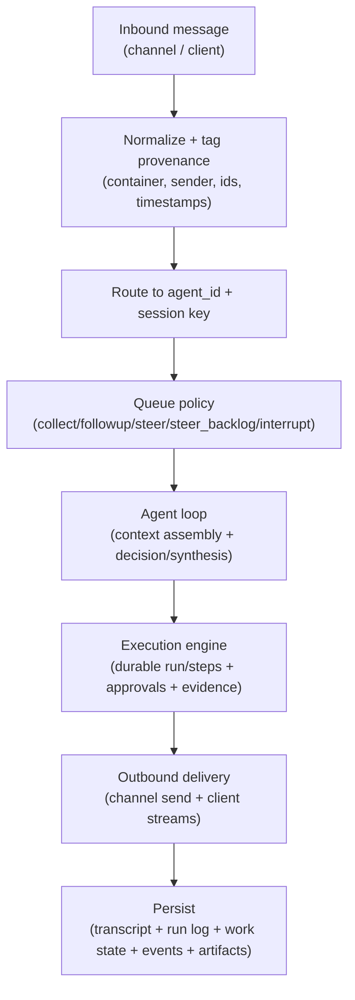

# Messages and Sessions

This document defines how Tyrum turns inbound messages into durable sessions and serialized execution, while keeping chat UX responsive and safe across channels.

## Message flow (end-to-end)



Key invariants:

- **Durable truth:** the StateStore is the source of truth for transcripts and run state.
- **Serialization:** at most one run executes per `(session_key, lane)` at a time (see [Sessions and Lanes](./sessions-lanes.md)).
- **Side effects are controlled:** outbound sends, filesystem, shell, and secret resolution are governed by policy/approvals/sandboxing, and produce audit evidence when feasible.

## Normalization (what every connector produces)

Channel connectors normalize inbound payloads into a small, typed envelope:

- **Container:** `dm | group | channel` plus provider-native ids (conversation/thread identifiers).
- **Sender identity:** stable sender id (and display labels where available).
- **Delivery identity:** connector/account identity (so multiple accounts on the same channel are distinct).
- **Message identity:** provider message id (or a derived stable id when missing), plus a receive timestamp.
- **Content:** text + attachments, with attachment metadata (type, size, hashes when available).
- **Provenance tags:** whether content is user-supplied, connector-supplied, tool-supplied, or system-supplied.

Connectors treat inbound content as **data**, not instructions. Provenance is preserved so policy can enforce rules such as “require approval before acting on web-derived content” or “deny outbound sends derived from untrusted sources without operator confirmation”.

## Sessions (durable conversation containers)

Sessions are durable conversation containers with stored transcripts and metadata. Session keys are stable and chosen by Tyrum, not by the model.

### Transcript source of truth

For channel-backed conversations, Tyrum keeps conversation content in more than one place on purpose, but those copies do not have equal authority:

- `sessions.turns_json` plus `sessions.summary` are the authoritative session context used for future model turns.
- `channel_inbox.payload_json` and `channel_inbox.reply_text` are transport/audit records for a specific inbound delivery.
- `channel_outbox.text` / `response_json` are delivery-side artifacts and may be chunked, retried, failed, or deleted after send.

Transport tables are therefore useful for debugging and best-effort repair, but they are not the canonical conversation state. Queue cleanup and outbox delivery may delete rows, so the runtime must continue to work even when transport logs are incomplete.

When retained channel logs disagree with session context, repair should rebuild the bounded turn window from transport history without discarding authoritative summarized context. Tyrum exposes this as `/repair [max_turns]`, which reconstructs `sessions.turns_json` from completed `channel_inbox` rows, folds any repaired overflow into the existing `sessions.summary`, prefers `reply_text`, and falls back to ordered outbox chunks when needed.

### Retention contract

The session/message retention contract is explicit:

- `sessions.turns_json` is bounded by agent config `sessions.max_turns`; older turns are compacted into `sessions.summary`.
- `sessions.summary` is itself bounded by the compaction caps, so session context does not grow without limit after repeated compactions.
- Inactive sessions are cleaned up by agent config `sessions.ttl_days` during active turns, and by deployment config `lifecycle.sessions.ttlDays` as a background sweep (default `30`); together they make the effective inactivity window explicit.
- Failed channel transport rows are retained for deployment config `lifecycle.channels.terminalRetentionDays` days (default `7`).
- Completed `channel_inbox` rows are only deleted after their dependent `channel_outbox` rows are gone, so repair/debug reads stay safe while delivery work still exists.
- Successful `channel_outbox` rows are deleted immediately after send; they are not part of the durable transcript contract.

### DM isolation (secure by default for multi-user inboxes)

Tyrum isolates direct-message context by default when more than one distinct sender can reach an agent via DMs. This prevents cross-user context leakage.

Session key selection follows a **DM scope** policy:

- `shared` (single-user continuity): all DMs for an agent/channel collapse into a shared key.
- `per_peer` (secure DM mode): each sender gets an isolated DM session.
- `per_channel_peer`: isolate by `(channel, sender)`.
- `per_account_channel_peer`: isolate by `(account, channel, sender)` for multi-account inboxes.

Identity linking can optionally map multiple provider sender ids to a canonical identity so the same person shares a DM session across channels when using the per-peer modes.

Identity links are stored in the StateStore table `peer_identity_links`.

The exact key formats are defined in [Sessions and Lanes](./sessions-lanes.md).

## Inbound dedupe (don’t run twice)

Channels can redeliver the same inbound message after reconnects and retries. Tyrum prevents duplicate runs by deduping inbound deliveries before they enqueue work.

Dedupe is keyed by stable identifiers, typically:

- `(channel, account_id, container_id, message_id)`

Dedupe entries are time-bounded (TTL) and stored in a way that remains correct under clustered gateway edges. When a duplicate delivery is detected, Tyrum records an audit event and drops the duplicate without starting another run.

Architecture notes:

- Inbound dedupe keys are persisted durably and pruned under a configurable TTL.

## Inbound debouncing (batch rapid bursts)

Rapid consecutive messages from the same sender/container are batched into a single agent turn using a per-container debounce window:

- Text-only messages arriving within the window are appended to a single “batched input”.
- Attachments flush immediately (no batching) to preserve ordering and evidence.
- Standalone control commands bypass debouncing so operator actions stay responsive.

Debouncing reduces unnecessary model calls while preserving the visible ordering of user intent.

## Queueing semantics (when a run is already active)

When a run is active for a `(session_key, lane)`, inbound messages are handled by an explicit queue mode. Queueing is lane-aware so automation lanes do not trample interactive lanes.

### Queue modes

- **`collect` (default):** coalesce queued messages into a single follow-up turn after the active run ends.
- **`followup`:** enqueue each message as its own follow-up turn (preserves turn-by-turn granularity).
- **`steer`:** inject the new message into the in-flight run at the next tool boundary and cancel pending tool calls for the current assistant message.
- **`steer_backlog`:** steer now and also preserve the message for a follow-up turn.
- **`interrupt`:** abort the active run (at the next safe boundary) and run the newest message.

Architecture notes:

- Queue mode is persisted with the inbound message so queueing behavior is deterministic under retries and restarts.
- `steer` and `interrupt` are represented as durable lane-scoped signals so they remain correct across restarts and multi-instance edges.

### Queue limits and overflow policy

Queueing is bounded to keep the system predictable:

- `cap`: maximum queued items per `(session_key, lane)`.
- `debounce_ms`: quiet-time window used by `collect` to batch bursts into one follow-up.
- `overflow`: what happens when `cap` is exceeded:
  - `drop_oldest`
  - `drop_newest`
  - `summarize_dropped` (creates a synthetic follow-up message that summarizes the dropped items)

Architecture notes:

- Queue bounds (`cap`) and overflow behavior are configurable per deployment.
- Overflow emits a structured event (for example `channel.queue.overflow`) so operators can see when messages were dropped or summarized.

### Interaction with execution guarantees

Queued follow-ups are represented as durable jobs/runs in the execution engine. Side-effecting operations inside the active run remain governed by:

- per-step idempotency keys
- approvals (pause/resume)
- sandbox/policy enforcement
- evidence capture and postconditions (when feasible)

`steer` and `interrupt` are conservative: they only take effect at safe boundaries and never violate the “one run per `(session_key, lane)`” invariant.

## Loop control (avoid runaway execution)

Tyrum uses multiple layers of loop control, because there is no single knob that is correct for every failure mode:

- **Per-turn step budget:** the agent runtime enforces a maximum number of model/tool steps per turn (a hard cap).
- **Within-turn loop detection:** if the model repeats the same tool-call patterns (for example calling the same tool with the same args in a tight loop), the runtime stops the turn early and returns an explicit “loop detected” response.
- **Cross-turn repetition warning:** if the assistant reply repeats itself across multiple turns in the same session, Tyrum appends a short warning to prompt the operator/user to change constraints. This is **warning-only** (it does not block execution).
- **Session context retention (`sessions.max_turns`):** this bounds how many recent user/assistant messages are retained in the session context before compaction; it is **not** an execution limiter.

Loop detection configuration lives in agent configuration under `sessions.loop_detection`.

Configuration (example):

```yaml
sessions:
  loop_detection:
    within_turn:
      enabled: true
      consecutive_repeat_limit: 3
      cycle_repeat_limit: 3
    cross_turn:
      enabled: true
      window_assistant_messages: 3
      similarity_threshold: 0.97
      min_chars: 120
      cooldown_assistant_messages: 6
```

Notes:

- “Within-turn” looks at repeated **tool-call signatures** (tool name + canonicalized args) and stops early.
- “Cross-turn” compares assistant reply text against recent assistant replies and only appends a warning.

## Outbound delivery (clients vs channels)

Tyrum delivers outputs to two audiences:

### Operator clients (WebSocket streams)

Operator clients receive server-push events for:

- run/step lifecycle (queued/running/paused/resumed/completed)
- tool execution progress
- approvals requested/resolved
- artifacts created/attached/fetched
- assistant output deltas and final replies (when streaming is enabled)

These streams are typed, at-least-once, and deduplicated by ids.

### Channels (chat surfaces)

Outbound channel sends are treated as **side effects**:

- They carry explicit idempotency keys so retries do not duplicate messages.
- They are eligible for approval gates (for example “message new recipient”, “message derived from untrusted content”, or “high-cost broadcast”).
- They produce audit events and, when applicable, evidence artifacts (provider receipts, message ids, rendered payloads).

## Streaming, typing, and pacing

Tyrum supports user-facing responsiveness without sacrificing determinism:

- **Block streaming (channels):** long replies can be emitted in coarse, completed blocks instead of waiting for the final message.
- **Typing indicators:** connectors can send “typing…” signals while a run is active, with configurable start modes and refresh cadence.
- **Human pacing:** optional small delays between streamed blocks to reduce “spammy” multi-message bursts.

Streaming and typing never override safety: policy/approvals still gate side effects, and streaming output is subject to redaction and size limits.

### Typing modes

Typing start behavior is explicit and policy-driven:

- `never` — do not emit typing indicators.
- `message` — start typing when the first non-silent assistant text is produced.
- `thinking` — start typing when reasoning/thinking output begins (when supported).
- `instant` — start typing as soon as a run is accepted for the session/lane.

Typing refresh cadence is bounded and disabled for non-interactive automation lanes unless explicitly enabled.

Architecture notes:

- Typing start mode is configurable per connector.
- Typing refresh cadence is configurable and bounded.
- Typing indicators are disabled by default for non-interactive automation lanes unless explicitly enabled.

## Markdown formatting and chunking (channel-safe)

Tyrum preserves consistent formatting across channels by chunking **before** rendering into channel-specific markup:

1. Parse assistant Markdown into a neutral IR (text + spans for styles/links).
2. Chunk the IR into channel-sized blocks without breaking inline formatting or code fences.
3. Render each chunk into the channel’s supported format (or fall back to plain text).

Details: [Markdown Formatting](./markdown-formatting.md).
