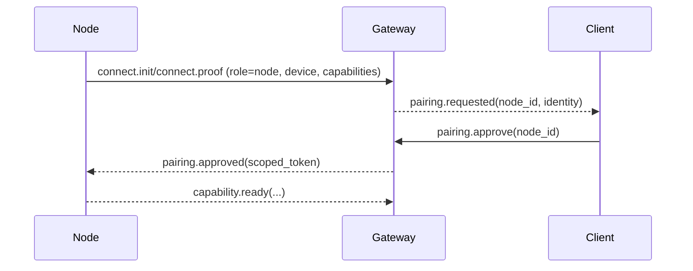

# Node

A node is a companion runtime that connects to the gateway with `role: node` and exposes capabilities (for example `camera.*`, `canvas.*`, `system.*`). Nodes let Tyrum safely use device-specific interfaces without baking that logic into the gateway.

## Node forms

- Desktop app (Windows/Linux/macOS)
- Mobile app (iOS/Android)
- Headless node (server or embedded device)

## Responsibilities

- Establish a single WebSocket connection per node device identity (`role: node`).
- Advertise supported capabilities and capability versions.
- Execute capability requests and return results/evidence.
- Maintain local device permissions (OS prompts, user consent) as needed.

## Pairing posture

- Nodes connect using a public-key device identity and prove possession of the private key during handshake.
- On first contact, the gateway creates a pairing request for the node device.
- Local nodes can be auto-approved by explicit policy; remote nodes require an explicit operator approval.
- Pairing results in a scoped authorization (for example a node-scoped token and a capability allowlist) that can be revoked.

## Trust and capability scope

Pairing binds a node device identity to an explicit authorization record:

- trust level (for example local vs remote)
- capability allowlist (specific capability names/versions)
- optional labels (operator-defined)

Capability execution requests are authorized against the node’s pairing record and the effective policy snapshot for the run.

## Revocation

Revocation removes the pairing authorization and invalidates scoped tokens. A revoked node can reconnect, but it cannot execute capabilities until re-paired.
