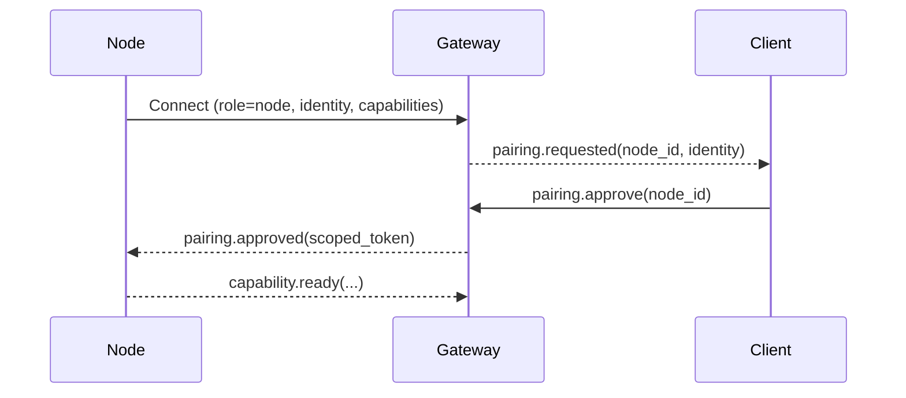

# Node

Status:

A node is a companion runtime that connects to the gateway with `role: node` and exposes capabilities (for example `camera.*`, `canvas.*`, `system.*`). Nodes let Tyrum safely use device-specific interfaces without baking that logic into the gateway.

## Node forms

- Desktop app (Windows/Linux/macOS)
- Mobile app (iOS/Android)
- Headless node (server or embedded device)

## Responsibilities

- Establish a single WebSocket connection per node device identity (`role: node`).
- Advertise supported capabilities and capability versions.
- Execute capability requests and return results/evidence.
- Maintain local device permissions (OS prompts, user consent) as needed.

## Pairing posture (default)

- First connect presents a device identity; the gateway creates a pairing request.
- Local nodes can be auto-approved; remote nodes require an explicit operator approval.
- Pairing results in a scoped authorization that can be revoked.

