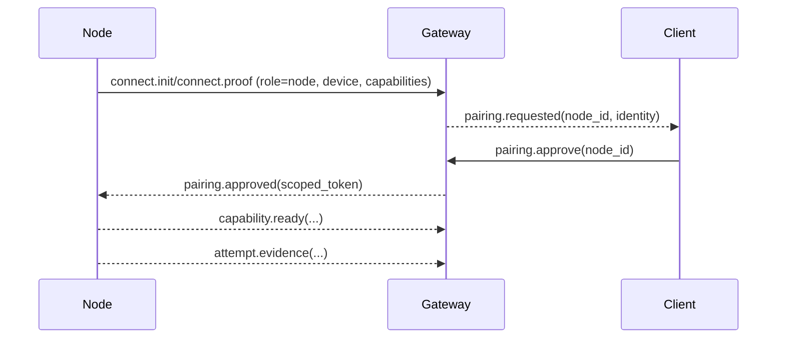

# Node

A node is a companion runtime that connects to the gateway with `role: node` and exposes capabilities (for example `camera.*`, `canvas.*`, `system.*`). Nodes let Tyrum safely use device-specific interfaces without baking that logic into the gateway.

## Integration quality bar

Nodes are “remote hands”, so Tyrum treats node capabilities as high-risk by default. Node capabilities meet an integration quality bar:

- **Explicitly authorized:** pairing + policy decide what a node may do.
- **Approval-gated:** state-changing or privacy-impacting actions can be paused behind approvals.
- **Evidence-backed:** capability results should include durable evidence/artifacts when feasible.

## Node forms

- Desktop app (Windows/Linux/macOS)
- Mobile app (iOS/Android)
- Headless node (server or embedded device)

## Responsibilities

- Establish a single WebSocket connection per node device identity (`role: node`).
- Advertise supported capabilities and capability versions.
- Execute capability requests and return results/evidence.
- Maintain local device permissions (OS prompts, user consent) as needed.

## Desktop OCR (pixel query)

For pixel-mode `Desktop.query` text search, the desktop node runs OCR locally and returns bounded
`{ text, bounds, confidence? }` matches (screenshot coordinate space) so agents can locate UI targets
without embedding full screenshots in tool outputs.

Implementation choice: **WASM OCR** (`tesseract.js`) is preferred over system binaries so the desktop
node works out-of-the-box across macOS/Windows/Linux.

Tradeoffs:

- Pros: no OS-level packages; cross-platform; worker can be cached per process.
- Cons: first call can be slow (worker init + language data); OCR accuracy varies by font/locale.

Configuration:

- `TYRUM_DESKTOP_OCR_TIMEOUT_MS` (default 10s; max 60s)
- `TYRUM_DESKTOP_OCR_LANG` (default `eng`)
- `TYRUM_DESKTOP_OCR_LANG_PATH` (optional override for offline/local language data)

## Pairing posture

- Nodes connect using a public-key device identity and prove possession of the private key during handshake.
- When a node connects and is not yet paired, the gateway creates a pairing request for the node device.
- Local nodes can be auto-approved by explicit policy; remote nodes require an explicit operator approval.
- Pairing results in a scoped authorization (for example a node-scoped token and a capability allowlist) that can be revoked.

After pairing approval, nodes SHOULD report which capabilities are currently ready to execute via `capability.ready` (for example after verifying OS permissions, local dependencies, or warmup).

During capability execution, nodes MAY stream operator-visible evidence for a given attempt via `attempt.evidence` so UIs and audits can observe progress without polling.

## Trust and capability scope

Pairing binds a node device identity to an explicit authorization record:

- trust level (for example local vs remote)
- capability allowlist (specific capability names/versions)
- optional labels (operator-defined)

Capability execution requests are authorized against the node’s pairing record and the effective policy snapshot for the run. Authorization is deny-by-default:

- the gateway only dispatches a capability request to a node when the node’s pairing `capability_allowlist` includes the required capability descriptor, and
- when tool policy is enabled, node dispatch is additionally gated by the effective policy snapshot (`tool_id: tool.node.dispatch`).

## Revocation

Revocation removes the pairing authorization and invalidates scoped tokens. A revoked node can reconnect, but it cannot execute capabilities until re-paired.
