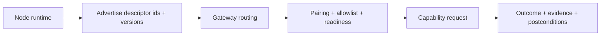

# Capabilities

Read this if: you need the contract between gateway routing and what a node can actually execute.

Skip this if: you only need the high-level node trust boundary; start with [Node](/architecture/node).

Go deeper: [Node](/architecture/node), [Handshake](/architecture/protocol/handshake), [Events](/architecture/protocol/events).

A capability is the typed interface a node advertises to the gateway. It is the boundary between requested intent and device-local execution.

## Capability contract

Each capability combines:

- a descriptor id and version
- typed operations and payloads
- evidence outputs for audit
- postconditions where state changes need verification
- explicit permissions and allowlist boundaries

The gateway should reason about concrete descriptors, not vague device access.

## Advertisement and routing model

- Nodes advertise versioned descriptors during handshake and readiness updates.
- The gateway can normalize older umbrella descriptors into concrete routing targets.
- Dispatch happens only when the node is paired, allowlisted for that descriptor, and ready.
- Managed node forms can start from narrower descriptor sets than standalone nodes.

That routing rule is the safety boundary: a connected node is not automatically allowed to execute every operation it knows how to perform.

## Common families

- **Browser**: geolocation, camera, microphone
- **iOS / Android**: current location, photo capture, audio capture
- **Desktop**: screenshot, snapshot, query, act, input, wait-for

These families map onto typed request/response schemas shared from `@tyrum/schemas`, so gateway routing and node implementations stay aligned.

## Why this boundary matters

- descriptor-level allowlists make pairing and revocation meaningful
- evidence and postconditions keep high-risk capabilities observable
- typed operations prevent gateway/node behavior from drifting into ad hoc RPC

## Related docs

- [Node](/architecture/node)
- [Handshake](/architecture/protocol/handshake)
- [Requests and Responses](/architecture/protocol/requests-responses)
- [Events](/architecture/protocol/events)
