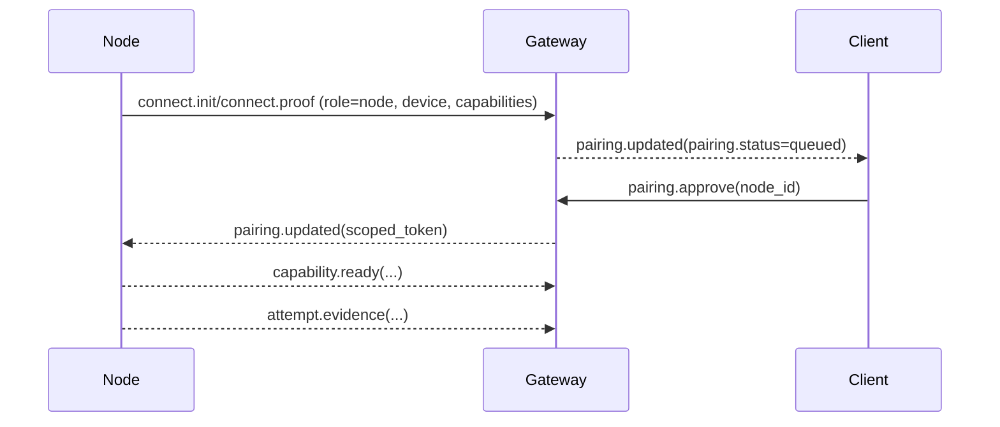

# Node

A node is a companion runtime that connects to the gateway with `role: node` and exposes authorized capabilities such as desktop automation, browser APIs, mobile sensors, camera access, or other device-local execution.

## Mission

Nodes exist so Tyrum can use device-specific or environment-specific capabilities without collapsing those concerns into the gateway. They provide the execution boundary for high-risk local interfaces while keeping policy and routing centralized.

## Integration quality bar

Nodes are "remote hands", so Tyrum treats node capabilities as high-risk by default. Node capabilities should be:

- **Explicitly authorized:** pairing and policy decide what a node may do.
- **Approval-gated:** state-changing or privacy-impacting actions can pause behind approvals.
- **Evidence-backed:** capability results should include durable evidence or artifacts when feasible.

## Node forms

Nodes can run on a variety of devices:

- Desktop node (Windows/Linux/macOS)
- Browser node (web host exposing browser APIs such as location, camera, and microphone)
- Mobile node (iOS/Android)
- Gateway-managed desktop environment node (sandboxed desktop runtime bootstrapped by the gateway)
- Headless node (server or embedded device)

Browser and mobile nodes are often embedded in operator hosts, but they still connect and are governed as nodes. See [Embedded Local Nodes](/architecture/client/embedded-local-nodes). Gateway-managed sandbox nodes are described in [Desktop Environments](/architecture/gateway/desktop-environments).

## Responsibilities

- Establish a node identity and connect to the gateway as a capability provider.
- Advertise supported capabilities and capability versions.
- Execute authorized capability requests and return typed results and evidence.
- Manage local permissions and runtime readiness on the node device.

## Non-responsibilities

- Nodes do not own global orchestration, approvals, or operator UX; the gateway and clients own those concerns.
- Nodes do not bypass gateway authorization by self-dispatching work.

## Boundary and ownership

- **Inside the boundary:** device-local execution, OS permissions, capability readiness, and evidence generation.
- **Outside the boundary:** pairing policy, global routing, durable orchestration, and operator-facing oversight.

## Internal building blocks

- **Pairing and authorization:** device identity, scoped authorization, and revocation handling.
- **Capability advertisement:** stable descriptions of what the node can execute.
- **Capability execution:** local device/system calls plus evidence capture and readiness checks.
- **Bootstrap/orchestration hooks:** optional host-provided bootstrap material for embedded or gateway-managed nodes without relaxing the node trust boundary.

## Inputs, outputs, and dependencies

- **Inputs:** pairing flows, capability RPC, policy-gated execution requests, local OS permission prompts, and optional host-provided bootstrap material for embedded or managed runtimes.
- **Outputs:** capability results, evidence artifacts, readiness signals, and error/failure reports.
- **Dependencies:** gateway control plane, protocol/contracts, pairing records, and local device/runtime APIs.

## Specialized capability notes

### Desktop OCR (pixel query)

For pixel-mode `Desktop.query` text search, the desktop node runs OCR locally and returns bounded `{ text, bounds, confidence? }` matches in screenshot coordinate space so agents can locate UI targets without embedding full screenshots in tool outputs.

When `selector.bounds` is provided, OCR matches are filtered to those whose bounds intersect the requested region.

Architecture notes:

- Prefer self-contained, cross-platform OCR runtimes over system binaries so the desktop node works out of the box across macOS, Windows, and Linux.

Tradeoffs:

- Pros: no OS-level packages, cross-platform behavior, and process-local worker caching.
- Cons: first call can be slow because of worker initialization and language data loading, and OCR accuracy varies by font and locale.

## Invariants and constraints

- Nodes are deny-by-default and only execute capabilities they are paired and authorized for.
- Device-local execution must remain observable and evidence-backed when feasible.
- Capability execution is a trusted boundary and must not be conflated with operator clients.

## Pairing posture

- Nodes connect using a public-key device identity and prove possession of the private key during handshake.
- When a node connects without an active pairing record, the gateway creates a pairing request for the node device.
- Local nodes can be auto-approved by explicit policy; remote nodes require explicit operator approval.
- Pairing results in a scoped authorization such as a node-scoped token and a capability allowlist that can later be revoked.
- Embedded local nodes may be bootstrapped by an operator host, and gateway-managed desktop environments may be approved by explicit management policy, but both still resolve to durable pairing records and capability allowlists.

After pairing approval, nodes should report which capabilities are ready to execute via `capability.ready` after verifying OS permissions, local dependencies, or warmup.

During capability execution, nodes may stream operator-visible evidence for a given attempt via `attempt.evidence` so UIs and audits can observe progress without polling.

## Failure and recovery

- **Failure modes:** permission denial, local dependency issues, disconnects, and capability-specific runtime failures.
- **Recovery model:** reconnect, re-advertise readiness, and re-enter the paired authorization flow when needed.

## Security and policy boundaries

- Node execution is policy-gated and often approval-gated because it touches high-risk local interfaces.
- Scoped authorization and capability allowlists define what a node may do.
- Revocation must take effect durably so a reconnect alone does not restore unauthorized access.

## Trust and capability scope

Pairing binds a node device identity to an explicit authorization record:

- trust level (for example local vs remote)
- capability allowlist (specific capability names and versions)
- optional operator-defined labels

Managed node forms may start from a narrower initial allowlist than standalone nodes. For example, gateway-managed desktop environments are expected to receive a bounded desktop capability allowlist rather than inheriting broad device access.

Capability execution requests are authorized against the node's pairing record and the effective policy snapshot for the run. Authorization is deny-by-default: the gateway only dispatches a capability request to a node when that node is allowed to execute it.

## Revocation

Revocation removes the pairing authorization and invalidates scoped tokens. A revoked node can reconnect, but it cannot execute capabilities until it is re-paired.

## Key decisions and tradeoffs

- **Capabilities behind nodes, not clients:** Tyrum keeps execution boundaries separate from operator surfaces.
- **Pairing as an explicit trust boundary:** node trust is a durable authorization decision, not an implicit connection property.
- **Evidence-backed execution:** node capabilities should return enough durable evidence for operators and audits to understand what happened.

## Drill-down

- [Architecture](/architecture)
- [Embedded Local Nodes](/architecture/client/embedded-local-nodes)
- [Desktop Environments](/architecture/gateway/desktop-environments)
- [Capabilities](/architecture/capabilities)
