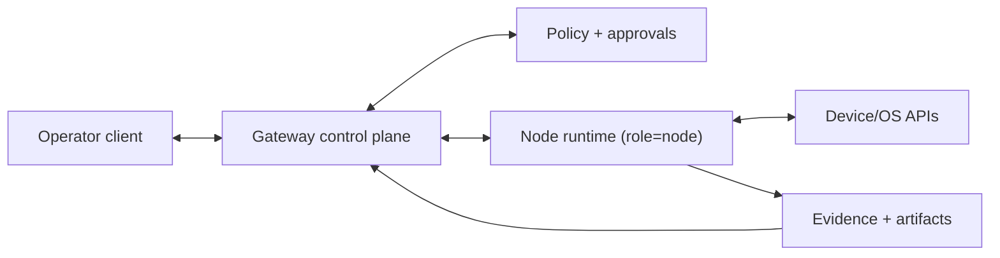

# Node

Read this if you want the trust boundary for device and environment capabilities. Skip this if you need exact capability descriptors and payload contracts; use the drill-down docs.

A node is a companion runtime that connects to the gateway with `role: node` and executes authorized device-local capabilities (desktop, browser, mobile, or headless environments).

## What This Page Covers

- Why nodes exist as a separate trust boundary.
- Pairing + authorization posture for capability dispatch.
- Primary lifecycle from connect to capability-ready execution.

## Node forms

Nodes can run on a variety of devices:

- Desktop node (Windows/Linux/macOS)
- Browser node (web host exposing browser APIs such as location, camera, and microphone)
- Mobile node (iOS/Android)
- Gateway-managed desktop environment node (sandboxed desktop runtime bootstrapped by the gateway)
- Headless node (server or embedded device)

Browser and mobile nodes are often embedded in operator hosts, but they still connect and are governed as nodes. See [Embedded Local Nodes](/architecture/client/embedded-local-nodes). Gateway-managed sandbox nodes are described in [Desktop Environments](/architecture/gateway/desktop-environments).

## Boundary

- **Inside node ownership:** local permissions/readiness checks, capability execution, and evidence generation.
- **Outside node ownership:** global routing, policy decisions, and operator UI orchestration.

## Primary Flow

1. Node connects with device identity and proves posconversation of private key material.
2. Gateway applies pairing posture (auto-approved local policy or explicit operator approval).
3. Node receives scoped authorization and advertises capability readiness.
4. Gateway dispatches only allowlisted, policy-compatible capability requests.
5. Node returns typed outcomes and operator-visible evidence.

## Pairing and Capability Posture

- Nodes are deny-by-default and execute only paired/allowlisted capabilities.
- High-risk or state-changing actions can pause behind approvals.
- Revocation is durable: reconnect alone cannot restore revoked access.
- Managed node forms can start with narrower capability allowlists than standalone nodes.

## Invariants

- Client hosts and node runtimes remain separate peers even when co-located.
- Capability dispatch always flows through gateway policy and pairing checks.
- Evidence should be emitted for high-impact operations when feasible.

## Failure and Recovery

- **Common failures:** permission denial, local dependency/runtime failure, disconnect/reconnect churn.
- **Recovery posture:** reconnect, re-advertise readiness, and re-enter pairing flow when authorization is missing or revoked.

## Not In Scope Here

- Full capability descriptor catalogs and operation payloads.
- Detailed pairing event contracts and review pipelines.
- Desktop automation operation semantics such as OCR/query/act specifics.

## Drill-down

- [Architecture](/architecture)
- [Embedded Local Nodes](/architecture/client/embedded-local-nodes)
- [Desktop Environments](/architecture/gateway/desktop-environments)
- [Capabilities](/architecture/capabilities)
- [Handshake](/architecture/protocol/handshake)
- [Events](/architecture/protocol/events)
