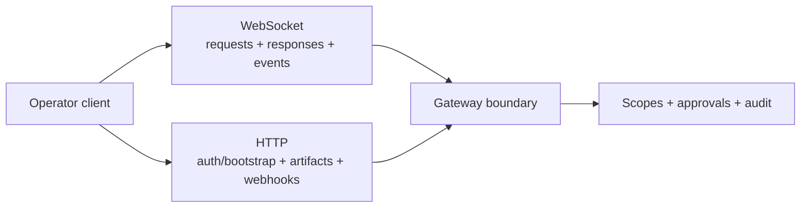

# API surfaces (WebSocket vs HTTP)

Read this if: you need the transport boundary between interactive control and resource-oriented HTTP access.

Skip this if: you are looking for exact request/event payloads; use the protocol reference pages first.

Go deeper: [Protocol](/architecture/protocol), [Contracts](/architecture/contracts), [Requests and Responses](/architecture/protocol/requests-responses).

The gateway is not WebSocket-only. Tyrum uses WebSocket for the interactive control plane and HTTP for resource/bootstrap surfaces, but scopes and per-method authorization remain the real boundary.

## What each surface is for

- **WebSocket** is the control plane: long-lived interaction, server-push events, heartbeats, and low-latency operator actions.
- **HTTP** is the resource plane: auth/session bootstrap, artifact upload/download, callback/webhook ingress, and one-shot snapshots.

Transport is a delivery choice, not a trust model.

## Core rule: scopes, not transport

- The same operator can use both HTTP and WebSocket.
- Whether an action is allowed depends on scopes, approvals, and policy.
- Both HTTP routes and WS request types must validate inputs and enforce authz deny-by-default.

Do not define "admin" or "operator" by transport.

## When WebSocket is the right choice

Use WebSocket when the UX benefits from a single live connection carrying:

- typed mutations
- immediate server-push state changes
- interactive timelines such as runs, approvals, pairing, or presence

In practice, most operator-facing control should stay on WebSocket even if some backing reads use HTTP.

## When HTTP is the right choice

Use HTTP for:

- browser-native auth/session bootstrap
- large blobs such as artifacts
- inbound webhooks and third-party callbacks
- simple snapshot/status reads

HTTP paths should still update durable state so WebSocket-connected clients see consistent state transitions.

## Avoid dual-surface drift

Do not implement the same mutation twice unless there is a strong reason. If a capability spans both transports, keep one business-logic implementation and make transport adapters match on authz, validation, audit, and semantics.

## Related docs

- [Protocol](/architecture/protocol)
- [Contracts](/architecture/contracts)
- [Handshake](/architecture/protocol/handshake)
- [Requests and Responses](/architecture/protocol/requests-responses)
