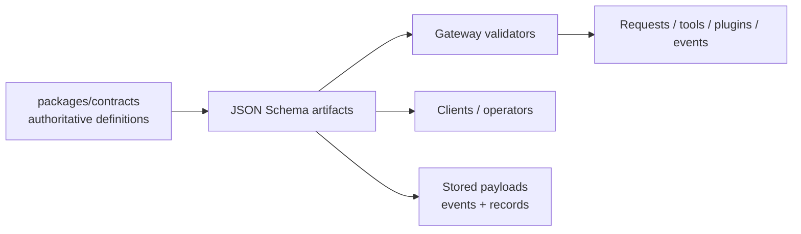

# Contracts

Read this if: you need to know where interface truth lives and how Tyrum keeps wire/storage/tool surfaces aligned.

Skip this if: you only need the high-level protocol picture; start with [Protocol](/architecture/protocol).

Go deeper: [Protocol](/architecture/protocol), [API surfaces (WebSocket vs HTTP)](/architecture/api-surfaces), `packages/contracts`.

Contracts are the schema authority for Tyrum interfaces. They keep protocol messages, tool surfaces, plugin manifests, and persisted payloads machine-valid and interoperable.

## What contracts do

Contracts define the shapes and semantics for:

- WebSocket requests, responses, and events
- tool inputs and outputs
- plugin registration surfaces
- stored payloads that must remain interpretable over time

When prose and schema disagree, schema wins.

## Source of truth and distribution

The canonical contract definitions live in `packages/contracts`. During build, Tyrum exports JSON Schema artifacts such as per-schema `*.json` files and a `catalog.json` index. The gateway publishes those artifacts so clients and operators can fetch the exact machine-readable definitions.

## Contract properties

- **Language-agnostic:** usable outside the TypeScript codebase
- **Versioned:** compatibility is explicit
- **Machine-validated:** trust boundaries enforce them at runtime

JSON Schema is the main interchange format, even if the source definitions begin as typed code-level schemas.

## Versioning model

- backward-compatible changes stay within a major version
- breaking changes require a new major version for the affected contract family
- for protocol traffic, the WebSocket subprotocol carries the major line and `protocol_rev` handles feature gating within it

## Core contract families

- protocol envelopes and operations
- execution and approval records
- artifacts and postconditions
- nodes, pairing, and capabilities
- policy bundles and decision outputs
- tools, playbooks, and plugin manifests

The important architectural point is not the catalog size. It is that validation, distribution, and compatibility all come from one schema authority instead of ad hoc runtime conventions.

## Related docs

- [Protocol](/architecture/protocol)
- [API surfaces (WebSocket vs HTTP)](/architecture/api-surfaces)
- [Requests and Responses](/architecture/protocol/requests-responses)
- [Events](/architecture/protocol/events)
