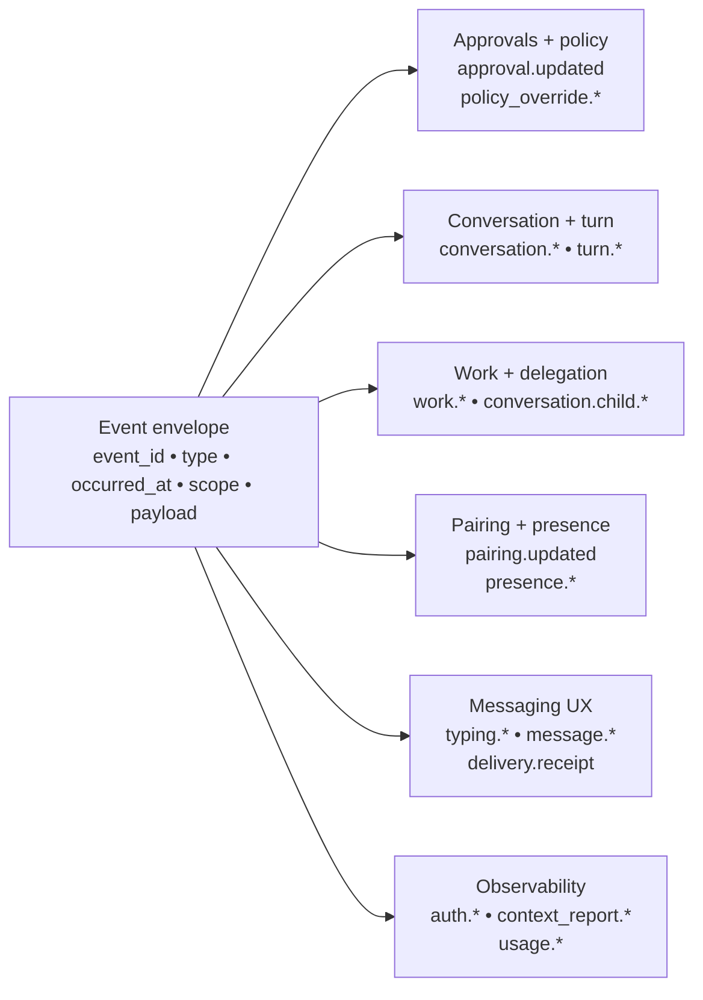

# Events

This is a protocol reference page for Tyrum's server-push event surface. It is intentionally contract-heavy and should be read after the [Protocol overview](/architecture/protocol).

The wire shapes are defined by shared, versioned contracts (see [Contracts](/architecture/contracts)).

## Quick orientation

- **Read this if:** you are implementing event producers/consumers, reviewing replay behavior, or validating event payload contracts.
- **Skip this if:** you are still building a mental model of gateway/protocol architecture; start at [Protocol](/architecture/protocol) first.
- **Go deeper:** use [Backplane](/architecture/backplane) for cluster delivery mechanics and `packages/contracts` for authoritative payload definitions.

## Event family map

## Parent concepts

- [Protocol](/architecture/protocol)
- [Approvals](/architecture/approvals)
- [Node](/architecture/node)

## Event envelope

For current event names and payloads, treat the schema exports in `packages/contracts` as authoritative. This page documents the target contract for operator and implementation guidance.

- `event_id`: unique id for dedupe.
- `type`: event name (for example `turn.updated`, `approval.updated`, `artifact.created`, `capability.ready`).
- `occurred_at`: timestamp.
- `scope`: routing scope (global, agent, conversation, turn, node, or client).
- `payload`: typed fields defined by a contract.

## Common event categories

- **Connection lifecycle:** connected/disconnected, heartbeat timeouts.
- **Presence:** gateway/client/node presence upserts, prunes, and snapshots.
- **Pairing:** node pairing state changes, including approval and revocation.
- **Approvals:** approval state changes, expiry, and linked policy override lifecycle.
- **Conversation and turn lifecycle:** conversation created/updated plus turn queued/active/blocked/completed/failed/cancelled.
- **Evidence:** artifacts captured or attached and postcondition outcomes.
- **Work and delegation:** WorkItems, WorkBoard drilldown, and child-conversation lifecycle.
- **Messaging UX:** typing indicators, outbound delivery receipts, and formatting fallbacks.
- **Observability:** context reports, usage snapshots, and provider quota polling status.

## Event catalog (target)

### Approvals and policy

- `approval.updated` - `{ approval: Approval }`
- `policy_override.created` - `{ override: PolicyOverride }`
- `policy_override.revoked` - `{ override: PolicyOverride }`
- `policy_override.expired` - `{ override: PolicyOverride }`

### Conversation and turn lifecycle

- `conversation.created` - `{ conversation }`
- `conversation.updated` - `{ conversation }`
- `conversation.state.updated` - `{ conversation_id, updated_at }`
- `turn.queued` - `{ turn_id, conversation_id }`
- `turn.started` - `{ turn_id, conversation_id }`
- `turn.blocked` - `{ turn_id, conversation_id, reason, approval_id? }`
- `turn.resumed` - `{ turn_id, conversation_id }`
- `turn.completed` - `{ turn_id, conversation_id }`
- `turn.failed` - `{ turn_id, conversation_id }`
- `turn.cancelled` - `{ turn_id, conversation_id, reason? }`
- `turn.updated` - `{ turn }`
- `artifact.created` - `{ artifact: ArtifactRef }`
- `artifact.attached` - `{ artifact: ArtifactRef, turn_id }`
- `artifact.fetched` - `{ artifact: ArtifactRef, fetched_by }`

### Work and delegation

- `work.item.created` / `work.item.updated` / `work.item.blocked` / `work.item.completed` / `work.item.cancelled` - `{ item: WorkItem }`
- `work.task.started` - `{ work_item_id, task_id, conversation_id }`
- `work.task.blocked` - `{ work_item_id, task_id, approval_id? }`
- `work.task.completed` - `{ work_item_id, task_id, result_summary? }`
- `work.artifact.created` - `{ artifact: WorkArtifact }`
- `work.decision.created` - `{ decision: DecisionRecord }`
- `work.signal.created` - `{ signal: WorkSignal }`
- `work.signal.updated` - `{ signal: WorkSignal }`
- `work.signal.fired` - `{ signal_id, firing_id, conversation_id? }`
- `work.state_kv.updated` - `{ scope, key, updated_at }`
- `conversation.child.created` / `conversation.child.closed` - `{ conversation }`

### Pairing and presence

- `pairing.updated` - `{ pairing: NodePairingRequest, scoped_token? }`
- `presence.upserted` - `{ entry: PresenceEntry }`
- `presence.pruned` - `{ instance_id }`

### Messaging UX

- `typing.started` / `typing.stopped` - `{ conversation_id }`
- `message.delta` - `{ conversation_id, message_id, role, delta }`
- `message.final` - `{ conversation_id, message_id, role, content }`
- `formatting.fallback` - `{ conversation_id, message_id, reason }`
- `delivery.receipt` - `{ conversation_id, channel, thread_id, status?, receipt?, error? }`

### Observability

- `auth.failed` - `WsAuthFailedEventPayload`
- `authz.denied` - `WsAuthzDeniedEventPayload`
- `context_report.created` - `{ turn_id, report: ContextReport }`
- `usage.snapshot` - `{ scope, local.totals, provider }`
- `provider_usage.polled` - `{ result }`

### Misc

- `plan.update` - `{ plan_id, status, detail? }`
- `error` - `{ code, message }`

## Notes

- Some gateway-to-peer interactions are modeled as requests with responses rather than events.
- Events are tenant-scoped. The gateway delivers an event only to peers authenticated within the same `tenant_id`.
- Stable event identity should be preserved across safe re-emission of the same durable state transition.

## Delivery expectations

- Events are delivered at-least-once. Consumers must tolerate duplicates and implement idempotent handling.
- Consumers should tolerate unknown `type` values and ignore events they do not recognize.
- Deduplicate using `event_id`.
- Clients should tolerate reconnect and resubscribe without losing safety invariants; durable state in the StateStore remains the source of truth.

### Client SDK semantics

- Client SDKs emit parsed events using their wire `type` names so operator clients do not need to parse raw WS JSON.
- Event dedupe is bounded and `event_id`-based across reconnects.
- Reconnect uses exponential backoff and preserves dedupe/replay safety guarantees across socket churn.

In clustered deployments, events are delivered to the owning gateway edge via the backplane/outbox abstraction (see [Backplane](/architecture/backplane)).
