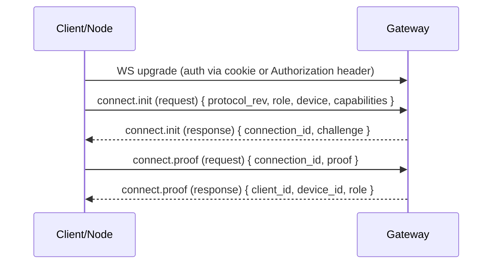

# Handshake

Read this if: you need the exact connection-establishment model for clients and nodes.

Skip this if: you are still learning the protocol at a high level; start with [Protocol](/architecture/protocol).

Go deeper: [Requests and Responses](/architecture/protocol/requests-responses), [Identity](/architecture/identity), [Node](/architecture/node).

Every WebSocket connection starts with a handshake that authenticates the peer, binds it to a stable device identity, and establishes what it is allowed to do.

## Flow



## Handshake boundary

- `connect.init` declares revision, role, device identity material, and capabilities.
- `connect.proof` proves possession of the device private key for the claimed public key.
- The gateway authenticates the access token during the WebSocket upgrade and authorizes the connection after identity is bound.

The older single-step `connect` request is unsupported; peers must use `connect.init` and `connect.proof`. A legacy `connect` request is rejected with close code `4003`.

## Core payload and proof model

`connect.init.payload` includes:

- `protocol_rev: number`
- `role: "client" | "node"`
- `device: { device_id, pubkey, label?, platform?, version?, mode? }`
- `capabilities: CapabilityDescriptor[]`

`device_id` is derived from `device.pubkey` and is validated by the gateway. The derivation is:

`device_id = "dev_" + base32_lower_nopad(sha256(pubkey_der_bytes))`

Where `base32_lower_nopad` uses the RFC 4648 alphabet (`a-z2-7`), rendered lowercase, with no padding, and `pubkey_der_bytes` is `device.pubkey` decoded from base64url (DER SPKI).

`connect.init` returns:

- `connection_id: string` (ephemeral, per WebSocket connection)
- `challenge: string` (a fresh nonce)

`connect.proof.payload.proof` is an Ed25519 signature (base64url) that proves possession of the device private key. The signature is over a stable transcript that binds the connection challenge and identifiers so it cannot be replayed across connections:

```text
tyrum-connect-proof
protocol_rev=<number>
role=<client|node>
device_id=<dev_...>
connection_id=<uuid>
challenge=<base64url>
```

That transcript prevents replay across different connections.

## Upgrade authentication model

The gateway validates the gateway access token during the WS upgrade.

Preferred transports, in order:

1. **`Authorization: Bearer <token>` header** when the client can set headers on the WebSocket upgrade request.
2. **Secure cookie** for browser-based clients where cookie auth is appropriate for the deployment. The gateway still exposes compatibility endpoints such as `POST /auth/session` for deployments that choose cookie auth.
3. **WebSocket subprotocol fallback** for constrained clients that cannot set headers.

Tokens MUST NOT be placed in URLs.

## Subprotocol fallback

All WebSocket clients MUST offer `tyrum-v1` in `Sec-WebSocket-Protocol`.
When using the fallback, the token is conveyed in the same header. Those clients additionally offer:

- `tyrum-v1`
- `tyrum-auth.<base64url(token)>`

The gateway selects `tyrum-v1` as the negotiated subprotocol and reads the token from the `tyrum-auth.*` entry.
The access token should be short-lived, revocable, and scoped to the peer role (`client` vs `node`) and least-privilege permissions.

## Operational hygiene

- Always use TLS (`wss://`) in any deployment where tokens transit a network.
- Treat **WebSocket upgrade headers as secrets**: ensure infra and application logs do not record `Authorization` or `Sec-WebSocket-Protocol` values.
- Ensure any telemetry/trace exporters redact these headers before egress.
- When using cookie auth, validate `Origin` for the WebSocket upgrade so cookies cannot be replayed cross-site.
- The gateway MUST NOT echo secret-bearing subprotocol entries (it should negotiate `tyrum-v1`, not `tyrum-auth.*`).

Operational note: some intermediaries log `Sec-WebSocket-Protocol`. Treat it as sensitive (redact in gateway/proxy logs). For peers that can set headers (non-browser clients/nodes), deployments may prefer an `Authorization: Bearer …` header rather than embedding the token in subprotocol metadata.

## Authorization after handshake

After a connection is authenticated, the gateway authorizes what the peer can do based on its role and (for operator clients) its granted scopes. The gateway can also issue device-bound tokens to reduce bootstrap-token usage during normal operation.

## Node pairing hook

Nodes require pairing approval before they can execute capabilities. Pairing binds a node device identity to a trust level and a scoped capability allowlist, and it can be revoked at any time.

On approval, the gateway issues a node-scoped access token and delivers it to the node via a `pairing.updated` event when the pairing transitions to `approved` (`payload.scoped_token`). Nodes can persist this token and use it for WS upgrade authentication (for example via `tyrum-auth.<base64url(token)>`) to reduce bootstrap-token usage during normal operation.

Revocation invalidates this scoped token immediately.

## Related docs

- [Protocol](/architecture/protocol)
- [Identity](/architecture/identity)
- [Requests and Responses](/architecture/protocol/requests-responses)
- [Node](/architecture/node)
