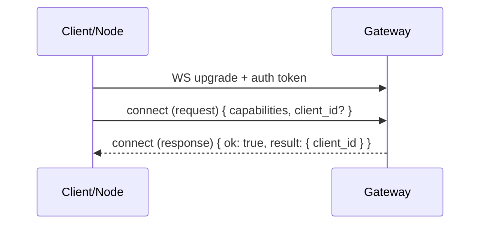

# Handshake

Status:

Every WebSocket connection starts with a handshake that identifies the peer and establishes what it is allowed to do.

## Handshake goals

- Establish protocol readiness (a connection is not "live" until the handshake completes).
- For capability execution: advertise **capabilities** (so the gateway can route `task.execute`).
- (Target) Provide stable identity + role for pairing, labeling, and revocation.

## Typical flow

## Connect payload (implemented)

- `capabilities: ClientCapability[]`
- optional `client_id: string` (client-provided hint; gateway may ignore)

The gateway replies with a typed response whose `result` includes:

- `client_id: string` (the gateway-assigned connection identity)

## Auth (implemented)

The gateway validates auth during the WS upgrade using WebSocket subprotocol metadata:

- `tyrum-v1`
- `tyrum-auth.<base64url(token)>`

## Identity / role (target)

Longer-term, the `connect` payload should also include:

- `role` (`client` vs `node`)
- stable device identity + human label
- platform metadata (OS/app version/device type)

## Pairing hook (nodes)

When a node connects for the first time, the gateway can require a pairing approval from a client before accepting capability execution.
