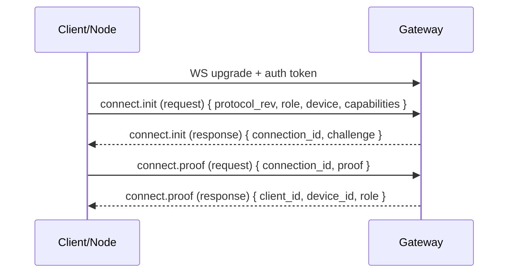

# Handshake

Every WebSocket connection starts with a handshake that identifies the peer and establishes what it is allowed to do.

## Flow



## Legacy handshake (deprecated)

Older peers may use a legacy request/response handshake:

- `connect` (request) `{ capabilities }`
- `connect` (response) `{ client_id }`

This legacy path does **not** include device identity proof or `protocol_rev` negotiation and is deprecated. Gateways may continue to accept it for backwards compatibility, but they SHOULD emit a warning (for example an `error` event with code `deprecated_handshake`) and it may be removed in a future protocol revision.

## Connect payload

`connect.init.payload` includes:

- `protocol_rev: number`
- `role: "client" | "node"`
- `device: { device_id, pubkey, label?, platform?, version?, mode? }`
- `capabilities: CapabilityDescriptor[]`

`device_id` is derived from `device.pubkey` and is validated by the gateway. The derivation is:

`device_id = "dev_" + base32_lower_nopad(sha256(pubkey_der_bytes))`

Where `base32_lower_nopad` uses the RFC 4648 alphabet (`a-z2-7`), rendered lowercase, with no padding, and `pubkey_der_bytes` is `device.pubkey` decoded from base64url (DER SPKI).

`connect.init` returns:

- `connection_id: string` (ephemeral, per WebSocket connection)
- `challenge: string` (a fresh nonce)

`connect.proof.payload.proof` is an Ed25519 signature (base64url) that proves possession of the device private key. The signature is over a stable transcript that binds the connection challenge and identifiers so it cannot be replayed across connections:

```text
tyrum-connect-proof
protocol_rev=<number>
role=<client|node>
device_id=<dev_...>
connection_id=<uuid>
challenge=<base64url>
```

## Auth

The gateway validates the gateway access token during the WS upgrade.

### Preferred transports (in order)

1. **`Authorization: Bearer <token>` header** when the client can set headers on the WebSocket upgrade request.
2. **Secure cookie** for browser-based clients where cookie auth is appropriate for the deployment.
3. **WebSocket subprotocol fallback** for constrained clients that cannot set headers.

Tokens MUST NOT be placed in URLs.

### Subprotocol fallback

When using the fallback, the token is conveyed in the `Sec-WebSocket-Protocol` header. Clients should offer both:

- `tyrum-v1`
- `tyrum-auth.<base64url(token)>`

The gateway selects `tyrum-v1` as the negotiated subprotocol and reads the token from the `tyrum-auth.*` entry.
The access token should be short-lived, revocable, and scoped to the peer role (`client` vs `node`) and least-privilege permissions.

### Operational hygiene (TLS + redaction)

- Always use TLS (`wss://`) in any deployment where tokens transit a network.
- Treat **WebSocket upgrade headers as secrets**: ensure infra and application logs do not record `Authorization` or `Sec-WebSocket-Protocol` values.
- Ensure any telemetry/trace exporters redact these headers before egress.
- When using cookie auth, validate `Origin` for the WebSocket upgrade so cookies cannot be replayed cross-site.
- The gateway MUST NOT echo secret-bearing subprotocol entries (it should negotiate `tyrum-v1`, not `tyrum-auth.*`).

Operational note: some intermediaries log `Sec-WebSocket-Protocol`. Treat it as sensitive (redact in gateway/proxy logs). For peers that can set headers (non-browser clients/nodes), deployments may prefer an `Authorization: Bearer …` header rather than embedding the token in subprotocol metadata.

## Authorization notes

After a connection is authenticated, the gateway authorizes what the peer can do based on its role and (for operator clients) its granted scopes. The gateway can also issue device-bound tokens to reduce bootstrap-token usage during normal operation.

Details: [Gateway authN/authZ](../gateway-authz.md).

## Pairing hook (nodes)

Nodes require pairing approval before they can execute capabilities. Pairing binds a node device identity to a trust level and a scoped capability allowlist, and it can be revoked at any time.

On approval, the gateway issues a node-scoped access token and delivers it to the node via a `pairing.approved` event (`payload.scoped_token`). Nodes can persist this token and use it for WS upgrade authentication (for example via `tyrum-auth.<base64url(token)>`) to reduce bootstrap-token usage during normal operation. Revocation invalidates this scoped token immediately.
