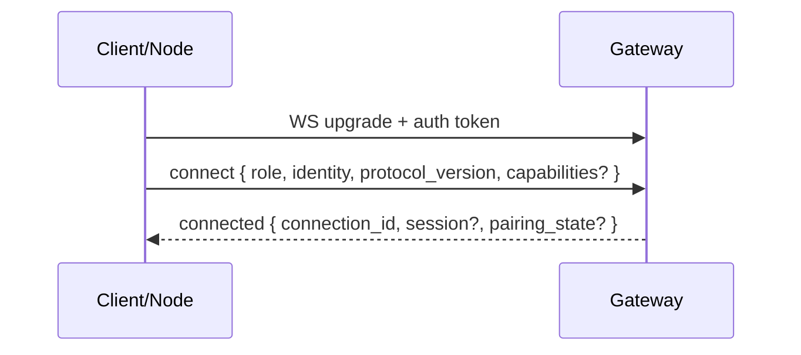

# Handshake

Status:

Every WebSocket connection starts with a handshake that identifies the peer and establishes what it is allowed to do.

## Handshake goals

- Establish the peer's **role** (`client` or `node`).
- Provide a stable **device identity** for pairing, labeling, and revocation.
- Negotiate **protocol version** and optional features.
- For nodes: advertise **capabilities** and capability versions.

## Typical flow

## Identity payload (conceptual)

- **Stable ID:** a UUID (or equivalent) that survives reconnects.
- **Human label:** user-editable device name (optional).
- **Platform metadata:** OS, app version, device type (optional).

## Pairing hook (nodes)

When a node connects for the first time, the gateway can require a pairing approval from a client before accepting capability execution.
