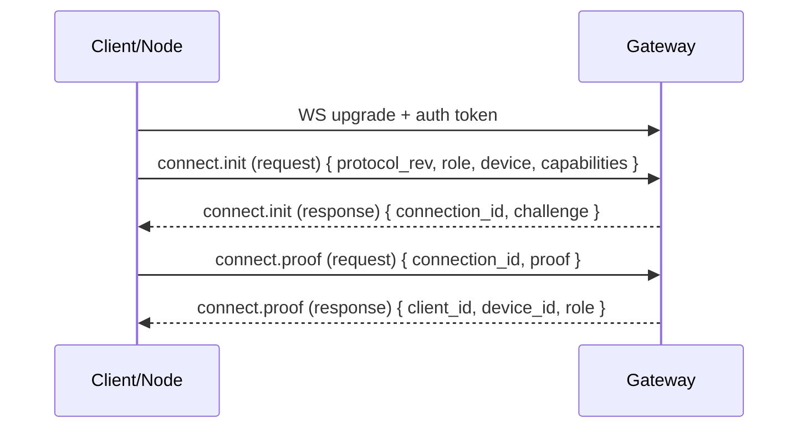

# Handshake

Every WebSocket connection starts with a handshake that identifies the peer and establishes what it is allowed to do.

## Flow



## Connect payload

`connect.init.payload` includes:

- `protocol_rev: number`
- `role: "client" | "node"`
- `device: { device_id, pubkey, label?, platform?, version?, mode? }`
- `capabilities: CapabilityDescriptor[]`

`device_id` is derived from `device.pubkey` and is validated by the gateway. The derivation is:

`device_id = "dev_" + base32_lower_nopad(sha256(pubkey_der_bytes))`

Where `base32_lower_nopad` uses the RFC 4648 alphabet (`a-z2-7`), rendered lowercase, with no padding, and `pubkey_der_bytes` is `device.pubkey` decoded from base64url (DER SPKI).

`connect.init` returns:

- `connection_id: string` (ephemeral, per WebSocket connection)
- `challenge: string` (a fresh nonce)

`connect.proof.payload.proof` is an Ed25519 signature (base64url) that proves possession of the device private key. The signature is over a stable transcript that binds the connection challenge and identifiers so it cannot be replayed across connections:

```text
tyrum-connect-proof
protocol_rev=<number>
role=<client|node>
device_id=<dev_...>
connection_id=<uuid>
challenge=<base64url>
```

## Auth

The gateway validates the gateway access token during the WS upgrade using WebSocket subprotocol metadata. Clients should offer both:

- `tyrum-v1`
- `tyrum-auth.<base64url(token)>`

The gateway selects `tyrum-v1` as the negotiated subprotocol and reads the token from the `tyrum-auth.*` entry.
The access token should be short-lived, revocable, and scoped to the peer role (`client` vs `node`) and least-privilege permissions. Avoid placing tokens in URLs.

## Pairing hook (nodes)

Nodes require pairing approval before they can execute capabilities. Pairing binds a node device identity to a trust level and a scoped capability allowlist, and it can be revoked at any time.
