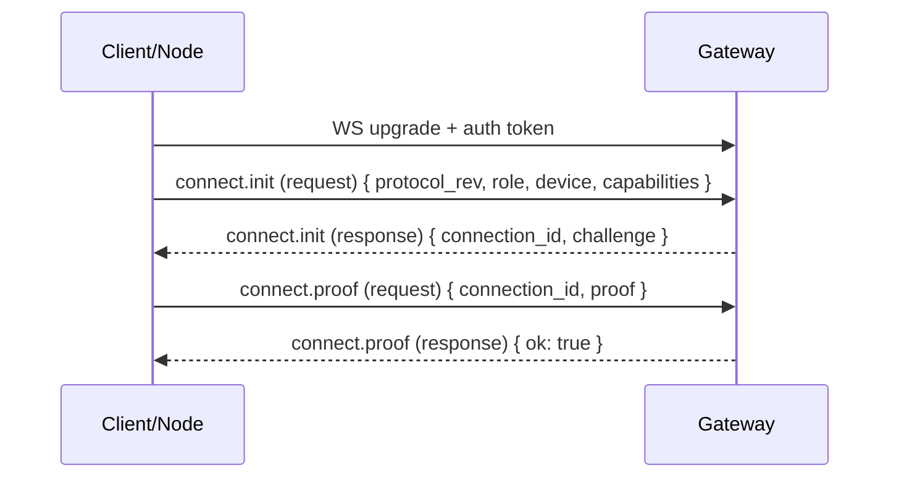

# Handshake

Every WebSocket connection starts with a handshake that identifies the peer and establishes what it is allowed to do.

## Flow

## Connect payload

`connect.init.payload` includes:

- `protocol_rev: number`
- `role: "client" | "node"`
- `device: { device_id, pubkey, label?, platform? }`
- `capabilities: CapabilityDescriptor[]`

`device_id` is derived from the public key (for example `base32(sha256(pubkey))` with a stable prefix) and is used as the durable device identity for pairing, revocation, and audit trails.

`connect.init` returns:

- `connection_id: string` (ephemeral, per WebSocket connection)
- `challenge: string` (a fresh nonce)

`connect.proof.payload.proof` is a signature that proves possession of the device private key. The signature binds the challenge nonce and a small transcript (for example `protocol_rev`, `role`, and `device_id`) so it cannot be replayed across connections.

## Auth

The gateway validates the gateway access token during the WS upgrade using WebSocket subprotocol metadata:

- `tyrum-v1`
- `tyrum-auth.<base64url(token)>`

## Pairing hook (nodes)

Nodes require pairing approval before they can execute capabilities. Pairing binds a node device identity to a trust level and a scoped capability allowlist, and it can be revoked at any time.
