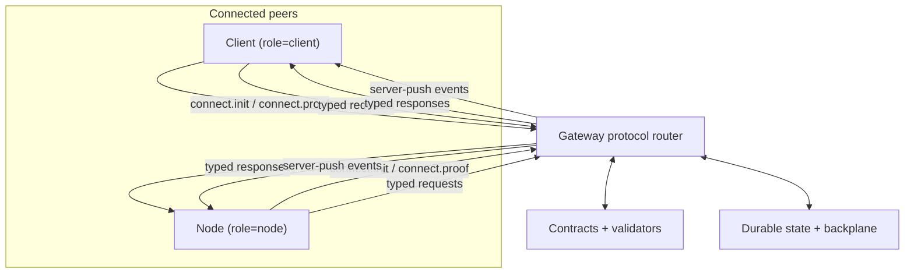

# Protocol

Read this if you want the control-plane mental model for how clients and nodes talk to the gateway. Skip this if you need exact field-level contracts first; use the drill-down links for that.

The Tyrum protocol is the typed interaction contract between gateway, clients, and nodes. It exists so long-lived control, request/reply actions, and server-push events all use one validated model. For wire-level behavior, exported schemas in `packages/schemas` are the source of truth.

## What This Page Covers

- Connection lifecycle: handshake, identity proof, and protocol revision agreement.
- Peer actions: typed requests and responses with explicit retry/idempotency expectations.
- Runtime visibility: server-push events for run progress, approvals, pairing, and observability.
- Compatibility boundary: contracts + validators that keep transport behavior predictable.

## Boundary

- **Inside protocol ownership:** message classes, envelope semantics, revision compatibility, and validation expectations.
- **Outside protocol ownership:** product policy, approval decisions, UI rendering, and node-local execution behavior.

## Primary Interaction Model

1. Peer establishes identity and revision with the handshake (`connect.init` and `connect.proof`).
2. Peer issues typed requests (`session.send`, `approval.resolve`, `task.execute`, and others).
3. Gateway returns typed responses and emits server-push events as durable state changes.
4. On disconnect, peers reconnect and recover with dedupe + retry semantics instead of assuming exactly-once delivery.

## Invariants That Must Hold

- Protocol behavior must stay safe under reconnects, retries, and at-least-once event delivery.
- Revision compatibility is explicit and fail-closed.
- Transport does not change authz/policy expectations.
- Durable state is the recovery source of truth when peers miss events.

## Transport Notes

- WebSocket is the primary interactive transport for long-lived connections and events.
- HTTP is complementary for bootstrap/resources (auth/session, artifacts, callbacks), not a replacement for the typed control model.

## Not In Scope Here

- Full wire catalogs and payload fields.
- Component-specific internals such as execution-engine state transitions or approval policy logic.
- Data retention and delivery-compaction mechanics.

## Drill-down

- [Architecture](/architecture)
- [API surfaces (WebSocket vs HTTP)](/architecture/api-surfaces)
- [Contracts](/architecture/contracts)
- [Handshake](/architecture/protocol/handshake)
- [Requests and Responses](/architecture/protocol/requests-responses)
- [Events](/architecture/protocol/events)
