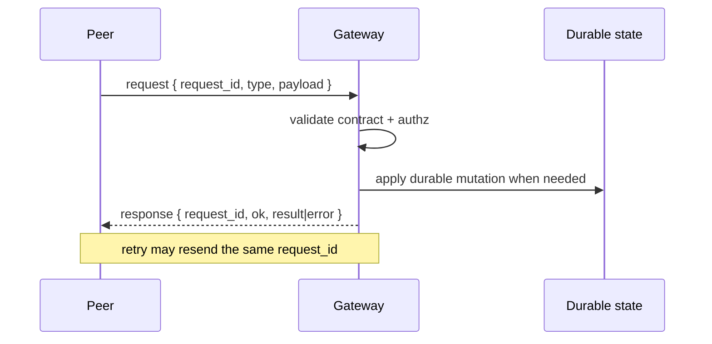

# Requests and Responses

Read this if: you need the interaction model for typed protocol operations and retries.

Skip this if: you need only the protocol overview; start with [Protocol](/architecture/protocol).

Go deeper: [Handshake](/architecture/protocol/handshake), [Contracts](/architecture/contracts), [Events](/architecture/protocol/events).

Requests are typed operations initiated by a gateway, client, or node peer. Responses are typed replies correlated by `request_id`.

The wire shapes are defined by shared versioned contracts, not by prose examples.

## Request/response model

Request envelope:

- `request_id`
- `type`
- `payload`
- optional `trace`

Response envelope:

- `request_id`
- `type`
- `ok`
- `result` when successful
- `error` when unsuccessful

The architectural point is correlation and retry safety: one logical action should remain interpretable even when transport visibility is imperfect.

## Common request families

- handshake: `connect.init`, `connect.proof`
- operator interaction: `conversation.send`, `approval.list`, `approval.resolve`
- workflow control: `workflow.start`, `workflow.resume`, `workflow.cancel`
- pairing and node readiness: `pairing.approve`, `pairing.deny`, `capability.ready`
- execution and evidence: `task.execute`, `attempt.evidence`
- health: `ping`

## Error model

Prefer explicit typed errors over vague strings:

- `contract_error`
- `unauthorized` / `forbidden`
- `not_found`
- `rate_limited`
- `internal`

That error vocabulary is part of the contract boundary and should stay consistent across handlers.

## Retry and idempotency

Tyrum treats retries as normal:

- **transport retry:** a peer can resend the same logical request with the same `request_id` when it did not observe a response
- **side-effect idempotency:** state-changing operations may also carry or derive an `idempotency_key` so retries do not duplicate outcomes

### `approval.resolve` as the reference example

- the approval row transitions atomically from pending to a terminal state
- only the first successful resolution enqueues resume/cancel work
- duplicate resolve attempts for an already-resolved approval do not enqueue more side effects
- downstream `approval.updated` remains at-least-once, so consumers still dedupe by `event_id`

## Related docs

- [Protocol](/architecture/protocol)
- [Handshake](/architecture/protocol/handshake)
- [Contracts](/architecture/contracts)
- [Events](/architecture/protocol/events)
