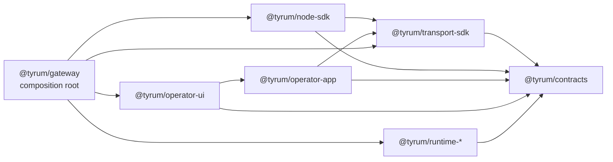

# ARCH-01 clean-break target-state decision

This is a reference decision record for issue `#1533` and epic `#1532`.

## Quick orientation

- **Read this if:** you need the long-lived decision behind the target package graph.
- **Skip this if:** you only need the canonical package layout and contributor rules; use [Target-state package graph](/architecture/target-state).
- **Go deeper:** use [Architecture overview](/architecture) for the current system map and [Gateway](/architecture/gateway) for runtime mechanics.

## Decision snapshot

Tyrum uses a clean-break target package graph built around contracts, transport, node, operator-app, focused runtime packages, and a reduced gateway composition root.

## Decision

- Adopt `@tyrum/contracts` as the only shared contract package.
- Split typed transport into `@tyrum/transport-sdk` and generic node lifecycle into `@tyrum/node-sdk`.
- Keep `@tyrum/operator-app` as the shared operator state/action surface and `@tyrum/operator-ui` as the operator UI surface on top of it.
- Extract runtime and business logic into `@tyrum/runtime-policy`, `@tyrum/runtime-node-control`, `@tyrum/runtime-execution`, `@tyrum/runtime-agent`, and `@tyrum/runtime-workboard`.
- Reduce `@tyrum/gateway` to composition root, transport adapters, bootstrap, and bundled operator asset serving.

## Why this decision

- The historical package graph let transport and runtime concerns leak upward into operator code.
- The clean-break target package graph makes dependency directions explicit enough for CI checks and contributor review.

## Non-negotiable rules

- No backwards-compatibility shims.
- When one runtime package needs another, the dependency goes through explicit ports and interfaces rather than gateway internals.

## Consequences

- Contributor entry points and PR templates need to point to the target package graph so new work reinforces the current shape.
- The package-boundary CI gate in `#1534` should encode this decision rather than invent a second architecture source of truth. Keep `scripts/lint/package-boundaries.config.mjs` synchronized with this record and with [Target-state package graph](/architecture/target-state).

## Related docs

- [Target-state package graph](/architecture/target-state)
- [Architecture overview](/architecture)
- [Gateway](/architecture/gateway)
