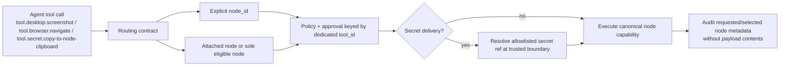

# ARCH-19 dedicated node-backed tool and routing decision

This is a reference decision record for issue `#1586` and epic `#1585`.

## Quick orientation

- **Read this if:** you need the canonical model-facing tool IDs, routing rules, or secret-delivery boundary for dedicated node-backed tools.
- **Skip this if:** you only need the general gateway enforcement pipeline; start with [Tools](/architecture/tools) and [Secrets](/architecture/secrets).
- **Go deeper:** use [Tools](/architecture/tools), [Secrets](/architecture/secrets), and [Capabilities](/architecture/capabilities) for the surrounding runtime mechanics.

## Decision snapshot

## Decision

- Capability-backed model-facing tools mirror canonical capability descriptor IDs under the `tool.` namespace by replacing the `tyrum.` prefix with `tool.`. Examples: `tyrum.desktop.screenshot` becomes `tool.desktop.screenshot`, `tyrum.browser.navigate-back` becomes `tool.browser.navigate-back`, and `tyrum.location.get` becomes `tool.location.get`.
- Dedicated tool schemas expose action-specific business inputs plus shared routing metadata such as optional `node_id` and `timeout_ms` when the routed action needs them.
- Agents never send `capability`, `action_name`, or transport `op` fields on the supported model-facing surface.
- `tool.node.list` remains the only generic node discovery helper. It should report dedicated routed tool availability directly so agents do not need a second inspection step to discover schemas.
- `tool.node.inspect` and `tool.node.dispatch` are removed from the supported model-facing surface.
- Secret delivery is a composed gateway action rather than a raw capability mirror. Its dedicated model-facing tool ID is `tool.secret.copy-to-node-clipboard`.

## Supported tool taxonomy

The dedicated tool ID rule is:

`tool.<canonical capability id without the tyrum prefix>`

Current capability-backed families covered by this decision:

- Desktop: `tool.desktop.screenshot`, `tool.desktop.snapshot`, `tool.desktop.query`, `tool.desktop.act`, `tool.desktop.mouse`, `tool.desktop.keyboard`, `tool.desktop.wait-for`
- Browser: `tool.browser.launch`, `tool.browser.navigate`, `tool.browser.navigate-back`, `tool.browser.snapshot`, `tool.browser.click`, `tool.browser.type`, `tool.browser.fill-form`, `tool.browser.select-option`, `tool.browser.hover`, `tool.browser.drag`, `tool.browser.press-key`, `tool.browser.screenshot`, `tool.browser.evaluate`, `tool.browser.wait-for`, `tool.browser.tabs`, `tool.browser.upload-file`, `tool.browser.console-messages`, `tool.browser.network-requests`, `tool.browser.resize`, `tool.browser.close`, `tool.browser.handle-dialog`, `tool.browser.run-code`
- Cross-platform sensors: `tool.location.get`, `tool.camera.capture-photo`, `tool.camera.capture-video`, `tool.audio.record`
- Discovery helper retained: `tool.node.list`
- Generic execution helpers removed: `tool.node.inspect`, `tool.node.dispatch`
- Secret delivery: `tool.secret.copy-to-node-clipboard`

If a new canonical node capability becomes model-facing later, the new tool ID must follow the same mirroring rule in the same PR that introduces the capability.

## Routing contract

An eligible node is paired, allowlisted for the routed capability, ready, and not denied by tool-specific policy.

### Explicit targeting

When `node_id` is present, the gateway must target only that node. The call fails if the node does not exist, is not paired, does not advertise the routed capability, is not ready, or is denied by policy.

### Omitted `node_id` for capability-backed tools

When `node_id` is omitted for dedicated capability-backed tools, the gateway may auto-select only through one of these stable paths:

1. The current lane or session has exactly one attached node and that node is eligible for the requested tool.
2. Exactly one eligible node exists for the requested tool.

Otherwise the gateway must fail with an ambiguous-node-selection error rather than guessing from labels, recency, platform, or any other heuristic.

The only supported implicit selection modes are `attached_node` and `sole_eligible_node`.

### Omitted `node_id` for secret clipboard delivery

`tool.secret.copy-to-node-clipboard` is stricter. Omitted `node_id` is allowed only when exactly one eligible clipboard-capable node exists after pairing, capability, and policy checks.

If more than one eligible clipboard-capable node exists, the gateway must fail fast and require an explicit `node_id`. Lane attachment, recent activity, display labels, or platform hints must not break ties for secret delivery.

## Approval, policy, and audit contract

- Policy matching, approval prompts, suggested overrides, and audit entries must anchor on the dedicated `tool_id` such as `tool.desktop.act`, not on generic `tool.node.dispatch` payload decoding.
- Routed tool metadata may expose `requested_node_id`, `selected_node_id`, and `selection_mode` (`explicit`, `attached_node`, or `sole_eligible_node`) plus a bounded node summary such as label, platform, and trust level.
- Approval and audit surfaces must not persist arbitrary routed payload contents only to explain selection. Tool inputs stay bounded by their own schemas and evidence contracts; routing metadata is recorded separately from payload data.
- Secret-adjacent approvals and audit entries may include safe identifiers such as `secret_ref_id` or `secret_alias`, but they must never include resolved secret values or clipboard payload text.

## Secret reference contract

Agent-visible secret references are allowlisted metadata records, not raw secret handles and never raw secret values.

| Field              | Meaning                                                                |
| ------------------ | ---------------------------------------------------------------------- |
| `secret_ref_id`    | Stable opaque identifier for an allowlisted secret reference           |
| `secret_alias`     | Optional agent-scoped alias; ergonomic shorthand, unique within scope  |
| `allowed_tool_ids` | Explicit dedicated tool IDs this reference may be used with            |
| `display_name`     | Optional operator-safe label that can appear in model-visible metadata |

Rules:

- `tool.secret.copy-to-node-clipboard` accepts exactly one secret selector: `secret_ref_id` or `secret_alias`, plus optional `node_id`.
- Aliases are resolved only inside the agent's allowlist. Unknown, duplicate, or disallowed aliases fail validation before secret resolution.
- The gateway resolves `secret_ref_id` or `secret_alias` to the underlying secret handle only after policy and approval gates pass, and only immediately before clipboard delivery.
- Clipboard delivery returns acknowledgement-only results. Outputs, errors, logs, traces, approvals, and resume state may mention the selected node and the safe secret reference metadata, but never the plaintext secret.

## Why this decision

- Generic node dispatch leaks transport details into prompts, policy, and approvals.
- Mirroring canonical capability IDs keeps model-facing tools aligned with the shared contracts catalog instead of creating a second naming system.
- A dedicated secret-to-node-clipboard tool gives secret delivery a tighter audit and ambiguity boundary than ordinary capability routing.

## Non-negotiable rules

- No backwards-compatibility shims and no merged state where both the old and new model-facing tool IDs remain registered.
- Temporary coexistence is allowed only inside a PR while the next clean-break step lands safely.
- No new docs, prompts, tests, or UI copy may instruct agents to use `tool.node.dispatch` or `tool.node.inspect`.
- Secret flows stay reference-based end to end. Raw secret values never become model-visible data.

## Consequences

- `#1587` must define the shared schema surface for dedicated routed tools, clipboard capability support, routed metadata, and secret reference validation.
- `#1588` and `#1589` implement the dedicated desktop, browser, and sensor execution surface defined here.
- `#1590` moves policy, approvals, and audit matching onto dedicated tool IDs and the routing metadata defined here.
- `#1593` implements `tool.secret.copy-to-node-clipboard` using the `secret_ref_id` / `secret_alias` contract and the stricter ambiguity rule for clipboard delivery.

## Related docs

- [Tools](/architecture/tools)
- [Secrets](/architecture/secrets)
- [Capabilities](/architecture/capabilities)
- [Gateway](/architecture/gateway)
- [Epic #1585](https://github.com/tyrumai/tyrum/issues/1585)
