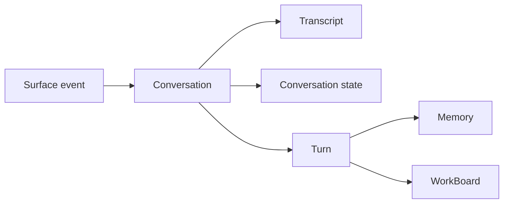

# ARCH-20 conversation and turn clean-break decision

This is a reference decision record for issue `#1821` and epic `#1820`.

## Quick orientation

- **Read this if:** you need the long-lived decision behind Tyrum's new architecture vocabulary and continuity model.
- **Skip this if:** you only need the high-level system map; use [Architecture overview](/architecture) and [Messages and Conversations](/architecture/messages-conversations).
- **Go deeper:** use [Conversations and Turns](/architecture/conversations-turns), [Transcript, Conversation State, and Prompt Context](/architecture/transcript-conversation-state), and [Turn Processing and Durable Coordination](/architecture/turn-processing).

## Decision snapshot

Tyrum uses a clean-break architecture built around `Agent`, `Surface`, `Channel`, `Conversation`, `Transcript`, `ConversationState`, `PromptContext`, `Turn`, `Memory`, and `WorkBoard`.

## Decision

- Replace `session` with `conversation` as the canonical durable context term.
- Replace lane-oriented continuity with explicit conversations and child conversations.
- Keep `channel` as an external integration term only.
- Introduce `surface` as the broad ingress term for UI, channels, automation, and delegation.
- Treat transcript, conversation state, and prompt context as separate layers with different responsibilities.
- Treat `turn` as the only top-level unit of agent progress.
- Model heartbeat as one dedicated conversation per `(agent, workspace)`.
- Model long-lived and background work as turn-driven progress plus durable work state, not as a separate run-first architecture.
- Allow destructive persistence cutover. No backwards compatibility, no aliases, no dual terminology, and no legacy terminology survive.

## Why this decision

- `session`, `lane`, and `run` had become overloaded and forced one concept to carry context partitioning, serialization, and background work semantics at the same time.
- The runtime already depends on compaction checkpoints and durable current truth, which means transcript, context continuity, and model prompt cannot remain one blurred concept.
- Heartbeat, UI chat, channel traffic, and delegated work need distinct context boundaries that are better expressed as conversations than as hidden lanes inside one session.
- A turn-first architecture matches how the model is actually used and keeps operator language aligned with runtime behavior.

## Rejected alternatives

### Keep `session` as the primary term

Rejected because it keeps the old overloaded vocabulary and encourages parallel use of `session`, `session_id`, and `session_key`.

### Keep `lane` as the concurrency and context model

Rejected because lanes hide distinct context boundaries inside one logical conversation. Child conversations are clearer and safer.

### Keep `run` or `task execution` as a first-class architecture concept

Rejected because ordinary agent progress is best described as turns plus durable state. Lower-level coordination details must stay subordinate to the turn model, not replace it.

### Reuse `channel` for all interaction sources

Rejected because UI, automation, and delegation are not external channels. `surface` keeps `channel` precise.

## Non-negotiable rules

- No backwards-compatibility shims.
- No dual public vocabulary.
- No legacy doc pages kept alive as canonical sources.
- No persistence migration that tries to preserve old session or run semantics.

## Consequences

- Public contracts, SDKs, and protocol docs must move to `conversation` and `turn` vocabulary.
- Durable persistence must store conversations, transcript events, conversation state, and turns directly.
- Heartbeat, automation, and delegation must target explicit conversations.
- Operator surfaces must present conversation and turn activity, not run-first activity.
- WorkBoard must link to conversations and turns instead of a separate run-first execution model.

## Related docs

- [Architecture](/architecture)
- [Messages and Conversations](/architecture/messages-conversations)
- [Conversations and Turns](/architecture/conversations-turns)
- [Transcript, Conversation State, and Prompt Context](/architecture/transcript-conversation-state)
- [Turn Processing and Durable Coordination](/architecture/turn-processing)
