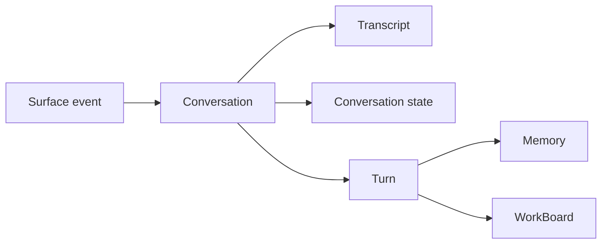

# ARCH-20 conversation and turn clean-break decision

This reference decision record is the architecture contract behind epic `#1820` and issue `#1828`.

## Quick orientation

- **Read this if:** you need the durable vocabulary and persistence model for the clean-break architecture.
- **Skip this if:** you only need the high-level map; use [Architecture overview](/architecture) and [Messages and Conversations](/architecture/messages-conversations).
- **Go deeper:** use [Conversations and Turns](/architecture/conversations-turns), [Transcript, Conversation State, and Prompt Context](/architecture/transcript-conversation-state), and [Turn Processing and Durable Coordination](/architecture/turn-processing).

## Decision snapshot

Tyrum uses a clean-break architecture built around `Agent`, `Surface`, `Channel`, `Conversation`, `Transcript`, `ConversationState`, `PromptContext`, `Turn`, `Memory`, and `WorkBoard`.

## Decision

- `conversation` is the canonical durable context boundary.
- Every durable context boundary gets its own explicit `conversation_key`.
- Child conversations are used for delegated or background work that needs distinct state.
- `turn` is the only top-level unit of agent progress.
- `surface` is the ingress term for UI, channels, automation, and delegation.
- `channel` stays limited to external delivery integrations.
- Transcript, conversation state, and prompt context remain separate layers with separate responsibilities.
- Heartbeat, automation, and other long-lived workflows use dedicated conversations instead of hidden partitions inside another conversation.
- Persistence follows the target model directly. No compatibility layer, alias, shim, or dual terminology is allowed.

## Why this decision

- The prior model overloaded one layer with durable context, execution serialization, and background-work coordination.
- Explicit conversations make state ownership, routing, and retention legible.
- Distinct context boundaries are safer when they are separate conversation identities rather than implicit partitions.
- A turn-first architecture matches runtime behavior and keeps operator language aligned with what the system actually persists and emits.

## Rejected alternatives

### Keep one overloaded durable context model

Rejected because it keeps unrelated responsibilities coupled and makes routing, persistence, and operator language harder to reason about.

### Keep hidden sub-context partitions inside one conversation

Rejected because implicit partitions preserve the old concurrency model under a new label. Distinct context boundaries must become distinct conversations.

### Keep an execution-first top-level architecture term

Rejected because ordinary agent progress is already represented by turns plus durable work state. Extra top-level vocabulary would reintroduce a split public model.

### Reuse `channel` for every ingress path

Rejected because UI, automation, and delegation are not external delivery channels. `surface` keeps the boundary precise.

## Non-negotiable rules

- No backwards-compatibility shims.
- No dual public vocabulary.
- No aliases for removed concepts.
- No persistence migration that preserves the old hidden-partition model.

## Consequences

- Public contracts, SDKs, routes, and operator surfaces must speak in conversation and turn vocabulary.
- Durable persistence must store conversations, transcript events, conversation state, and turns directly.
- Heartbeat, automation, and delegation must target explicit conversation identities.
- Operator surfaces must present conversation and turn activity, not an alternate execution-first model.
- WorkBoard must link to conversations and turns directly.

## Related docs

- [Architecture](/architecture)
- [Messages and Conversations](/architecture/messages-conversations)
- [Conversations and Turns](/architecture/conversations-turns)
- [Transcript, Conversation State, and Prompt Context](/architecture/transcript-conversation-state)
- [Turn Processing and Durable Coordination](/architecture/turn-processing)
