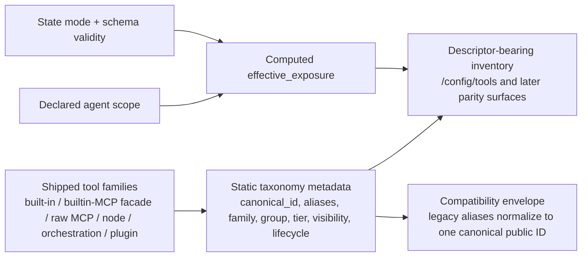

# ARCH-21 public tool taxonomy and exposure model

This reference decision record is the architecture contract behind issue `#1962` and epic `#1961`.

## Quick orientation

- **Read this if:** you need the canonical public tool IDs, family/group vocabulary, or exposure metadata contract for Tyrum's shipped tool surface.
- **Skip this if:** you only need the shared enforcement pipeline; use [Tools](/architecture/tools).
- **Go deeper:** use [Tools](/architecture/tools), [Memory](/architecture/memory), and [ARCH-19 dedicated node-backed tool and routing decision](/architecture/arch-19-dedicated-node-backed-tools).

## Decision snapshot

- Every shipped public tool gets exactly one canonical public ID. Compatibility aliases may exist during migration, but public docs and emitted canonical inventory must converge on one ID per tool.
- The `mcp.` prefix stays public only for raw MCP-backed tools that are exposed as MCP inventory. Built-in MCP facades such as `websearch`, `webfetch`, and `codesearch` keep facade IDs, and built-in memory helpers move to the `memory` family as their canonical public IDs.
- The `tool.` namespace stays public for the already-shipped node-backed, node-discovery, saved-place, and automation families. [ARCH-19 dedicated node-backed tool and routing decision](/architecture/arch-19-dedicated-node-backed-tools) remains settled and is not reopened here.
- Static taxonomy metadata is separate from computed `effective_exposure`. Canonical naming, aliases, deprecation state, grouping, tier, and visibility are descriptor facts. Exposure is the post-gating answer for a specific declared agent and, later, explicit profile selectors.
- Tool inventory surfaces are agent-scoped today. If callers later need profile-aware or conversation-kind-aware answers, they must pass explicit selectors rather than relying on implicit runtime state.

## Decision

- Adopt one contributor-facing taxonomy contract for all shipped public families, including bare built-ins, built-in MCP facades, raw MCP-backed tools, memory helpers, workboard/work orchestration, plugins, saved places, automation schedules, and the settled `tool.*` families.
- Treat public naming as a contract layered above current runtime provenance fields such as `source`, `backing_server`, and `plugin`.
- Define the canonical public built-in memory helper IDs as the `memory` family plus the existing verbs `seed`, `search`, and `write`. The currently shipped `mcp.memory.*` IDs become deprecated public aliases during the migration window tracked by later epic items.
- Keep `mcp.<server>.<tool>` canonical for raw MCP-backed tools that remain directly exposed from shared-state MCP server inventory.
- Keep built-in Exa-backed web/code tools as public facades without an `mcp.` prefix. Their backing server metadata stays public as provenance, not as part of the canonical ID.
- Classify legacy parser shims such as `tool.fs.read`, `tool.exec`, `tool.http.fetch`, `tool.*`, and `tool.fs.*` as compatibility-only inputs. They are not canonical public IDs and must not be emitted or documented as canonical taxonomy.

## Naming rules

### Allowed public shapes

- Standalone built-ins may stay single-segment when that is already the shipped public contract: `read`, `write`, `edit`, `apply_patch`, `glob`, `grep`, `bash`, `websearch`, `webfetch`, `codesearch`.
- Dotted public IDs use lowercase ASCII segments matching `[a-z][a-z0-9-]*`, separated by `.`.
- The action or verb belongs in the final segment: `artifact.describe`, the `memory` family write helper, `tool.location.place.create`, `tool.automation.schedule.pause`, `workboard.item.list`, `mcp.github.search`.
- Hyphenated final action segments are allowed when already shipped and stable: `tool.desktop.wait-for`, `tool.secret.copy-to-node-clipboard`.

### Reserved public prefixes

- `mcp.` is reserved for raw MCP-backed public tools only.
- `tool.` is reserved for platform-owned public families that route through the settled node/location/automation taxonomy.
- `memory.`, `sandbox.`, `subagent.`, and `workboard.` are reserved for platform-owned public families.
- Platform-owned standalone IDs such as `read`, `bash`, `websearch`, and `artifact.describe` are reserved exact IDs.
- Plugin tools must not claim reserved platform prefixes or exact platform-owned IDs. Plugin-owned IDs stay plugin-defined and must live in their own namespace.

### Family depth

- One-segment IDs are exception families kept only where Tyrum already ships them as public built-ins.
- New structured families should prefer a stable family prefix plus a trailing action segment.
- Two-level family prefixes are canonical where already shipped and meaningful: `tool.location.place.*`, `tool.automation.schedule.*`, `workboard.item.*`, `workboard.task.*`, `tool.node.capability.get`.
- Raw MCP IDs always encode the backing server as the second segment: `mcp.<server>.<tool>`.

## Vocabulary

| Term           | Meaning                                                                                                                                                         |
| -------------- | --------------------------------------------------------------------------------------------------------------------------------------------------------------- |
| `canonical`    | The one public ID that docs, read APIs, runtime emissions, and operator surfaces must converge on.                                                              |
| `alias`        | A supported compatibility ID that resolves to a canonical ID but must not be emitted as the canonical answer.                                                   |
| `deprecated`   | An alias or legacy public ID still accepted during migration and scheduled for removal under an explicit migration policy.                                      |
| `public`       | Eligible to appear in public descriptor-bearing inventory, config, policy, status, and execution-facing contracts.                                              |
| `default`      | The baseline public tier for common operator and agent-facing tools.                                                                                            |
| `advanced`     | A public tool or family that is intentionally exposed behind the advanced/operator-facing tier rather than the default public tier.                             |
| `internal`     | Not part of the model-facing or user-configurable public contract. Internal IDs may exist for implementation or backing integration reasons.                    |
| `runtime-only` | Internal identifiers or helper names used only inside runtime execution, normalization, or transport bridging. They must not appear as public taxonomy entries. |

## Canonical public families

| Group           | Canonical family or pattern          | Current shipped surface                                                                                                                                                             | Canonical public status | Tier       | Notes                                                                                                                                                      |
| --------------- | ------------------------------------ | ----------------------------------------------------------------------------------------------------------------------------------------------------------------------------------- | ----------------------- | ---------- | ---------------------------------------------------------------------------------------------------------------------------------------------------------- |
| `core`          | standalone built-ins                 | `read`, `write`, `edit`, `apply_patch`, `glob`, `grep`, `bash`                                                                                                                      | unchanged               | `default`  | Current bare IDs remain canonical.                                                                                                                         |
| `core`          | `artifact.<verb>`                    | `artifact.describe`                                                                                                                                                                 | unchanged               | `default`  | Dotted built-in family stays canonical.                                                                                                                    |
| `retrieval`     | standalone web facades               | `websearch`, `webfetch`, `codesearch`                                                                                                                                               | unchanged               | `default`  | Backed by Exa today, but `mcp.exa.*` is not the public ID for these facades.                                                                               |
| `memory`        | `memory.<verb>`                      | `mcp.memory.seed`, `mcp.memory.search`, `mcp.memory.write`                                                                                                                          | **renamed**             | `default`  | Canonical public IDs use the `memory` family with verbs `seed`, `search`, and `write`; `mcp.memory.*` remains only as deprecated aliases during migration. |
| `extension`     | `mcp.<server>.<tool>`                | raw MCP tools from shared-state MCP server inventory                                                                                                                                | unchanged               | `advanced` | `mcp.` remains public only for raw MCP-backed tools.                                                                                                       |
| `extension`     | plugin-owned namespace               | plugin descriptor IDs surfaced through the plugin registry                                                                                                                          | unchanged               | `advanced` | Canonical IDs are plugin-defined, but reserved platform prefixes are off-limits.                                                                           |
| `environment`   | `tool.location.place.<verb>`         | `tool.location.place.list`, `.create`, `.update`, `.delete`                                                                                                                         | unchanged               | `advanced` | Saved-place family stays under `tool.location.place.*`.                                                                                                    |
| `environment`   | `tool.automation.schedule.<verb>`    | `tool.automation.schedule.list`, `.get`, `.create`, `.update`, `.pause`, `.resume`, `.delete`                                                                                       | unchanged               | `advanced` | Automation schedule family stays under `tool.automation.schedule.*`.                                                                                       |
| `node`          | `tool.node.<...>` discovery helpers  | `tool.node.list`, `tool.node.capability.get`                                                                                                                                        | unchanged               | `advanced` | Public node discovery stays in `tool.node.*`; removed generic dispatch helpers stay removed.                                                               |
| `node`          | `tool.desktop.<action>`              | `tool.desktop.screenshot`, `.snapshot`, `.query`, `.act`, `.mouse`, `.keyboard`, `.wait-for`                                                                                        | unchanged               | `advanced` | Settled by ARCH-19.                                                                                                                                        |
| `node`          | `tool.browser.<action>`              | browser capability-backed tools such as `tool.browser.navigate` and `tool.browser.snapshot`                                                                                         | unchanged               | `advanced` | Settled by ARCH-19.                                                                                                                                        |
| `node`          | `tool.location.get`                  | `tool.location.get`                                                                                                                                                                 | unchanged               | `advanced` | Settled by ARCH-19 and distinct from saved places.                                                                                                         |
| `node`          | `tool.camera.<action>`               | `tool.camera.capture-photo`, `tool.camera.capture-video`                                                                                                                            | unchanged               | `advanced` | Settled by ARCH-19.                                                                                                                                        |
| `node`          | `tool.audio.<action>`                | `tool.audio.record`                                                                                                                                                                 | unchanged               | `advanced` | Settled by ARCH-19.                                                                                                                                        |
| `node`          | `tool.secret.copy-to-node-clipboard` | `tool.secret.copy-to-node-clipboard`                                                                                                                                                | unchanged               | `advanced` | Settled by ARCH-19.                                                                                                                                        |
| `orchestration` | `sandbox.<verb>`                     | `sandbox.current`, `.request`, `.release`, `.handoff`                                                                                                                               | unchanged               | `advanced` | Managed desktop control-plane family.                                                                                                                      |
| `orchestration` | `subagent.<verb>`                    | `subagent.spawn`, `.list`, `.get`, `.send`, `.close`                                                                                                                                | unchanged               | `advanced` | Operator/delegation control family.                                                                                                                        |
| `orchestration` | `workboard.<resource>.<verb>`        | `workboard.capture`, `workboard.item.*`, `workboard.task.*`, `workboard.artifact.*`, `workboard.decision.*`, `workboard.signal.*`, `workboard.state.*`, `workboard.clarification.*` | unchanged               | `advanced` | Work orchestration family remains public but advanced.                                                                                                     |

## Current-to-canonical mapping

| Current shipped ID or pattern                   | Canonical public ID or pattern | Status after this decision | Evidence                                                                                                     |
| ----------------------------------------------- | ------------------------------ | -------------------------- | ------------------------------------------------------------------------------------------------------------ |
| `read`                                          | `read`                         | canonical                  | `packages/gateway/src/modules/agent/tool-catalog.ts`                                                         |
| `bash`                                          | `bash`                         | canonical                  | `packages/gateway/src/modules/agent/tool-catalog.ts`                                                         |
| `artifact.describe`                             | `artifact.describe`            | canonical                  | `packages/gateway/src/modules/agent/tool-catalog.ts`                                                         |
| `websearch` / `webfetch` / `codesearch`         | unchanged                      | canonical                  | `packages/gateway/src/modules/agent/tool-catalog.ts`                                                         |
| `mcp.<server>.<tool>`                           | unchanged                      | canonical                  | `packages/gateway/src/modules/agent/mcp-manager.ts`                                                          |
| `mcp.memory.seed`                               | `memory` + `.seed`             | deprecated alias           | `packages/gateway/src/modules/agent/mcp-manager.ts`, `packages/gateway/src/modules/agent/runtime/prompts.ts` |
| `mcp.memory.search`                             | `memory` + `.search`           | deprecated alias           | `packages/gateway/src/modules/agent/mcp-manager.ts`, `packages/gateway/src/modules/agent/runtime/prompts.ts` |
| `mcp.memory.write`                              | `memory` + `.write`            | deprecated alias           | `packages/gateway/src/modules/agent/mcp-manager.ts`, `packages/gateway/src/modules/agent/runtime/prompts.ts` |
| `tool.location.place.*`                         | unchanged                      | canonical                  | `packages/gateway/src/modules/agent/tool-catalog-location.ts`                                                |
| `tool.automation.schedule.*`                    | unchanged                      | canonical                  | `packages/gateway/src/modules/agent/tool-catalog-automation.ts`                                              |
| `tool.node.list` and `tool.node.capability.get` | unchanged                      | canonical                  | `packages/gateway/src/modules/agent/tool-catalog.ts`                                                         |
| `tool.desktop.*`                                | unchanged                      | canonical                  | `packages/gateway/src/modules/agent/tool-desktop-definitions.ts`                                             |
| `tool.browser.*`                                | unchanged                      | canonical                  | `packages/gateway/src/modules/agent/dedicated-capability-tools.ts`                                           |
| `tool.location.get`                             | unchanged                      | canonical                  | `packages/gateway/src/modules/agent/dedicated-capability-tools.ts`                                           |
| `tool.camera.*` / `tool.audio.record`           | unchanged                      | canonical                  | `packages/gateway/src/modules/agent/dedicated-capability-tools.ts`                                           |
| `tool.secret.copy-to-node-clipboard`            | unchanged                      | canonical                  | `packages/gateway/src/modules/agent/tool-secret-definitions.ts`                                              |
| `sandbox.*`                                     | unchanged                      | canonical                  | `packages/gateway/src/modules/agent/tool-catalog-sandbox.ts`                                                 |
| `subagent.*`                                    | unchanged                      | canonical                  | `packages/gateway/src/modules/agent/tool-catalog-subagent.ts`                                                |
| `workboard.*`                                   | unchanged                      | canonical                  | `packages/gateway/src/modules/agent/tool-catalog-workboard.ts`                                               |

## Legacy compatibility envelope

The following IDs or patterns are compatibility shims only. They are not canonical taxonomy entries and must not be emitted as canonical public IDs:

| Legacy input      | Canonical target                        | Current source                      |
| ----------------- | --------------------------------------- | ----------------------------------- |
| `tool.fs.read`    | `read`                                  | `packages/contracts/src/tool-id.ts` |
| `tool.fs.write`   | `write`                                 | `packages/contracts/src/tool-id.ts` |
| `tool.exec`       | `bash`                                  | `packages/contracts/src/tool-id.ts` |
| `tool.http.fetch` | `webfetch`                              | `packages/contracts/src/tool-id.ts` |
| `tool.*`          | `*` allowlist wildcard                  | `packages/contracts/src/tool-id.ts` |
| `tool.fs.*`       | filesystem built-in allowlist expansion | `packages/contracts/src/tool-id.ts` |

`tool.*` and `tool.fs.*` are parser-time compatibility helpers for current config and policy inputs. They do not define a public family boundary and must not be treated as canonical family-level aliases.

## Static taxonomy metadata versus computed effective exposure

### Required static taxonomy metadata

These fields describe the tool itself and do not depend on one agent's current allowlist or runtime state:

| Field                       | Meaning                                                                                                                                   |
| --------------------------- | ----------------------------------------------------------------------------------------------------------------------------------------- |
| `canonical_id`              | Canonical public ID after alias normalization.                                                                                            |
| `family`                    | Stable public family label, for example `memory`, `tool.automation.schedule`, `tool.location.place`, `workboard`, or `mcp`.               |
| `group`                     | Broader grouping used for inventory and operator navigation: `core`, `retrieval`, `environment`, `node`, `orchestration`, or `extension`. |
| `tier`                      | Exposure tier. This decision uses `default` and `advanced` as the supported public tiers.                                                 |
| `visibility`                | `public`, `internal`, or `runtime_only`.                                                                                                  |
| `lifecycle`                 | `canonical`, `alias`, or `deprecated`.                                                                                                    |
| `aliases`                   | Supported compatibility IDs that normalize to the canonical public ID.                                                                    |
| `source`                    | Provenance of the implementation: `builtin`, `builtin_mcp`, `mcp`, or `plugin`.                                                           |
| `backing_server` / `plugin` | Provenance metadata for backed or plugin-owned tools. These fields explain source, not public naming.                                     |

Current `/config/tools` already emits `source`, `family`, `backing_server`, `plugin`, and `canonical_id`, but it does not yet emit the full lifecycle, visibility, alias, or grouping metadata defined here. That follow-on work belongs to later issues in epic `#1961`.

### Effective exposure

`effective_exposure` is a computed answer, not taxonomy metadata. Today the gateway computes it from the declared agent scope, runtime state mode, schema validity, and current allowlist:

- `enabled`
- `disabled_by_agent_allowlist`
- `disabled_by_state_mode`
- `disabled_invalid_schema`

The current `/config/tools` route and transport SDK already expose this computed answer. The current `/context/tools` route exposes only `enabled_by_agent`, which is an agent-scoped partial answer and not a replacement for full effective-exposure semantics.

Canonical naming, aliases, deprecation state, group, tier, and visibility must not be inferred from `effective_exposure`. They remain static taxonomy facts even when a tool is currently disabled.

## Inspection contract for inventory surfaces

### Agent-scoped today

The current shipped inventory inputs are agent-scoped only:

- `/config/tools` and `packages/transport-sdk/src/http/tool-registry.ts` accept only optional `agent_key`.
- `/context/tools` and `packages/transport-sdk/src/http/context.ts` accept only optional `agent_key`.

Those surfaces must answer the declared agent's tool universe, not an inferred profile-specific or conversation-kind-specific subset.

### Reserved explicit selectors for later work

If a later contract needs profile-aware or conversation-kind-aware exposure answers, the caller must pass explicit selectors on top of `agent_key`. The only reserved selector names from this decision are:

- `execution_profile`
- `conversation_kind`

Future implementations may add those selectors, but they must not infer exposure answers from implicit current conversation state, attached node state, prior turns, or transient operator request context.

`conversation_id` and `turn_id` remain context-report selectors, not tool-inventory exposure selectors.

## Consequences

- Follow-on migration issues must normalize public memory references from `mcp.memory.*` to the canonical `memory` family IDs across defaults, prompts, execution profiles, policy, bookkeeping, and docs.
- Follow-on metadata issues must emit alias, deprecation, visibility, grouping, and tier metadata consistently across gateway and transport consumers.
- Follow-on resolver issues must keep `effective_exposure` as a post-gating answer that composes with, but does not replace, static taxonomy metadata.
- ARCH-19 routing, schema, approval, and audit rules stay authoritative for dedicated node-backed families.

## Related docs

- [Tools](/architecture/tools)
- [Memory](/architecture/memory)
- [Gateway plugins](/architecture/plugins)
- [ARCH-19 dedicated node-backed tool and routing decision](/architecture/arch-19-dedicated-node-backed-tools)
