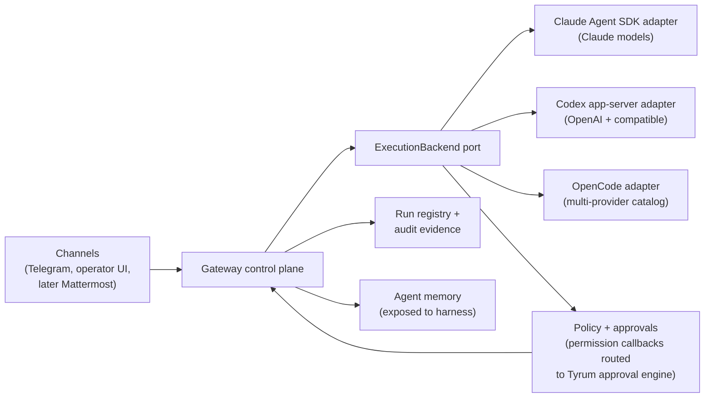

# ARCH-22 governed gateway over external harnesses

This reference decision record is the architecture contract for the harness pivot epic. It supersedes the runtime-extraction direction of [ARCH-01](./arch-01-clean-break-target-state.md) and the [Runtime extraction parity map](/architecture/runtime-extraction-parity) as forward plans.

## Quick orientation

- **Read this if:** you need to know why Tyrum no longer builds its own agent harness and what the gateway owns instead.
- **Skip this if:** you need the conversation/turn vocabulary; use [ARCH-20](./arch-20-conversation-turn-clean-break.md), which remains in force.
- **Go deeper:** the harness pivot epic issue, [Approvals](/architecture/approvals), [Work board and delegated execution](/architecture/workboard).

## Decision snapshot

Tyrum is a **governed, self-hosted agent gateway**. Execution is delegated to external coding-agent harnesses behind an `ExecutionBackend` port. The gateway owns what harnesses do not: channels, durable conversations and approvals, policy, audit evidence, memory, and node control.

## Decision

- **External harnesses are the execution engine.** Three backends are in scope from the first round — Claude Agent SDK, Codex app-server, and OpenCode — behind one `ExecutionBackend` port (create/resume a harness session, stream events, intercept tool approvals). The spike validates the port against all three via a shared conformance checklist; the Phase 0 gate designates a primary backend for productionization.
- **Tyrum remains the system of record for conversation history.** Every event a harness emits (assistant output, tool calls and results, approval outcomes) is translated and appended to Tyrum's durable transcript; operator history, retention, and audit evidence never depend on harness-side files. Harness session state (Claude JSONL transcripts, Codex rollout files, OpenCode's local store) is kept per workspace as a resume-fidelity cache only: if it is lost, or a conversation switches backends, the adapter starts a fresh harness session seeded from Tyrum's conversation-state checkpoint — the harness-independent continuity layer.
- **The homegrown agent loop is deprecated and will be deleted.** The in-gateway turn loop, tool executors (read/write/edit/apply_patch/bash/glob/grep/web), compaction, context pruning, and multi-provider model rotation are replaced by the harness. Deletion is a phase gate, not a long-lived dual path.
- **Migration is strangler-style with a per-conversation backend flag** (`execution_backend: native | claude_agent_sdk | codex | opencode`, default `native`) that exists only during the migration window and is removed when the native path is deleted.
- **Approvals and policy are the moat and move up a level.** The gateway stops being an executor that approves its own steps and becomes the approval decision authority for external harnesses: each backend's ask-channel (Claude Agent SDK `canUseTool`, Codex app-server approval requests, OpenCode permission events) routes into the existing policy evaluation and durable approval engine; humans resolve from operator surfaces and chat channels. Harness-local sandboxing and permission rules are defense in depth, not the control: real enforcement stays at boundaries the agent cannot rewrite (gateway credentials, egress, git server).
- **Audit becomes evidence retention the harness lacks.** The gateway ingests harness transcripts/telemetry into its own store with owned retention, and approval resolutions record human identity.
- **WorkBoard planning machinery is retired; durable run records stay.** The planner/dispatcher/kanban orchestration is removed. What remains is a run registry: durable records of who asked, which agent and harness session ran, on which node, under which approvals, with what outcome. Planning intake lives in chat and external trackers; decomposition happens inside the harness.
- **Conversations, turns, channels, memory, and node control remain gateway-owned** per ARCH-20 vocabulary. A turn's execution is performed by a harness session; its coordination, persistence, and evidence remain Tyrum's.
- **Mattermost is added last**, as a normal channel adapter on the already-pivoted gateway.

## Why this decision

- ~25–30k LOC of the gateway reimplements what Claude Code/Codex ship natively, on their fastest-moving axis (sandboxing, editing, subagents, context management). That parity race stalled the project; vendors iterate faster than a self-hosted platform can.
- Every viable harness now exposes the exact seam this design needs: Claude Agent SDK (`canUseTool`, hooks, harness sessions, SessionStore), Codex app-server (JSON-RPC with server-initiated approval requests), OpenCode (HTTP server with a permission-reply endpoint).
- Harness-native policy is explicitly a client-side control, not a security boundary (per vendor docs); harness transcripts self-delete by default and telemetry has no retention. Approval routing to chat, evidence retention, and cross-harness aggregation are the durable gaps — and they map exactly onto Tyrum's existing approvals/policy/audit code, its best-engineered subsystem.
- The industry converged on dynamic delegation: standalone agent-workboard products shut down (Terragon 2026-01, Bloop/vibe-kanban 2026-04); planning lives in trackers and in-run decomposition. Durable run/evidence records, not planning boards, are what enterprise-grade agent operation still needs.

## Rejected alternatives

### Continue the homegrown harness to feature parity

Rejected. Three months of stalled feature work at ~190k product LOC is the evidence; the reimplemented surface (loop, tools, compaction, model glue) is commodity and permanently behind.

### Adopt an existing gateway (OpenClaw) and retire Tyrum

Rejected as the product direction. OpenClaw is single-operator by design, has refused multi-user RBAC/audit, and its security record is a public crisis. Its channel breadth is acknowledged and conceded; Tyrum's differentiation is governance.

### Clean-room rewrite in a new repository

Rejected. The valuable assets (approvals/policy engine, durable turn coordination, channel adapters, node pairing) already live here and are test-covered; the strangler port preserves them while the commodity parts are cut out.

### Keep WorkBoard as a planning product

Rejected on market evidence and on our own behavior: Tyrum's development itself was planned in GitHub issues, not WorkBoard.

### Design the port around a single backend first

Rejected. A port shaped by one vendor's SDK would bake that vendor's assumptions into the seam, and a Claude-only first round would silently drop Tyrum's multi-provider model support. The spike builds minimal conformance adapters for all three backends; depth (productionization) waits for the Phase 0 gate's primary-backend choice.

## Non-negotiable rules

- No refactors of the native execution path during the migration window; spike/adapter code stays isolated behind the port.
- The backend flag is a migration tool, not a product feature: when the native loop is deleted, the flag goes with it. No dual agent-loop maintenance.
- Approvals created for harness tool calls go through the existing durable approval engine — no parallel approval mechanism.
- New approval resolutions must record human identity, not transport metadata alone.
- Harness sessions must be resumable across gateway restarts before the native path may be deleted.
- Transcript persistence from the harness event stream is part of adapter conformance: a backend that cannot feed Tyrum's transcript is not a valid backend. Conversation history must remain fully readable after harness session files are deleted.
- Adapters expose the full tool surface from their first build; capability posture (allow / require_approval / deny) is policy configuration, never adapter code. Harness-native allow rules may only mirror Tyrum policy decisions (the read-only fast path) — they must not grant anything Tyrum policy would gate. The approval router lands before tool enablement in every adapter.

## Consequences

- `packages/gateway/src/modules/agent/runtime/**` (turn loop, tool-set building, compaction), tool executors, and model-rotation machinery are deleted at the loop-deletion phase.
- The multi-provider model catalog survives through backend mapping rather than direct provider calls: OpenCode (models.dev-based, like Tyrum's catalog) carries the broad provider set, Codex covers OpenAI plus OpenAI-compatible providers, and the Claude Agent SDK is Claude-only (first-party, Bedrock, or Vertex). Tyrum model presets resolve to a `(backend, provider/model)` pair per conversation; auth-profile rotation in its current form is deleted with the native loop.
- The runtime-extraction epic (#1755) and its parity map are closed as superseded; `runtime-agent` and `runtime-execution` packages are removed or repurposed for the port.
- Policy match targets gain a mapping from harness tool names (Bash, Edit, Write, WebFetch, MCP tools) to Tyrum's tool taxonomy (ARCH-21 continues to govern naming).
- Agent memory is exposed to harness sessions (initially via prompt injection, later as an MCP server) instead of being called by Tyrum's own loop.
- WorkBoard orchestrator/dispatcher/reconciler, subagent leasing, and the kanban operator surface are removed at the run-registry phase; run records and their WS events remain.
- Adapters maintain two taps per backend: the ask-channel for gating, and the observation channel (Claude hooks, Codex item notifications, OpenCode events) for transcript and audit of auto-allowed calls — auto-approved tools never reach the ask-channel.
- Operator surfaces present harness session activity (streams, approvals, runs); TUI and mobile are out of scope for the pivot.
- Licensing accompanies the pivot: the public repository moves from MIT to FSL-1.1-ALv2 (free self-hosting and professional services; competing hosted offerings prohibited; each version converts irrevocably to Apache-2.0 after two years). A future paid hosted control plane is a separate, private concern layered on the public gateway — the gateway itself never depends on it.

## Related docs

- [ARCH-01 clean-break target-state decision record](./arch-01-clean-break-target-state.md) (superseded as a forward plan by this record)
- [Runtime extraction parity map](/architecture/runtime-extraction-parity) (superseded)
- [ARCH-20 conversation and turn clean-break decision](./arch-20-conversation-turn-clean-break.md) (remains in force)
- [ARCH-21 public tool taxonomy and exposure model](./arch-21-public-tool-taxonomy-and-exposure-model.md) (remains in force)
- [Approvals](/architecture/approvals)
- [Work board and delegated execution](/architecture/workboard)
