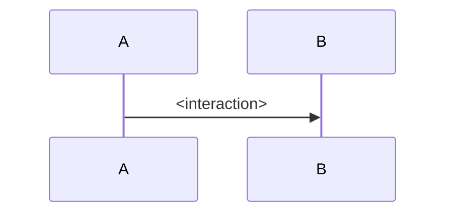

# Architecture Doc Templates

This page defines the default architecture writing contract for Tyrum.

Use it to keep docs newcomer-friendly at the top and detailed where detail belongs.

## Page archetypes

Architecture pages should be written as one of three archetypes.

| Archetype | Typical levels | Purpose                                               | Word target | Diagram rule                                                                |
| --------- | -------------- | ----------------------------------------------------- | ----------- | --------------------------------------------------------------------------- |
| Overview  | Level 0/1      | Build a clear system or subsystem mental model fast   | 350-900     | **Required:** at least one Mermaid diagram near the top                     |
| Component | Level 2        | Explain one behavior boundary and how it works        | 350-800     | **Expected for most pages:** add Mermaid when it reduces ambiguity          |
| Reference | Level 3        | Specify exact mechanics, schemas, and ops constraints | flexible    | Optional; add Mermaid/table only when it improves comprehension of the spec |

## Opening summary pattern

Every architecture page should start with a short orientation block before deep detail:

- `Read this if ...`
- `Skip this if ...`
- `Go deeper ...`

Recommended length: 3-6 lines total.

## Diagram policy

- Mermaid is the standard format for new diagrams.
- Level 0 and Level 1 pages must include at least one Mermaid diagram.
- Level 2 pages should include a Mermaid diagram when the topic has flow, boundaries, or handoff state.
- Level 3 pages may stay mostly textual, but should include diagrams or compact tables when they clearly lower reading cost.
- Prefer one primary diagram near the top over multiple small diagrams scattered through the page.

## Drill-down and traceability rules

- Level 0 links to Level 1 only.
- Level 1 links upward to Level 0 and downward to owned Level 2 pages.
- Level 2 links upward to its Level 1 parent and downward to relevant Level 3 references.
- Level 3 links back to the closest useful Level 2 or Level 1 context page.

Keep one canonical overview page and one canonical mechanics page per concept.

## Overview template (Level 0/1)

Use this for architecture landing pages and major subsystem overviews.

````md
# <System or Subsystem Name>

Read this if: <who should read now>
Skip this if: <who should jump to detail pages>
Go deeper: <Child page 1>, <Child page 2>

<One-sentence role of this system/subsystem.>

## Purpose

<Why this exists and what problem it solves.>

## Core building blocks

- **<Block>:** <Responsibility and boundary>
- **<Block>:** <Responsibility and boundary>

## Topology


## Primary flows

### <Flow name>

1. <Step>
2. <Step>
3. <Step>

## Key decisions and tradeoffs

- **<Decision>:** <Why this boundary exists>
- **<Decision>:** <What it optimizes for>

## Drill-down

- <Child page 1>
- <Child page 2>
````

## Component template (Level 2)

Use this for a single subsystem concept (for example approvals, memory, workboard, tools).

````md
# <Component Name>

Read this if: <who needs this concept>
Skip this if: <who can stay at overview level>
Go deeper: <Mechanics page>

<One-sentence component boundary.>

## Purpose

<Why this component exists inside the parent subsystem.>

## Responsibilities

- <Responsibility>
- <Responsibility>

## Non-goals

- <What this page/component does not own>

## Inputs, outputs, dependencies

- **Inputs:** <...>
- **Outputs:** <...>
- **Dependencies:** <...>

## Control flow



## Invariants and constraints

- <Invariant>
- <Constraint>

## Failure and recovery

- **Failures:** <Expected failures>
- **Recovery:** <How it recovers>

## Related docs

- <Parent overview>
- <Mechanics reference>
````

## Reference template (Level 3)

Use this for exact protocol, data-model, storage, and operational mechanics pages.

```md
# <Mechanics Topic>

Read this if: <who needs exact behavior>
Skip this if: <who should start at concept/overview>
Go deeper: <Sibling detail page>

<One-sentence statement of what is specified here.>

## Parent concept

- <Parent page>

## Scope

<What this page specifies and what it does not.>

## Detailed mechanics

### <Section>

1. <Step>
2. <Step>

## Constraints and edge cases

- <Constraint>
- <Edge case>

## Operational notes

- <How to monitor or maintain>

## Related docs

- <Overview>
- <Adjacent reference>
```

## Author checklist

- Archetype is explicit (`Overview`, `Component`, or `Reference`).
- Opening summary uses `Read this if / Skip this if / Go deeper`.
- Diagram requirements are met for the selected archetype.
- Page links cleanly upward and downward in the architecture tree.
- The first screen of content is understandable to the intended reader.
