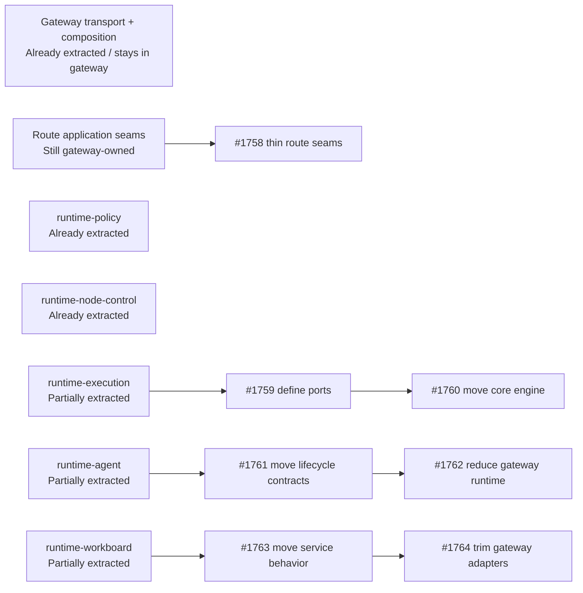

# Runtime extraction parity map

This map bridges the [Target-state package graph](/architecture/target-state) and the current `@tyrum/gateway` layout. Use it as the contributor-facing source of truth for the [#1755 extraction epic](https://github.com/tyrumai/tyrum/issues/1755) and update it whenever ownership moves.

## Quick orientation

- **Read this if:** you are deciding whether new code belongs in `@tyrum/gateway` or one of the runtime packages.
- **Skip this if:** you only need the target dependency rules; use [Target-state package graph](/architecture/target-state).
- **Go deeper:** use [ARCH-01 clean-break target-state decision record](/architecture/arch-01-clean-break-target-state), `packages/gateway/src/bootstrap/runtime-builders.ts`, and the linked extraction issues.

## Status key

- **Already extracted:** for runtime packages, the target package is already the behavioral owner; for intentional gateway-owned domains, the domain is already at its target boundary.
- **Partially extracted:** a runtime package exists, but gateway still owns meaningful behavior or duplicate seams.
- **Still gateway-owned:** the behavior still lives primarily in `@tyrum/gateway` even though the target state says it should be thinner.

## Snapshot diagram

## Runtime domain map

| Domain                                                           | Target package/layer                                          | Current ownership snapshot                                                                                                                                                                                                                                                                          | Status              | Blockers / drift to watch                                                                                                                                                                           | Next intended issue or step                                                                                                                                                                                                             |
| ---------------------------------------------------------------- | ------------------------------------------------------------- | --------------------------------------------------------------------------------------------------------------------------------------------------------------------------------------------------------------------------------------------------------------------------------------------------- | ------------------- | --------------------------------------------------------------------------------------------------------------------------------------------------------------------------------------------------- | --------------------------------------------------------------------------------------------------------------------------------------------------------------------------------------------------------------------------------------- |
| Bootstrap, HTTP/WS transport, and bundled operator asset serving | `@tyrum/gateway` composition root                             | `packages/gateway/src/bootstrap/*`, `packages/gateway/src/routes/*`, and `packages/gateway/src/ws/*` remain the intended public runtime surface.                                                                                                                                                    | Already extracted   | The risk here is not missing extraction; it is transport and business logic drifting back into gateway internals.                                                                                   | Keep this surface thin and enforce it through [#1756](https://github.com/tyrumai/tyrum/issues/1756).                                                                                                                                    |
| Planner and other route-level application seams                  | `@tyrum/gateway` transport adapters calling explicit services | `packages/gateway/src/routes/plan.ts` still mixes transport, policy, wallet, and DAL orchestration directly inside the route layer.                                                                                                                                                                 | Still gateway-owned | The internal gateway boundary rule in [#1756](https://github.com/tyrumai/tyrum/issues/1756) is the gating safeguard for keeping future route logic from spreading.                                  | Land [#1758](https://github.com/tyrumai/tyrum/issues/1758) so `/plan` becomes a transport adapter, then apply the same seam to other route and WebSocket entry points touched by [#1756](https://github.com/tyrumai/tyrum/issues/1756). |
| Policy evaluation, overrides, and review-policy primitives       | `@tyrum/runtime-policy`                                       | `packages/runtime-policy/src/*` owns evaluation, bundle merge/load, admin service, suggested overrides, and review-policy helpers. Gateway mostly retains stores, scoped snapshot helpers, and route/process wiring.                                                                                | Already extracted   | Approval processors and review delivery are still gateway-integrated, so avoid reintroducing new policy logic under `packages/gateway/src/modules/policy` or `packages/gateway/src/modules/review`. | No extraction issue is needed in this epic; treat new work here as adapter-thinning only unless a focused follow-up issue is opened.                                                                                                    |
| Node pairing, readiness, inventory, and dispatch coordination    | `@tyrum/runtime-node-control`                                 | `packages/runtime-node-control/src/*` owns pairing, capability-ready, inventory, and dispatch services. Gateway retains protocol and DAL adapters plus capability catalog and inspection surfaces.                                                                                                  | Already extracted   | Capability catalog and inspection behavior are still gateway-owned product surfaces; do not let them pull pairing or dispatch logic back out of the runtime package.                                | Keep new pairing, readiness, inventory, and dispatch rules in `@tyrum/runtime-node-control`. Open a separate follow-up only if capability inspection needs its own extraction target.                                                   |
| Execution engine orchestration and worker loop                   | `@tyrum/runtime-execution`                                    | `packages/runtime-execution/src/*` currently exposes worker-loop, task-result, and type seams, but the execution engine core still lives under `packages/gateway/src/modules/execution/engine/**` plus gateway step executors.                                                                      | Partially extracted | The runtime package surface is still too thin to move core orchestration safely without first freezing the adapter ports back into gateway.                                                         | Land [#1759](https://github.com/tyrumai/tyrum/issues/1759) first, then [#1760](https://github.com/tyrumai/tyrum/issues/1760).                                                                                                           |
| Agent runtime lifecycle and turn orchestration                   | `@tyrum/runtime-agent`                                        | `packages/runtime-agent/src/*` owns the generic `AgentRuntime` shell and context-pruning helper. Gateway still owns lifecycle contracts, context assembly, tool-set building, turn preparation, and turn execution under `packages/gateway/src/modules/agent/runtime/**`.                           | Partially extracted | Gateway remains the primary source of lifecycle and context types today, so package extraction would be unstable without a contract pass first.                                                     | Land [#1761](https://github.com/tyrumai/tyrum/issues/1761) first, then [#1762](https://github.com/tyrumai/tyrum/issues/1762).                                                                                                           |
| Workboard orchestration, CRUD behavior, and delegated execution  | `@tyrum/runtime-workboard`                                    | `packages/runtime-workboard/src/*` owns orchestrator, dispatcher, reconciler, subagent-service, and package service entry points, but gateway still owns DALs, `GatewayWorkboardService`, runtime adapters, notifications, and scheduler helpers under `packages/gateway/src/modules/workboard/**`. | Partially extracted | Ownership is duplicated: the runtime package exists, but substantive CRUD and operator-facing behavior still lives in gateway.                                                                      | Land [#1763](https://github.com/tyrumai/tyrum/issues/1763) first, then [#1764](https://github.com/tyrumai/tyrum/issues/1764).                                                                                                           |
| Operational control-plane plumbing outside this runtime split    | `@tyrum/gateway`                                              | Auth, backplane, lifecycle hooks, observability, and operator asset composition remain gateway-owned and are not mapped to new runtime packages in the target graph.                                                                                                                                | Already extracted   | These areas can still accumulate business logic by accident if execution, agent, or workboard work reaches back into them.                                                                          | Keep them in gateway. Open new extraction work only if the target-state graph changes.                                                                                                                                                  |

## Sequencing guidance

1. Use this map as the source-of-truth input for [#1759](https://github.com/tyrumai/tyrum/issues/1759), [#1761](https://github.com/tyrumai/tyrum/issues/1761), and [#1763](https://github.com/tyrumai/tyrum/issues/1763).
2. Do not start [#1760](https://github.com/tyrumai/tyrum/issues/1760), [#1762](https://github.com/tyrumai/tyrum/issues/1762), or [#1764](https://github.com/tyrumai/tyrum/issues/1764) before their preceding contract and ownership issues land.
3. Treat policy and node-control as the reference pattern for the end state: package-owned behavior with gateway-specific adapters at the edge.

## Related docs

- [Architecture overview](/architecture)
- [Target-state package graph](/architecture/target-state)
- [ARCH-01 clean-break target-state decision record](/architecture/arch-01-clean-break-target-state)
