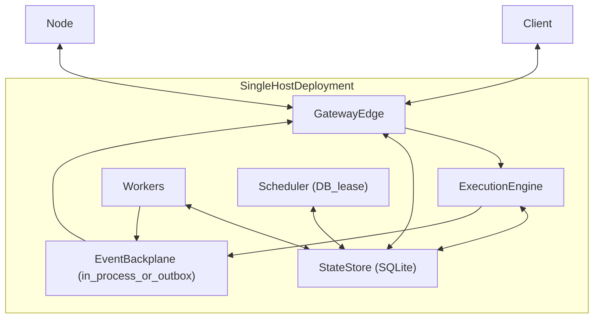
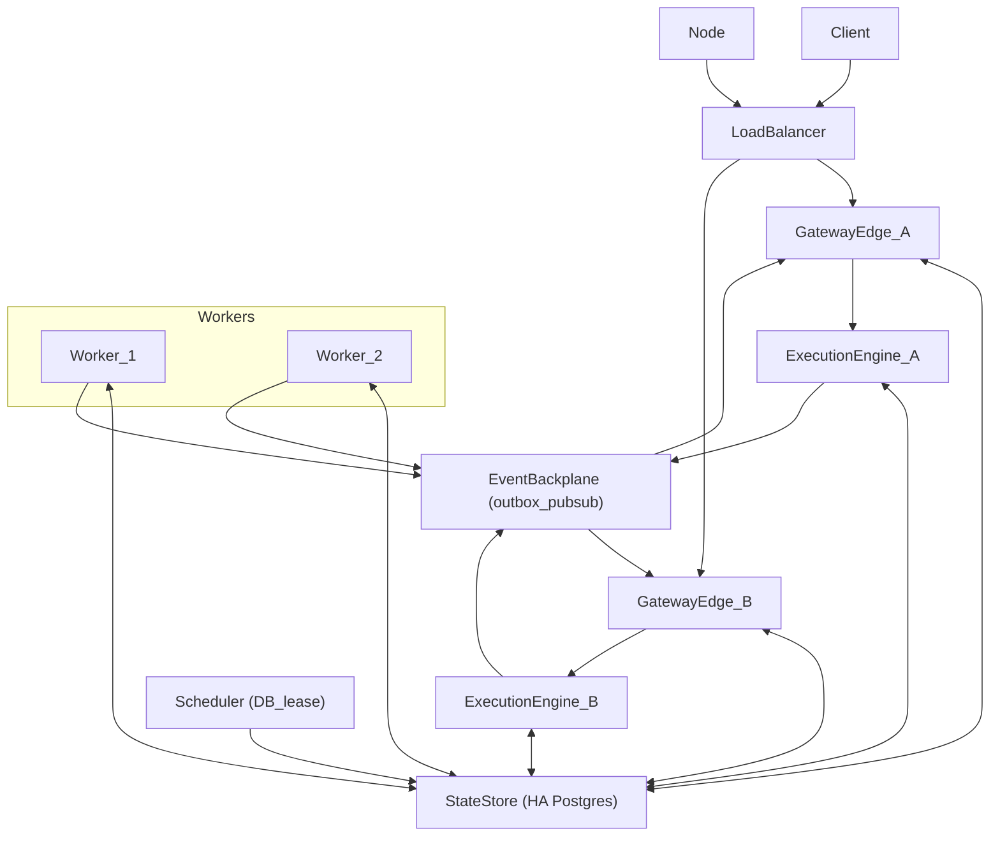

# Scaling and High Availability

Status:

This document describes how Tyrum scales from a single-machine install (for example a desktop app with an embedded gateway and a local SQLite database) to a horizontally scalable deployment (replicated gateway edge + workers + lease-based schedulers backed by HA Postgres).

The intent is a **single architecture** with a fixed set of logical components that can be co-located or split across processes/hosts as deployment needs grow.

A core goal is that a single-host deployment behaves like “the cluster, but with 1 of each”: the same coordination primitives (leases and the event backplane) exist in all deployments, and the single-host case is simply uncontested and often implemented in-process.

## Hard invariants

Tyrum’s architecture relies on a few invariants that must hold in both small and large deployments:

- **Durable state:** sessions, approvals, runs/jobs/steps, and audit logs must survive process restarts.
- **Retry safety:** requests and events must be safe under retries and at-least-once delivery.
- **Lane serialization:** execution is serialized per `(session_key, lane)` (see [Sessions and Lanes](./sessions-lanes.md)).
- **Secrets by handle:** raw secret values do not enter model context; executors resolve handles at the last responsible moment (see [Secrets](./secrets.md)).
- **Observable execution:** long-running work emits events and can be inspected/replayed from durable logs (see [Execution engine](./execution-engine.md)).

## Logical components

These are the logical building blocks that appear in all deployments:

- **Gateway edge:** WebSocket server, auth, contract validation, routing, event delivery to connected clients/nodes.
- **Execution engine:** durable run state machine and orchestration (pause/resume, retries, idempotency, budgets).
- **Workers:** step executors that claim work and perform side effects via tools/nodes/MCP.
- **Schedulers:** cron/watchers/heartbeat triggers that enqueue work (must be cluster-safe; see below).
- **StateStore:** the system of record for durable state and logs (SQLite locally; Postgres for HA/scale).
- **Event backplane:** a cross-instance delivery mechanism for events/commands in clustered deployments.
- **Secret provider:** resolves secret handles to raw values in trusted execution contexts.

## StateStore (SQLite → HA Postgres)

Tyrum is local-first by default and can use SQLite for a single-machine install. Horizontal scaling and HA require a shared StateStore with stronger concurrency and durability semantics (typically Postgres).

- **Local default:** SQLite file, single host.
- **Scalable/HA:** HA Postgres cluster (3-node) or a Postgres-compatible managed database platform.

The most important portability discipline is: **treat persisted schemas as contracts**. If you want SQLite and Postgres to be swappable backends, schema changes must be versioned and tested against both backends.

## WebSocket-first event delivery (the “WS reality”)

Tyrum is **WebSocket-first**: typed requests/responses plus server-push events are the primary operator interface transport (see [Protocol](./protocol/index.md)).

A WebSocket connection is a single long-lived TCP connection. Practically that means:

- **A connection is owned by exactly one gateway edge instance at a time** (trivial when there is only one instance).
- Durable state can live entirely in the StateStore, but **only the owning instance can write to that socket**.

This is not a Tyrum-specific limitation; it is a property of long-lived connections. To keep behavior consistent when scaling up, deployments route updates through an **event backplane** abstraction: in a single-host deployment this may be in-process, while in multi-instance deployments it becomes a shared backplane.

### Event backplane options (capabilities, not mandates)

The backplane is a logical requirement; it can be implemented in several ways depending on scale:

- **In-process backplane:** local pub/sub when components are co-located (replica count = 1). Lowest operational overhead while keeping the same eventing model.
- **DB outbox + polling:** write events to an outbox table in the StateStore; gateway edges poll and deliver. Simple, durable, and a good starting point.
- **Postgres `LISTEN/NOTIFY`:** useful for low/medium scale real-time signaling; still typically paired with an outbox for durability.
- **External pub/sub (Redis/NATS/Kafka):** higher throughput and lower latency; commonly paired with an outbox for replay/recovery.

## Workers: claim/lease + idempotency + lane locks

To scale execution safely, workers must be able to run concurrently without duplicating side effects or corrupting session state. The standard pattern is:

- **Durable job/run state** in the StateStore.
- **Atomic claim/lease** of work items so only one worker executes a given step attempt at a time.
- **Idempotency keys** for side-effecting steps so retries are safe.
- **Lane serialization** enforced via a distributed lock/lease keyed by `(session_key, lane)`.

The exact mechanism can vary (row-level locks, advisory locks, lease rows), but the observable behavior must match the [Sessions and Lanes](./sessions-lanes.md) guarantee.

## Schedulers/watchers/cron: DB-leases (always)

Schedulers must not double-fire triggers when multiple instances are running. To keep semantics identical between single-host and clustered deployments, schedulers use **DB-leasing** in the StateStore:

- A scheduler instance acquires a lease (owner id + expiry) for a given schedule/trigger shard.
- The lease is renewed periodically; on expiry another instance can take over.
- Each firing should have a durable, unique `firing_id` so downstream enqueue/execution can dedupe under retries.

## Deployment topologies

These are examples of deploying the same logical components in different shapes.

### Single host (co-located)

All logical components run on one machine, and may run in a single OS process for simplicity. The backplane and leases still exist; they are simply uncontested and often implemented in-process.

### Cluster (replicated edge + replicated workers + leased scheduler)

Gateway edge instances are replicated for connection handling and API capacity. Workers are replicated for throughput. The execution engine can be co-located with each gateway edge instance; coordination via the StateStore (leases/locks) keeps behavior consistent as replica counts change. Schedulers use DB-leases to prevent double-fires. Durable state lives in HA Postgres.

