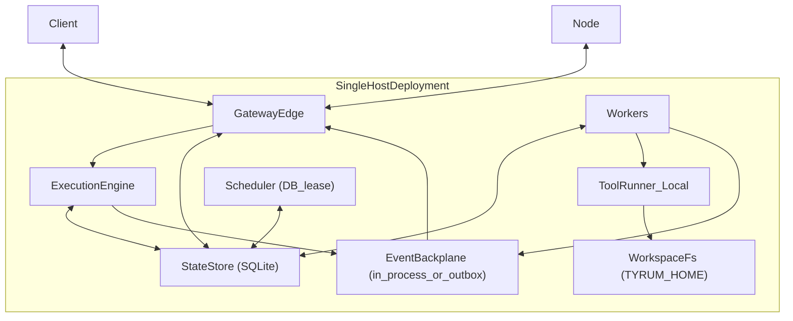
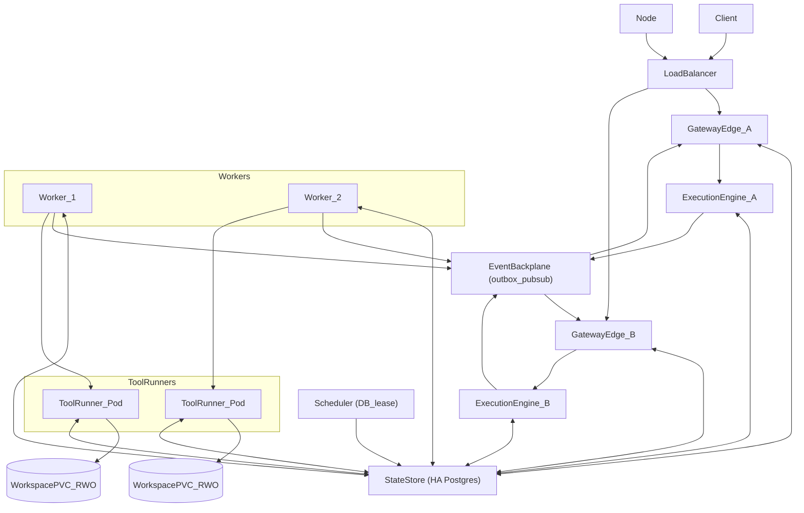

# Scaling and High Availability

Tyrum runs as a single-host local installation or as a horizontally scalable deployment with replicated gateway edges, workers, and lease-coordinated schedulers backed by HA Postgres.

The system uses one logical architecture in all deployments. Components may be co-located or split across processes/hosts; coordination primitives (leases and the event backplane) are always present so a single-host deployment behaves like a cluster with one replica.

## Hard invariants

Tyrum’s architecture relies on a few invariants that must hold in both small and large deployments:

- **Durable state:** sessions, approvals, runs/jobs/steps, and audit logs must survive process restarts.
- **Retry safety:** requests and events must be safe under retries and at-least-once delivery.
- **Lane serialization:** execution is serialized per `(session_key, lane)` (see [Sessions and Lanes](./sessions-lanes.md)).
- **Secrets by handle:** raw secret values do not enter model context; executors resolve handles at the last responsible moment (see [Secrets](./secrets.md)).
- **Observable execution:** long-running work emits events and can be inspected/replayed from durable logs (see [Execution engine](./execution-engine.md)).

## Logical components

These are the logical building blocks that appear in all deployments:

- **Gateway edge:** WebSocket server, auth, contract validation, routing, event delivery to connected clients/nodes.
- **Execution engine:** durable run state machine and orchestration (pause/resume, retries, idempotency, budgets).
- **Workers:** step executors that claim work and perform side effects via tools/nodes/MCP.
- **ToolRunner:** an execution context that mounts a workspace filesystem and runs tool steps. In a single-host deployment it can be a local subprocess; in a cluster it is typically a sandboxed job/pod.
- **Schedulers:** cron/watchers/heartbeat triggers that enqueue work (must be cluster-safe; see below).
- **StateStore:** the system of record for durable state and logs (SQLite locally; Postgres for HA/scale).
- **Event backplane:** a cross-instance delivery mechanism for events/commands in clustered deployments.
- **Secret provider:** resolves secret handles to raw values in trusted execution contexts.

## Runtime roles

Containerized deployments run three long-lived roles:

- **`gateway-edge`**: WebSocket/HTTP edge, auth, contract validation, routing, and the execution engine control plane.
- **`worker`**: claims work and performs step execution (side effects) via tools/nodes/MCP.
- **`scheduler`**: cron/watchers/heartbeat triggers coordinated by DB leases.

### Packaging

Tyrum is distributed as container images that run any of the runtime roles via entrypoints/flags. Reference deployment forms include:

- `docker-compose` for single-host installs
- Helm for clustered installs

## StateStore

The StateStore is the system of record for durable state and logs.

- **Single host:** SQLite file on local disk.
- **Multi-instance:** HA Postgres cluster (or Postgres-compatible managed database).

Persisted schemas are treated as contracts. Schema changes are versioned and validated against all supported backends.

Split deployments run on Postgres.

Schema change scripts are maintained per backend (SQLite and Postgres) while keeping core tables aligned (sessions, approvals, execution, outbox, routing directory, audit).

### Snapshot export/import

The gateway supports snapshot export/import for the durable tables required to reconstruct sessions and execution:

- exports are consistent (transactional) and include the minimal indexes needed for audit and replay
- imports preserve stable identifiers (`session_key`, `run_id`, `step_id`, `attempt_id`, `approval_id`, `artifact_id`) and hashes
- snapshot bundles declare whether they include artifact bytes (and for which sensitivity classes), and include artifact retention lifecycle metadata needed to interpret “missing bytes” states

## WebSocket-first event delivery (the “WS reality”)

Tyrum is **WebSocket-first**: typed requests/responses plus server-push events are the primary operator interface transport (see [Protocol](./protocol/index.md)).

A WebSocket connection is a single long-lived TCP connection. Practically that means:

- **A connection is owned by exactly one gateway edge instance at a time** (trivial when there is only one instance).
- Durable state can live entirely in the StateStore, but **only the owning instance can write to that socket**.

This is not a Tyrum-specific limitation; it is a property of long-lived connections. To keep behavior consistent when scaling up, deployments route updates through an **event backplane** abstraction: in a single-host deployment this may be in-process, while in multi-instance deployments it becomes a shared backplane.

### Event backplane

The backplane uses a durable outbox table in the StateStore:

- Producers append events/commands to the outbox.
- Gateway edges poll and deliver outbox items to their connected peers.
- Consumers treat delivery as at-least-once and dedupe using ids.

See [Backplane (outbox contract)](./backplane.md) for explicit ordering, retention, replay, and failure behavior expectations.

Deployments may use low-latency signals (for example Postgres `LISTEN/NOTIFY` or external pub/sub) to reduce polling latency. The outbox remains the durable source of truth and replay log.

### WebSocket routing (connection directory)

Each gateway edge instance heartbeats its active connections (with TTL) into the StateStore, including identity metadata (role, `device_id`) and capability summaries where relevant. Directed dispatch uses the directory to enqueue outbox commands to the owning edge for a given peer.

## Workers: claim/lease + idempotency + lane locks

To scale execution safely, workers must be able to run concurrently without duplicating side effects or corrupting session state. The standard pattern is:

- **Durable job/run state** in the StateStore.
- **Atomic claim/lease** of work items so only one worker executes a given step attempt at a time.
- **Idempotency keys** for side-effecting steps so retries are safe.
- **Lane serialization** enforced via a distributed lock/lease keyed by `(session_key, lane)`.

The exact mechanism can vary (row-level locks, advisory locks, lease rows), but the observable behavior must match the [Sessions and Lanes](./sessions-lanes.md) guarantee.

## Schedulers/watchers/cron: DB-leases (always)

Schedulers must not double-fire triggers when multiple instances are running. To keep semantics identical between single-host and clustered deployments, schedulers use **DB-leasing** in the StateStore:

- A scheduler instance acquires a lease (owner id + expiry) for a given schedule/trigger shard.
- The lease is renewed periodically; on expiry another instance can take over.
- Each firing should have a durable, unique `firing_id` so downstream enqueue/execution can dedupe under retries.

## Workspace durability and mount semantics (the `TYRUM_HOME` reality)

Tyrum treats the workspace filesystem as a durable operator-visible surface: an agent can write files and expect them to exist across restarts and future runs.

In single-host deployments this is straightforward: `TYRUM_HOME` is a persistent local directory on disk.

In clustered deployments, **durable workspaces** interact with Kubernetes volume semantics:

- **RWO volumes** can be attached read/write by only one node at a time.
- If multiple long-lived deployments (edge/worker/scheduler) all mount the same RWO PVC, multi-node clusters can wedge on volume attachment.

To keep the single-host and cluster behaviors aligned while avoiding RWX requirements, Tyrum uses a simple rule:

- **Only ToolRunner mounts the workspace filesystem.**
- Gateway edge, schedulers, and control-plane workers are otherwise **stateless with respect to workspace POSIX volumes**.

Long-term memory does not depend on the workspace filesystem: it is stored in the **StateStore** and is scoped to the agent, making it available across channels and across gateway replicas without requiring shared POSIX mounts.

ToolRunner runs as a **local subprocess** in single-host deployments and as a **sandboxed job/pod** in clustered deployments. Both forms mount the workspace at `TYRUM_HOME`, execute workspace-backed tools, persist outcomes/artifacts to the StateStore, and exit.

## Deployment topologies

These are examples of deploying the same logical components in different shapes.

### Single host (co-located)

All logical components run on one machine and may run in a single OS process. The backplane and leases are still used; with one replica they are uncontested and can run in-process.

### Cluster (replicated edge + replicated workers + leased scheduler)

Gateway edge instances are replicated for connection handling and API capacity. Workers are replicated for throughput. The execution engine can be co-located with each gateway edge instance; coordination via the StateStore (leases/locks) keeps behavior consistent as replica counts change. Schedulers use DB-leases to prevent double-fires. Durable state lives in HA Postgres.

## Failure and failover validation

Coordination primitives (leases, outbox delivery, approvals, and lane serialization) are exercised by integration tests with an explicit failure matrix, including:

- edge crash/restart while clients are connected
- worker crash/restart during an in-flight attempt (lease expiry/takeover)
- scheduler crash/restart (no double-fires; leases transfer)
- database transient failures and restart/failover behavior
- network partitions between components (edge↔DB, worker↔DB)

These tests are treated as **hard gates**: reference deployments and the failure-matrix suite should run in CI so scaling behavior does not regress unnoticed.
