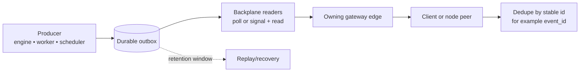

# Backplane (Outbox Contract)

This is a mechanics/reference page for clustered event delivery. Read it after [Scaling and High Availability](/architecture/scaling-ha), not before.

## Quick orientation

- **Read this if:** you need the durable outbox mental model, replay expectations, or cluster fanout invariants.
- **Skip this if:** you are still building the top-level deployment picture.
- **Go deeper:** use [Protocol events](/architecture/protocol/events) for payload semantics and [Operational table maintenance](/architecture/operational-maintenance) for pruning details.

## Durable outbox mental model

The outbox is the durable source of truth. The backplane is only the mechanism that gets durable rows to the edge instance that owns a live socket.

## What the backplane must guarantee

| Contract               | What it means operationally                                                                             |
| ---------------------- | ------------------------------------------------------------------------------------------------------- |
| At-least-once delivery | Consumers and peers must tolerate duplicates.                                                           |
| No global ordering     | Reconnects and replica races can reorder events. Critical views must be rebuildable from durable state. |
| Tenant isolation       | Each outbox item belongs to exactly one `tenant_id`; delivery never crosses tenants.                    |
| Durable append         | Producers append outbox items transactionally with the state they describe when feasible.               |
| Bounded retention      | Replay history is finite; operators recover old state from durable APIs, not infinite event history.    |

## Delivery loop

1. A producer writes state and appends an outbox row.
2. A backplane reader polls the outbox or wakes up from a low-latency signal.
3. The reader routes the row to the edge that currently owns the target connection.
4. The edge delivers the event or command over WebSocket.
5. The peer deduplicates by stable identity and refreshes durable state if ordering matters.

## What is in the outbox

| Item type        | Typical use                                                                          |
| ---------------- | ------------------------------------------------------------------------------------ |
| Event            | Notify clients/nodes about execution, approvals, pairing, presence, or work changes. |
| Directed command | Route a delivery action to the edge that owns a specific peer or connection.         |

## Retention and replay

The retention window exists to survive normal restart and failover, not to act as the only audit log.

| Recovery case            | Expected behavior                                                                            |
| ------------------------ | -------------------------------------------------------------------------------------------- |
| Edge restart             | Unconsumed rows remain deliverable after the edge comes back or another edge takes over.     |
| Short partition          | Readers resume from durable outbox state and may redeliver rows.                             |
| Peer reconnect           | The peer may see duplicates or gaps and should refresh durable state for critical views.     |
| Offline beyond retention | Incremental events may be gone; recovery must still work from durable state tables and APIs. |

## Implementation freedom

Implementations may differ on latency and transport:

- Polling only.
- Polling plus Postgres `LISTEN/NOTIFY`.
- Another signal path paired with the same durable outbox.

What does not change is the contract above: durable append, at-least-once delivery, dedupe safety, and bounded retention.

## Safety notes

- Avoid raw secret values in outbox payloads; store handles or redacted material instead.
- Treat outbox rows and any fanout transport as sensitive operator data.
- Do not assume socket delivery alone is enough for correctness; durable StateStore state remains authoritative.

## Related docs

- [Scaling and High Availability](/architecture/scaling-ha)
- [Protocol events](/architecture/protocol/events)
- [Operational table maintenance](/architecture/operational-maintenance)
- [Data lifecycle and retention](/architecture/data-lifecycle)
