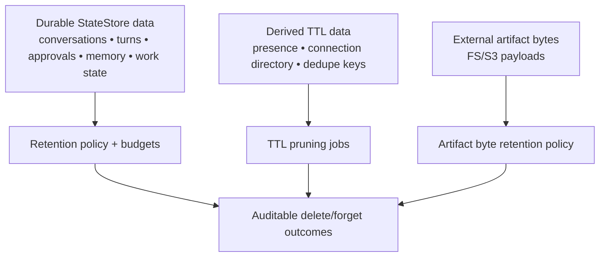

# Data lifecycle and retention

This is a scaling/reference page for retention mechanics across Tyrum data surfaces. It is not the best first page for understanding deployment architecture.

## Quick orientation

- **Read this if:** you are setting retention policy, planning pruning jobs, or validating audit/privacy guarantees.
- **Skip this if:** you need the deployment mental model first; start at [Scaling and high availability](/architecture/scaling-ha).
- **Go deeper:** use [Operational table maintenance contract](/architecture/operational-maintenance) for table-level maintenance behavior.

The StateStore is the source of truth for conversations, turns, approvals, and audit evidence.
That durability must be paired with explicit **retention** and **deletion** rules so deployments remain operable (bounded cost), safe (privacy), and explainable (audit).

This page summarizes lifecycle expectations across the major data surfaces. Most sections stay implementation-agnostic, but the conversation/channel transcript surfaces below document the current retention contract and deployment knobs because they are high-volume by default.

References:

- [Scaling and high availability](/architecture/scaling-ha)
- [Backplane (outbox contract)](/architecture/backplane)
- [Observability](/architecture/observability)
- [Operational table maintenance contract](/architecture/operational-maintenance)
- [Artifacts](/architecture/artifacts)
- [Sandbox and policy](/architecture/sandbox-policy)

## Lifecycle map



## Principles

- **Bounded by default:** every high-volume surface has an explicit retention/TTL/limit/budget.
- **Durable truth vs derived views:** durable tables are the source of truth; derived views (presence, directories, caches) are TTL-bounded.
- **Safety first:** sensitive classes (secrets, sensitive artifacts, connector payloads) default to shorter retention and stricter access.
- **Auditable deletion:** destructive lifecycle actions are observable and attributable (who/when/why).

## Data classes (what exists where)

### Durable StateStore data (system of record)

Examples:

- conversations, transcript events, and conversation state
- durable agent memory (facts, notes/preferences, procedures, tombstones)
- durable work state (WorkItems, task graphs, WorkArtifacts/DecisionRecords/WorkSignals, state KV)
- conversation/turn/evidence state
- approvals and policy overrides
- audit/event logs and policy decision records
- outbox items (backplane)

Lifecycle expectations:

- Retention is configurable and documented.
- Stable identifiers remain stable across export/import (see [Scaling and high availability](/architecture/scaling-ha)).
- Deletions do not silently break referential “why was this allowed?” questions (for example keep minimal tombstones or export snapshots for audit as required by policy).

### Derived/TTL-bounded StateStore data

Examples:

- presence and instance inventory (TTL-pruned)
- connection directory entries (owning-edge heartbeats with TTL)
- inbound dedupe keys (TTL-bounded)

Lifecycle expectations:

- TTL pruning is safe under clustered edges (no correctness dependence on long-lived cache rows).
- TTL windows are chosen to tolerate normal jitter and brief partitions without creating “ghost ownership”.

Architecture notes:

- TTL-derived state is pruned periodically based on explicit expiry timestamps.
- The per-table maintenance contract for current operational tables is documented in [Operational table maintenance contract](/architecture/operational-maintenance).
- Conversation/transcript retention is enforced by configurable lifecycle policies (for example last-activity windows), with safe cascading to dependent derived records.
- In clustered deployments, retention jobs run under a single-writer lock/lease so pruning is correct and predictable.

## Conversation + channel retention contract

Tyrum's clean-break retention contract for the highest-volume conversation/message surfaces is:

- `transcript_events` is durable retained history. Compaction does not collapse history back into one mutable transcript blob.
- `conversation_state` stays bounded by checkpoint, pending-state, and current-truth budgets instead of by unbounded transcript growth.
- `turns` are retained under explicit lifecycle policy so operators can inspect recent execution detail without letting turn drilldown grow forever.
- Inactive conversations are pruned by conversation lifecycle policy plus explicit operator delete/forget actions where supported.
- Conversation pruning cascades to dependent rows such as model overrides, provider pins, context reports, and turn-level derived records.
- Terminal channel transport rows are pruned by deployment config `lifecycle.channels.terminalRetentionDays` (default `7`).
- `channel_inbox` rows in status `failed` are retained for the terminal retention window, then deleted.
- `channel_inbox` rows in status `completed` are deleted only after dependent `channel_outbox` rows are gone. This keeps repair/debug data available while delivery-side work still exists.
- Successful `channel_outbox` rows are removed immediately after send. Failed `channel_outbox` rows are retained for the same terminal retention window, then pruned.

Example deployment config:

```json
{
  "lifecycle": {
    "conversations": { "ttlDays": 30 },
    "turns": { "terminalRetentionDays": 30 },
    "channels": { "terminalRetentionDays": 7 }
  }
}
```

## Review, managed-runtime, and location retention

These surfaces are smaller than transcripts, but they are architecture-significant because they answer safety and context questions that operators will ask later.

### Review records

- `approvals`, `node_pairings`, and `review_entries` form part of the durable safety/audit chain.
- Review rows should stay retained long enough to answer who reviewed what, why it escalated, and which evidence justified the final decision.
- If long-term retention pressure exists, prune review evidence bodies before deleting the parent approval/pairing audit record entirely.

### Managed desktop environments

- `desktop_environment_hosts` and `desktop_environments` are durable control-plane inventory, not ephemeral cache rows.
- Environment status and runtime metadata should survive restarts so operators can understand the last known state of a sandbox.
- Attached desktop-environment logs are bounded operational evidence and should be retained on shorter windows than the canonical environment record.

### Location data

- `location_profiles`, `location_places`, and `automation_triggers` are durable operator configuration and should be retained until explicitly changed or deleted.
- `location_subject_states` are the current derived state needed for correct enter/exit/dwell evaluation and should be retained while the profile is active.
- `location_samples` and `location_events` are high-sensitivity history. Retain them under explicit windows that balance audit/debug value against privacy and storage cost.
- If aggressive pruning is required, remove old raw samples first, then old location events, while keeping enough history to explain recent trigger firings.

### Artifact bytes (FS/S3)

Artifact bytes live outside the StateStore; the StateStore holds metadata and durable linkage.

Lifecycle expectations:

- Artifact retention varies by label/sensitivity and is governed by policy (see [Artifacts](/architecture/artifacts)).
- Artifact fetch is always authorized by durable linkage (anti-IDOR) and is auditable.
- Deleting artifact bytes without deleting metadata should be treated as a first-class state (for example “missing bytes”) and surfaced to operators.

## Outbox/backplane retention (special case)

The outbox is both a delivery queue and a replay log. It must be durable **and** bounded.

Lifecycle expectations:

- Retention and compaction are explicit and enforced (see [Backplane](/architecture/backplane)).
- Operational recovery (edge restarts, brief partitions) should succeed without manual outbox surgery.
- When outbox items are deleted by retention, recovery remains possible via durable StateStore-backed reads (events are not the only truth).

## Memory budgets (special case)

Agent memory persists across restarts, but must remain bounded for cost and operability. The default lifecycle model is **budget-based**, not time-based:

- Inactivity must not cause forgetting.
- When budgets are exceeded, the system performs consolidation and eviction until back under budget.
- Eviction should prefer compressing/re-summarizing high-volume episodic data and dropping derived indexes (embeddings) before deleting canonical memory content.
- Explicit “forget” actions must be auditable and should produce tombstones that preserve stable ids and deletion proof without retaining content.

## WorkBoard budgets (special case)

The WorkBoard must persist across restarts and multi-channel use, but its drilldown surfaces must remain bounded for cost and operator usability.

Lifecycle expectations:

- WorkItems and task state are retained long enough to support audit and "why did it do that?" investigation.
- WorkArtifacts and DecisionRecords are retained under explicit budgets and may be summarized/consolidated at task boundaries or under pressure.
- WorkSignals are lifecycle-managed: fired/resolved signals are archived, compacted, or deleted according to policy so they do not accumulate indefinitely.
- Canonical state KV (agent/work item) is small and authoritative; updates and deletions are observable and attributable.

Budget knobs may include:

- max WorkArtifacts per WorkItem (and max body bytes per artifact),
- max DecisionRecords per WorkItem,
- max active WorkSignals per WorkItem/workspace (and history retention for fired signals),
- max KV entries per scope (agent/work item).

WorkBoard drilldown should prefer **linking** to durable turn/approval/artifact identifiers over copying large raw logs, so auditability is preserved without unbounded growth.

## Redaction and privacy boundaries

Retention is only safe when redaction boundaries are correct:

- Secrets are referenced via handles and resolved only in trusted execution contexts (see [Secrets](/architecture/secrets)).
- Logs, tool outputs, artifacts, and outbound messages SHOULD apply redaction appropriate to the deployment’s policy.
- Treat WebSocket upgrade headers as sensitive (see [Handshake](/architecture/protocol/handshake)).

## Export/import and “forget” workflows

Snapshot export/import is part of the lifecycle story:

- Exports are consistent and preserve stable ids/hashes needed for audit and replay (see [Scaling and high availability](/architecture/scaling-ha)).
- Export bundles SHOULD document whether they include artifact bytes, and under what sensitivity rules.
  - Snapshot bundles declare this in `artifacts.bytes` (inclusion + sensitivity classes) and declare the presence of artifact-byte lifecycle fields via `artifacts.retention.turn_artifacts` (per-artifact lifecycle values live in `tables.turn_artifacts`).

If a deployment supports “forget” or data deletion requests, it MUST define:

- which durable records are deleted vs anonymized vs retained for audit,
- how linked artifacts are handled (metadata and bytes), and
- how the system proves deletion occurred (auditable events).

Architecture notes:

- “Forget” requests are explicit and confirmed, and require a declared decision (for example delete/anonymize/retain) with an auditable outcome.
- Destructive decisions preserve audit-chain continuity (for example via hash chaining) without retaining the deleted content.
