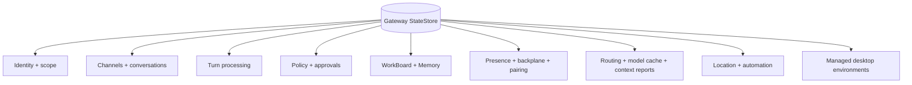

# Gateway data model map

This is a schema reference page for the Gateway StateStore under the clean-break conversation/turn architecture. It is intentionally table- and audit-heavy and should be used as a mechanics map, not a system overview.

## Quick orientation

- **Read this if:** you are mapping target-state runtime behavior to tables, reviewing retention/sensitivity posture, or validating migration impacts.
- **Skip this if:** you are learning architecture boundaries for the first time; start at [Scaling and high availability](/architecture/scaling-ha).
- **Go deeper:** use [ARCH-20 conversation and turn clean-break decision](/architecture/arch-20-conversation-turn-clean-break) for the vocabulary contract and [Gateway FK audit](./data-model-fk-audit.md) for relationship policy decisions.

This page is a lightweight, human-readable map of the target Gateway StateStore schema: table groups (“bounded contexts”), retention expectations, and sensitivity/PII notes for operators.

For the audited foreign-key vs soft-reference decisions on approval/policy linkage columns, see [Gateway FK audit](./data-model-fk-audit.md).

This document complements (and does not replace) the broader retention guidance in [Data lifecycle and retention](./data-lifecycle.md).

## Bounded-context cluster map

## Bounded contexts (table groups)

### Identity + scope

Tables:

- `tenants`, `agents`, `workspaces`, `agent_workspaces`

Purpose: durable identity and workspace scoping (multi-tenant boundary).

### Channels + conversations

Tables:

- `channel_accounts`, `channel_threads`
- `conversations`, `conversation_state`, `transcript_events`
- `conversation_model_overrides`, `conversation_provider_pins`
- `conversation_send_policy_overrides`, `conversation_queue_overrides`, `conversation_queue_signals`
- `channel_inbound_dedupe`, `channel_inbox`, `channel_outbox`

Purpose: connector accounts/threads, durable conversations/transcript retention, per-conversation overrides, and inbound/outbound queueing.

### Secrets + auth

Tables:

- `secrets`, `secret_versions`
- `auth_profiles`, `auth_profile_secrets`

Purpose: DB-backed secret handles + encrypted versions, and provider auth profile metadata.

### Policy + approvals

Tables:

- `policy_snapshots`, `policy_overrides`
- `approvals`, `review_entries`
- `plans`, `planner_events`

Purpose: durable policy bundles/overrides plus approval, review, and plan/audit surfaces.

### Turn processing + durable coordination

Tables:

- `turns`, `turn_items`, `turn_pauses`, `turn_artifacts`
- `resume_tokens`
- `conversation_leases`, `workspace_leases`
- `idempotency_records`, `concurrency_slots`

Purpose: durable turn orchestration state, immutable per-turn trace items, pause/resume metadata, evidence linkage, and the leases/idempotency primitives that keep conversation progress safe under retries or restarts.

### Automation (watchers)

Tables:

- `watchers`, `watcher_firings`

Purpose: durable watcher definitions and their firing/queue history.

### Location + location automation

Tables:

- `location_profiles`, `location_places`
- `location_samples`, `location_subject_states`, `location_events`
- `automation_triggers`

Purpose: durable location configuration plus accepted/rejected samples, geofence/category state, emitted events, and location-trigger definitions.

### Canvas artifacts

Tables:

- `canvas_artifacts`, `canvas_artifact_links`

Purpose: operator/agent-authored artifacts that can be linked to plans, conversations, work items, or turns.

### Context reports

Tables:

- `context_reports`

Purpose: structured reports emitted by runtime components to support debugging/observability.

### Secret resolution audit

Tables:

- `secret_resolutions`

Purpose: audit trail of secret-handle resolutions (success/failure + minimal context).

### Presence + backplane

Tables:

- `principals`, `connections`
- `outbox`, `outbox_consumers`
- `presence_entries`

Purpose: node/client identity, live connections/capabilities, durable outbox delivery, and TTL presence inventory.

### Pairing + OAuth

Tables:

- `node_pairings`
- `oauth_pending`, `oauth_refresh_leases`
- `peer_identity_links`

Purpose: node pairing workflow and OAuth onboarding/book-keeping.

### Managed desktop environments

Tables:

- `desktop_environment_hosts`, `desktop_environments`

Purpose: gateway-managed desktop sandbox inventory, desired state, host health, and runtime status for managed desktop nodes.

### Routing + model cache (operator/dev)

Tables:

- `routing_configs`
- `models_dev_cache`, `models_dev_refresh_leases`

Purpose: operator-managed routing configuration and a bounded “models list” dev cache/lease.

### WorkBoard

Tables:

- `work_items`, `work_item_tasks`, `subagents`
- `work_item_events`, `work_item_links`
- `work_artifacts`, `work_decisions`
- `work_signals`, `work_signal_firings`
- `work_item_state_kv`, `agent_state_kv`, `work_scope_activity`

Purpose: durable work tracking + drilldown surfaces for evidence, decisions, signals, and scoped state.

### Memory

Tables:

- `memory_items`, `memory_item_provenance`, `memory_item_tags`, `memory_tombstones`
- `memory_item_embeddings`, `vector_metadata`

Purpose: durable agent memory (canonical content) plus derived indexes (embeddings/vectors).

## Timestamp audit

Tables below were reviewed because they either had mutable-looking fields without `updated_at` or intentionally model state as append-only/domain-clocked rows.

| Table / columns                                                                                          | Decision                                      | Reasoning                                                                                                                                                                                    |
| -------------------------------------------------------------------------------------------------------- | --------------------------------------------- | -------------------------------------------------------------------------------------------------------------------------------------------------------------------------------------------- |
| `channel_accounts.status`                                                                                | Mutable, add `updated_at`                     | Account status is semantic state and previously had no authoritative "last changed" clock. Migration `116_timestamp_audit.sql` adds `updated_at`; DAL status changes must write it.          |
| `channel_threads`                                                                                        | Immutable row; keep `created_at` only         | A thread row is the durable mapping from `(channel_account_id, provider_thread_id)` to Tyrum scope. If provider identity changes, create a new row instead of mutating the existing mapping. |
| `work_signals.status`, `work_signals.trigger_spec_json`, `work_signals.payload_json`                     | Mutable, add `updated_at`                     | Signal definitions are edited and paused/resumed after creation. `last_fired_at` only captures deliveries, not config/status edits, so `updated_at` is the missing operational clock.        |
| `approvals.status`, `approvals.resume_token`, `approvals.resolution_json`                                | Mutable, but keep lifecycle clocks            | Approval rows are mostly single-transition records. `created_at`, `expires_at`, and `resolved_at` already answer when the request was pending, expired, or resolved.                         |
| `conversation_state.summary_json`, `conversation_state.pending_json`                                     | Mutable projection; keep `updated_at`         | Conversation state is the mutable continuity layer. Operators need one authoritative freshness clock plus any checkpoint-specific clocks.                                                    |
| `transcript_events`                                                                                      | Append-only; keep `created_at` only           | Transcript history is immutable event data. New history appends rather than mutating old rows.                                                                                               |
| `turns.status`, `turns.blocked_reason`, `turns.outcome_json`                                             | Mutable, but keep lifecycle clocks            | Turns should expose `queued_at`, `started_at`, `finished_at`, and any pause/cancel clocks that answer operator questions directly.                                                           |
| `turn_pauses.status`, `turn_pauses.resolution_json`                                                      | Mutable, but keep lifecycle clocks            | Pause rows are single-transition records. `created_at` and `resolved_at` answer when work blocked and when it resumed or was denied.                                                         |
| `turn_artifacts.retention_expires_at`, `turn_artifacts.bytes_deleted_at`, `turn_artifacts.metadata_json` | Mutable, but keep retention clocks            | Artifact lifecycle work should use explicit retention clocks rather than a generic catch-all mutation timestamp.                                                                             |
| `routing_configs`                                                                                        | Immutable by revision; keep `created_at` only | Routing config updates already create a new revision row; operators sort by revision/`created_at` rather than in-place mutation time.                                                        |
| `policy_snapshots`                                                                                       | Immutable snapshot; keep `created_at` only    | Snapshots are content-addressed audit records. New policy state is modeled as a new snapshot row.                                                                                            |
| `channel_inbox`                                                                                          | Mutable, but keep domain clocks               | Queue state already has purpose-built timestamps: `received_at_ms`, `processed_at`, and `lease_expires_at_ms`. Adding a generic `updated_at` would duplicate those semantics.                |
| `channel_outbox`                                                                                         | Mutable, but keep domain clocks               | Delivery lifecycle is already represented by `created_at`, `sent_at`, and `lease_expires_at_ms`, which answer the operator questions that matter here.                                       |
| `connections`                                                                                            | Mutable, but keep heartbeat clocks            | Connection freshness is defined by `last_seen_at_ms`/`expires_at_ms`; a generic `updated_at` would be less precise than the existing heartbeat fields.                                       |
| `conversation_leases`, `workspace_leases`, `oauth_refresh_leases`, `models_dev_refresh_leases`           | Mutable, but keep expiry clock only           | Lease ownership changes are operationally meaningful only through the current expiry window, so `lease_expires_at_ms` is the authoritative freshness signal.                                 |

This audit therefore adds generic `updated_at` only to `channel_accounts`, `conversation_state`, and `work_signals`. The remaining reviewed mutable tables are intentionally modeled with either append-only rows or more specific lifecycle clocks than a generic "last changed" timestamp.

## Retention + sensitivity (PII map)

The table below is intentionally coarse-grained: it’s meant to help operators decide what needs strict retention/redaction controls and what can be safely pruned when a deployment is under storage pressure.

| Area (bounded context)         | Typical retention                | PII/sensitive content?    | Primary “hot” tables to watch                                | Notes / pruning posture                                                                                         |
| ------------------------------ | -------------------------------- | ------------------------- | ------------------------------------------------------------ | --------------------------------------------------------------------------------------------------------------- |
| Identity + scope               | Durable                          | Low                       | `tenants`, `agents`, `workspaces`                            | Keep; small cardinality.                                                                                        |
| Channels + conversations       | Durable + bounded queues         | High (user content)       | `conversations`, `channel_inbox`, `channel_outbox`           | Conversation transcripts are bounded by compaction; terminal channel rows follow explicit lifecycle windows.    |
| Secrets + auth                 | Durable                          | **Secrets**               | `secret_versions`, `auth_profile_secrets`                    | Treat as highly sensitive even if encrypted-at-rest.                                                            |
| Policy + approvals             | Durable                          | Medium–High               | `approvals`, `review_entries`, `policy_snapshots`            | Approvals/prompts and review evidence can contain user content; policy bundles are security-critical.           |
| Turn processing                | Durable + bounded logs           | Medium–High               | `turns`, `turn_artifacts`, `idempotency_records`             | Outputs/errors may contain user data; prune/compact under explicit policy.                                      |
| Automation (watchers)          | Durable + bounded history        | Low–Medium                | `watcher_firings`                                            | History can grow; safe to prune old firings.                                                                    |
| Location + location automation | Durable config + bounded history | High (location)           | `location_samples`, `location_events`, `automation_triggers` | Keep profiles/places/triggers durable; prune raw samples and old event history under explicit retention policy. |
| Canvas artifacts               | Durable (budgeted)               | Medium–High               | `canvas_artifacts`                                           | Human-authored content; bound by budgets/retention.                                                             |
| Context reports                | Bounded                          | Medium–High               | `context_reports`                                            | Debug payloads can contain user content; keep short retention by default.                                       |
| Secret resolution audit        | Bounded                          | Medium                    | `secret_resolutions`                                         | Keep for audit/security; prune with policy if needed.                                                           |
| Presence + backplane           | TTL + bounded replay             | Medium                    | `presence_entries`, `connections`, `outbox`                  | Presence/connections are TTL; outbox is durable but must be compacted.                                          |
| Pairing + OAuth                | TTL + bounded                    | High (tokens/identifiers) | `oauth_pending`, `node_pairings`                             | OAuth pending rows are short-lived; pairing contains device metadata.                                           |
| Managed desktop environments   | Durable + bounded logs           | Medium–High               | `desktop_environments`, `desktop_environment_hosts`          | Control-plane state is durable; attached logs and takeover metadata are operationally sensitive.                |
| Routing + model cache          | Durable + TTL leases             | Low–Medium                | `routing_configs`, `models_dev_cache`                        | Config may contain endpoints/keys-by-handle; treat as sensitive metadata.                                       |
| WorkBoard                      | Durable (budgeted)               | Medium–High               | `work_artifacts`, `work_decisions`, `work_item_events`       | Evidence/decisions can include user content; history can grow without budgets.                                  |
| Memory                         | Durable + derived indexes        | High (user content)       | `memory_items`, `memory_item_embeddings`                     | Canonical memory is durable; embeddings/vectors are derived and can be rebuilt.                                 |

## Pruning checklist

When storage pressure increases, prune in this order (least risky → most sensitive). Always align with your deployment’s retention policy and audit requirements.

1. **TTL / derived surfaces (safe first)**
   - `presence_entries`, `connections` (remove expired rows)
   - `channel_inbound_dedupe` (remove expired rows)
   - `oauth_pending` (remove expired rows)
   - `conversation_leases`, `workspace_leases`, `models_dev_refresh_leases`, `oauth_refresh_leases` (remove expired/abandoned leases)
   - `memory_item_embeddings`, `vector_metadata` (derived; safe to rebuild)

2. **Queue history + high-volume operational logs**
   - `channel_inbox`, `channel_outbox` (retain only what’s needed for delivery/audit; prune terminal rows under the configured lifecycle windows)
   - `watcher_firings` (prune old, terminal firings)
   - `context_reports` (short retention; prune aggressively)
   - `location_samples` (high-volume sensor history; prune under explicit location retention windows)
   - `idempotency_records`, `concurrency_slots` (bounded retention; prune old terminal rows)

3. **Durable “why did it do that?” surfaces (prune only with policy)**
   - `turns` / `turn_artifacts` metadata (coordinate with artifact-byte retention)
   - `location_events` and `review_entries` (retain long enough to answer trigger and safety/audit questions)
   - WorkBoard history tables: `work_item_events`, `work_signal_firings`, and oversized `work_artifacts` / `work_decisions` bodies

4. **Canonical truth (avoid ad-hoc deletion)**
   - `conversations`, `transcript_events`, `conversation_state`, and `memory_items` are the durable system-of-record for continuity and memory. Only prune via explicit operator policy (and consider tombstones/export requirements).
   - `approvals` / `policy_*` / `routing_configs` are security/audit sensitive; delete only with explicit policy and change-control.

## Migration notes (SQLite vs Postgres)

- **Canonical reference:** treat this page plus [ARCH-20 conversation and turn clean-break decision](/architecture/arch-20-conversation-turn-clean-break) as the target-state schema contract until the persistence cutover in issue `#1823` lands.
- **SQLite:** altering tables is constrained; prefer additive migrations and avoid editing already-applied migrations. When a rebuild is unavoidable, prefer explicit copy + rebuild patterns and document the operational impact (downtime, backup/restore).
- **Postgres:** uses typed columns (`UUID`, `TIMESTAMPTZ`, `JSONB`, …) and `CASCADE` drops for rebuilds. Keep JSON fields as `JSONB` for queryability and consider GIN indexes where warranted by measured query patterns.
