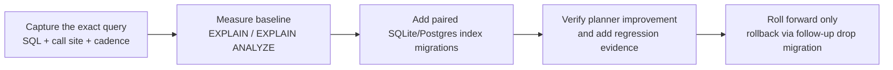

# Index tuning loop

This is a mechanics/runbook page for proposing and validating StateStore index changes.

## Quick orientation

- **Read this if:** a query is hot, a planner regressed, or you are proposing a new index migration.
- **Skip this if:** you only need the schema overview.
- **Go deeper:** use [Gateway data model map (v2)](/architecture/data-model-map) for table shape and the contract tests for proof.

## Tuning loop

## Reference checklist

| Step                   | What to record                                                                 |
| ---------------------- | ------------------------------------------------------------------------------ |
| Capture the hot query  | Exact SQL, call site, cadence, tenant/cardinality shape.                       |
| Measure baseline       | SQLite: `EXPLAIN QUERY PLAN`; Postgres: `EXPLAIN (ANALYZE, BUFFERS)`.          |
| Propose an index       | Add a numbered migration in both dialect directories with the same index name. |
| Verify improvement     | Confirm the planner uses the index and removes avoidable scans or sorts.       |
| Preserve reversibility | Never edit applied migrations; drop with a new follow-up migration if needed.  |

## SQLite vs Postgres evidence

| Dialect  | Baseline tool                | Useful note                                                                            |
| -------- | ---------------------------- | -------------------------------------------------------------------------------------- |
| SQLite   | `EXPLAIN QUERY PLAN`         | Use `PRAGMA automatic_index = OFF` when you need reproducible explicit-index evidence. |
| Postgres | `EXPLAIN (ANALYZE, BUFFERS)` | Run on representative data, not an empty development database.                         |

## Example: `channel_outbox` ordering

`ChannelOutboxDal` frequently needs `WHERE inbox_id = ? ORDER BY chunk_index, outbox_id LIMIT 1`. The repo added a paired index so those loops avoid full scans and temp sorting.

| Evidence           | Location                                                                            |
| ------------------ | ----------------------------------------------------------------------------------- |
| SQLite migration   | `packages/gateway/migrations/sqlite/105_channel_outbox_inbox_chunk_order_idx.sql`   |
| Postgres migration | `packages/gateway/migrations/postgres/105_channel_outbox_inbox_chunk_order_idx.sql` |
| Regression test    | `packages/gateway/tests/contract/index-tuning-loop.test.ts`                         |

## Related docs

- [Gateway data model map (v2)](/architecture/data-model-map)
- [Operational table maintenance](/architecture/operational-maintenance)
- [DB naming conventions](/architecture/db-naming-conventions)
