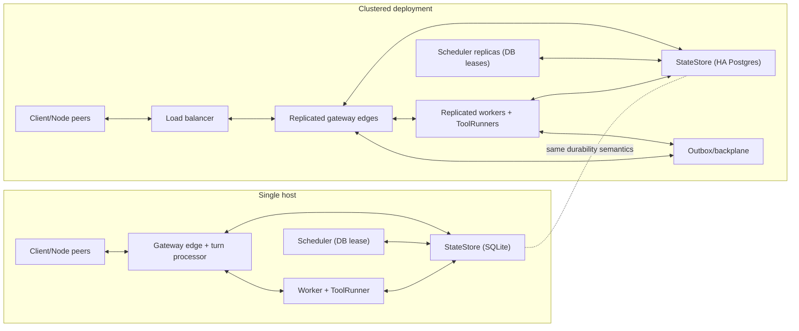

# Scaling and High Availability

Read this if you need the deployment mental model from laptop install to multi-instance cluster. Skip this if you need table-level mechanics first; use the drill-down docs.

Tyrum keeps one logical architecture across deployment sizes. The difference between single host and cluster is replica count and infrastructure shape, not control-plane semantics.

## What This Page Covers

- Deployment roles and how they map to single-host vs cluster.
- The durability and coordination primitives that must remain true at every size.
- High-level failure posture for restart, failover, and reconnect scenarios.

## Deployment Shapes

### Single-host

- Typical form: one machine with co-located gateway edge, turn processor, worker, and scheduler roles.
- Durable state: SQLite StateStore on local persistent disk.
- Backplane/lease behavior still exists conceptually, but usually in uncontested form.

### Clustered

- Typical form: replicated gateway edges, replicated workers, lease-coordinated schedulers, optional desktop-runtime role.
- Durable state: HA Postgres StateStore.
- Backplane/outbox handles cross-edge event delivery and directed routing.
- Workers and schedulers coordinate with durable leases/claims instead of in-memory ownership.

## Runtime Roles

- **`gateway-edge`**: long-lived WebSocket/HTTP edge, routing, auth, control-plane coordination.
- **`worker`**: claims and executes work attempts through tools, nodes, and MCP.
- **`scheduler`**: emits cron/watch/heartbeat triggers under DB lease coordination.
- **`desktop-runtime` (optional)**: reconciles gateway-managed desktop environments.

## Short Invariants (Must Hold Everywhere)

- Durable state is the source of truth; restarts cannot erase execution-critical state.
- Requests/events are retry-safe under at-least-once delivery.
- Execution that must be serialized stays serialized per conversation.
- Secrets remain handles until trusted execution boundaries resolve them.
- Workspace durability is explicit; ToolRunner is the writer boundary for workspace-backed steps.

## Coordination Primitives

- **StateStore durability**: conversation, approval, turn, artifact, audit, and routing state survives process churn.
- **Outbox/backplane delivery**: cross-instance event routing stays at-least-once with dedupe safety.
- **Claim/lease execution**: workers claim work atomically and take over safely on expiry.
- **Scheduler DB leases**: trigger ownership is durable and failover-safe.
- **Idempotency + retries**: side-effecting work does not duplicate outcomes during retries.

## Failure and Recovery Posture

- **Edge failure**: connections reconnect to healthy edges; state is re-derived from durable records.
- **Worker failure**: lease expiry enables takeover without replaying completed side effects.
- **Scheduler failure**: lease transfer prevents double-firing under multi-instance operation.
- **Database/transient network issues**: retries + durable contracts restore service without changing policy semantics.

## Not In Scope Here

- Protocol wire contracts and payload catalogs.
- Component-level execution/approval internals.
- Table-level retention, schema, and index tuning mechanics.

## Drill-down

- [Architecture](/architecture)
- [Backplane (outbox contract)](/architecture/backplane)
- [StateStore dialects (SQLite vs Postgres)](/architecture/gateway/statestore-dialects)
- [Postgres JSON fields: JSONB vs TEXT](/architecture/gateway/postgres-json-fields)
- [Data lifecycle and retention](/architecture/data-lifecycle)
- [Gateway data model map (v2)](/architecture/data-model-map)
- [Gateway FK audit](/architecture/data-model-fk-audit)
- [DB naming conventions](/architecture/db-naming-conventions)
- [DB enum constraints](/architecture/db-enum-constraints)
- [DB JSON hygiene](/architecture/db-json-hygiene)
- [Operational table maintenance](/architecture/operational-maintenance)
- [Index tuning loop](/architecture/index-tuning)
