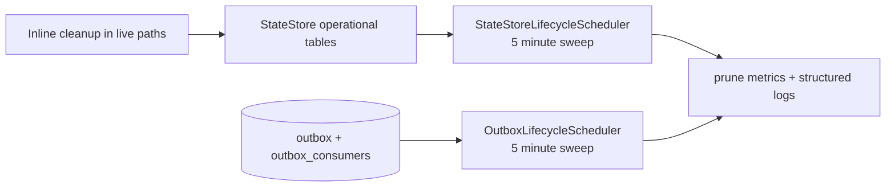

# Operational Table Maintenance Contract

This is a mechanics/reference page for bounded operational tables: what prunes them, what safety rule applies, and what operators can rely on during recovery.

## Quick orientation

- **Read this if:** you are debugging prune behavior, sizing retention, or validating recovery assumptions.
- **Skip this if:** you only need the high-level cluster model.
- **Go deeper:** pair this with [Data lifecycle and retention](/architecture/data-lifecycle), [Backplane](/architecture/backplane), and [Presence](/architecture/presence).

## Maintenance loops

## Maintenance matrix

| Table                       | Bounded by                                               | Prune path                                      | Safety rule                                                                                       |
| --------------------------- | -------------------------------------------------------- | ----------------------------------------------- | ------------------------------------------------------------------------------------------------- |
| `presence_entries`          | `expires_at_ms` TTL; heartbeat caps                      | scheduler sweep plus heartbeat cleanup          | Presence is derived inventory; delete only expired rows.                                          |
| `connections`               | `expires_at_ms` TTL                                      | scheduler sweep plus edge heartbeat cleanup     | Active owners must keep refreshing TTL.                                                           |
| `channel_inbound_dedupe`    | `expires_at_ms` TTL                                      | inline best-effort cleanup plus scheduler sweep | Replay protection remains valid inside the configured dedupe window.                              |
| `channel_inbox`             | terminal retention window                                | scheduler sweep                                 | Completed rows wait for dependent `channel_outbox` cleanup; failed rows age out after the window. |
| `channel_outbox`            | inline success deletion; terminal retention for failures | delivery path plus scheduler sweep              | Canonical transcript recovery must not depend on retained outbox rows.                            |
| `conversation_leases`       | `lease_expires_at_ms` TTL                                | scheduler sweep                                 | Only expired leases are removed.                                                                  |
| `workspace_leases`          | `lease_expires_at_ms` TTL                                | scheduler sweep                                 | Active owners must renew before expiry.                                                           |
| `oauth_pending`             | `expires_at`                                             | scheduler sweep plus callback consumption       | Live auth handshakes must survive until their advertised expiry.                                  |
| `oauth_refresh_leases`      | `lease_expires_at_ms` TTL                                | scheduler sweep                                 | Delete only expired refresh ownership.                                                            |
| `models_dev_refresh_leases` | `lease_expires_at_ms` TTL                                | scheduler sweep                                 | Refresh lease cleanup must not delete the separate cache row.                                     |
| `outbox`                    | time retention window, default `24h`                     | outbox scheduler sweep                          | Replay history is bounded; durable state remains authoritative after prune.                       |
| `outbox_consumers`          | stale `updated_at` against same retention window         | outbox scheduler sweep                          | Remove only stale cursors that have stopped advancing.                                            |

## What operators should expect

| Situation            | Expected behavior                                                                                                   |
| -------------------- | ------------------------------------------------------------------------------------------------------------------- |
| Normal operation     | Background jobs keep bounded tables from growing without limit.                                                     |
| Clustered deployment | Prune loops run under a single-writer lock or lease so replicas do not race cleanup.                                |
| Tick failure         | The system logs `statestore.lifecycle_tick_failed` or `outbox.lifecycle_tick_failed` and increments error counters. |
| Recovery after prune | Critical state must still be reconstructible from durable tables and APIs, not only from operational buffers.       |

## Explicit non-goals

- `models_dev_cache` does not need a prune loop because it is bounded by a singleton primary key.
- Successful `channel_outbox` rows are already removed inline; a second background success-prune job would duplicate that lifecycle.

## Observability hooks

Use these as the first stop when checking maintenance health:

- `lifecycle_prune_rows_total{scheduler="statestore",table="..."}`
- `lifecycle_prune_rows_total{scheduler="outbox",table="..."}`
- `statestore.lifecycle_pruned`
- `outbox.lifecycle_pruned`
- `lifecycle_tick_errors_total{scheduler=...}`

## Related docs

- [Data lifecycle and retention](/architecture/data-lifecycle)
- [Backplane (outbox contract)](/architecture/backplane)
- [Presence](/architecture/presence)
- [Index tuning loop](/architecture/index-tuning)
